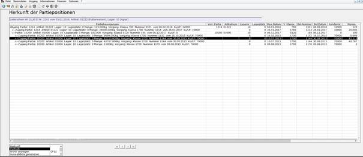
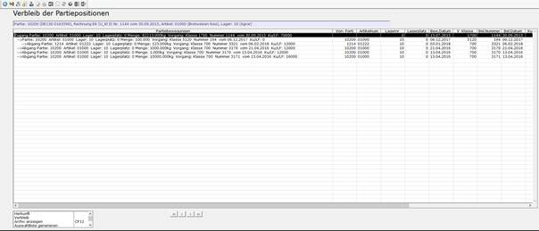
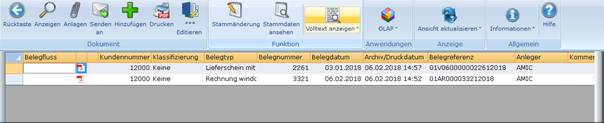
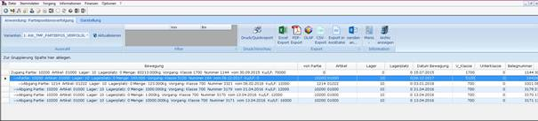

# Herkunft und Verbleib von Partiepositionen

<!-- source: https://amic.de/hilfe/_partieposvervolgung.htm -->

Hauptmenü > Warenverkauf > Lieferscheinbearbeitung oder Direktsprung **[LIB]  
**Hauptmenü > Warenverkauf > Rechnungsbearbeitung oder Direktsprung **[REB]  
**Hauptmenü > Wareneinkauf > Eingangslieferscheine bearbeiten oder Direktsprung **[ELB]  
**Hauptmenü > Wareneinkauf > Eingangsrechnungen bearbeiten oder Direktsprung **[ERE]  
**Hauptmenü > Rohwarenabrechnung > EK-Rohwarenbearbeitung oder Direktsprung **[RWB]  
**Hauptmenü > Rohwarenabrechnung > VK-Rohwarenbearbeitung oder Direktsprung **[RWBV]  
**Hauptmenü > Produktion/Abwicklung > Produktion oder Direktsprung **[PROB]  
**Hauptmenü > Produktion/Abwicklung > Lager-Umbuchung oder Direktsprung **[LGU]  
**Hauptmenü > Produktion/Abwicklung > Artikel-Umbuchung oder Direktsprung **[ARU]  
    
**

In den positionsorientierten Anwendungsvarianten der Anwendungen zur Bearbeitung von Eingangs- und Ausgangs-Lieferscheinen, Eingangs- und Ausgangs-Rechnungen, Produktionsbelegen sowie Artikel- und Lagerumbuchungs-Belegen steht jeweils eine Funktion zur Bestimmung des Verbleibs beziehungsweise der Herkunft der zur gewählten Belegposition zugehörigen Partiepositionen zur Verfügung. In den Anwendungsvarianten zur Erfassung und Korrektur von Rohwarebelegen bezieht sich die Herkunfts- beziehungsweise Verbleib-Funktion auf die gegebenenfalls zugeordnete Partie der Lieferposition des gewählten Belegs.

Ausgehend von den der gewählten Position zugeordneten Partien werden bei der **Herkunfts-Funktion** alle Zugänge des Artikels zur jeweiligen Partie unter Berücksichtigung von Artikel, Lager und Lagerplatz aus anderen Partien und Eingangslieferscheinen und Eingangsrechnungen ermittelt, wobei jeweils nur Bewegungen betrachtet werden, deren Bewegungsdatum kleiner oder gleich dem der Ausgangsbewegung ist. Bei Zugängen aus anderen Partien werden diese wiederum auf deren Herkunft untersucht.

Bei der **Verbleib-Funktion** werden, ausgehend von den der gewählten Position zugeordneten Partien, alle Abgänge des Artikels zur jeweiligen Partie unter Berücksichtigung von Artikel, Lager und Lagerplatz in andere Partien und Ausgangslieferscheinen und Ausgangsrechnungen ermittelt, wobei jeweils nur Bewegungen betrachtet werden, deren Bewegungsdatum größer oder gleich dem der Ausgangsbewegung ist. Bei Abgängen in andere Partien werden diese wiederum auf deren Verbleib untersucht.

Da die Partiebewegungen durch die Abarbeitung erfasster, umgewandelter oder korrigierter Belege per Mandantenserver erzeugt werden, ist darauf zu achten, dass bei Nutzung der Funktionen die beteiligten Belege bereits durch den Mandantenserver abgearbeitet wurden.

<strong>ACHTUNG:</strong> Bei Nutzung von Artikel-, Lager- und Lagerplatzumbuchungen sowie des Produktionsmoduls muss für die entsprechenden Vorgangsklassen und Vorgangsunterklassen unbedingt im Modul ***Formularzuordnung/Vorgangsunterklassen*** im Register ***Partie*** das Maschinentagebuch durch den Eintrag ‚**Ja**‘ im Feld *Maschinentagebuch führen* aktiviert sein. Nur dann können derartige Herkunfts- und Verbleib-Bezüge ausgewertet werden.

Das Ergebnis der Herkunfts-/Verbleib-Bestimmung wird auf einer Maske in einer Tabelle dargestellt.  
Jede Zeile enthält Angaben zu den beteiligten Partiebewegungen. Eine Partiebewegung wird nicht weiter verfolgt und dargestellt, wenn der entsprechende Zweig bereits bei der Herkunfts-/Verbleib-Ermittlung einer zuvor untersuchten Ausgangsbewegung erreicht wurde.

Jede dargestellte Partiebewegung auf der Maske kann nach Positionierung in der Tabelle durch Aufruf der Funktion **Herkunft** oder **Verbleib** weiter untersucht werden.

Das Verfahren kann bei Bedarf auch auf der Ergebnismaske wiederholt werden. Mit ESC wird die aktuelle Maske geschlossen und in die vorhergehende Stufe zurückgewechselt.

Die Funktion **Archiv anzeigen** ruft die Archivanzeige mit archivierten Belegen zur markierten Zeile auf.

Die Funktion **Auswahlliste generieren** erzeugt mit den dargestellten Daten der aktuellen Maske eine Auswahlliste und ruft diese auf, so dass auf dieser Ebene Anbindungen wie Excel-Export, OLAP, Crystal Report, Archiv-Anzeige und andere genutzt werden können. 

