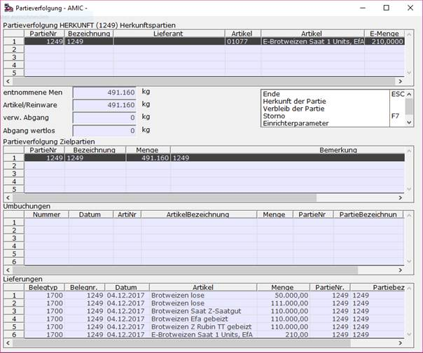
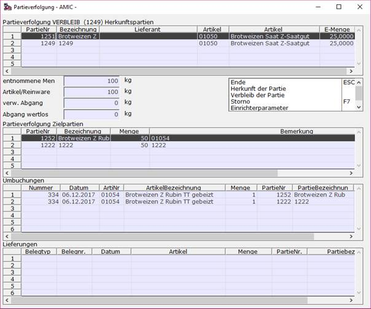
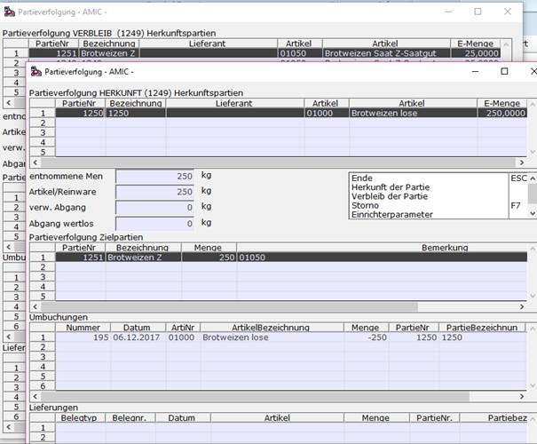
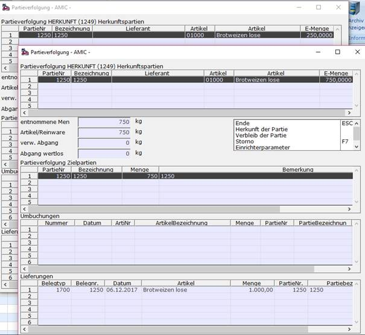

# Herkunftspartien und Verbleibverfolgung

<!-- source: https://amic.de/hilfe/_partievervolgung.htm -->

Hauptmenü > Partieverwaltung > Partie-Stammdaten oder Direktsprung **[PAR]  
    
**

In der Anwendung zur Bearbeitung von Partiestammdaten stehen Funktionen zur Bestimmung des Verbleibs beziehungsweise der Herkunft von Partiemengen zum gewählten Partiestamm zur Verfügung. Ausgehend von den der gewählten Partie werden bei der **Herkunfts-Funktion** alle Zugänge zur jeweiligen Partie unter Berücksichtigung von Artikel, Lager und Lagerplatz aus anderen Partien und Eingangslieferscheinen und Eingangsrechnungen sowie Umbuchungen und Produktionszugängen ermittelt. Entsprechend werden bei der **Verbleib-Funktion** die Abgänge der Partie unter Berücksichtigung von Artikel, Lager und Lagerplatz aus anderen Partien und Ausgangslieferscheinen und Ausgangsrechnungen sowie Umbuchungen und Produktionsabgängen ermittelt.

<strong>Achtung:</strong> Bei Nutzung von Artikel-, Lager- und Lagerplatzumbuchungen sowie des Produktionsmoduls muss für die entsprechenden Vorgangsklassen und Vorgangsunterklassen unbedingt im Modul ***Formularzuordnung/Vorgangsunterklassen*** im Register ***Partie*** das Maschinentagebuch durch den Eintrag ‚**Ja**‘ im Feld *Maschinentagebuch führen* aktiviert sein. Nur dann können derartige Herkunfts- und Verbleib-Bezüge ausgewertet werden!

Im angezeigten Beispiel der Herkunft der Partie 1249) erfolgen sämtliche Zugänge zur Partie 1249 aus Eingangsbelegen, die im unteren Bereich aufgeführt sind.

Die Funktion Verbleibverfolgung der Partie 1249 ergibt die angezeigte Darstellung: Bei dem unter ‚Umbuchungen‘ ausgewiesenem Beleg 334 handelt es sich um einen Produktionsvorgang mit einer Abgangs-Komponente, der zwei Partien (1249 und 1251) zugeordnet wurden und daher beide im Bereich ‚Herkunftspartien‘ dargestellt werden, sowie einer Zugangsposition (Produktionsergebnis), der ebenfalls zwei Partien zugeordnet wurden (1252 und 1222), dargestellt im Bereich ‚Partieverfolgung Zielpartien‘.

Ein Mausklick in eine Partienummer in einem der oberen beiden Bereiche ermöglicht durch anschließendem Aufruf einer der Funktionen ‚Herkunft der Partie‘ oder ‚Verbleib der Partie‘ die weitere Verfolgung der ausgewählten Partie:

Die Partie 1251 wurde per Artikelumbuchung aus Partie 1250 erzeugt.

Um die Herkunft dieser Partie festzustellen erfolgt wiederum die Auswahl per Mausklick auf die Partienummer 1250 und Anwendung der Herkunfts-Funktion:

Der Darstellung ist zu entnehmen, dass es nur einen Zugang zur Partie 1250 gab, nämlich mit der Eingangsrechnung 1250 v. 06.12.2017!

**Tipp:** Ein Doppelklick mit der Maus auf ein der Partienummern in den beiden oberen Bereichen startet übrigens direkt die zuletzt ausgeführte Funktion (Herkunft bzw. Verbleib) mit der angeklickten Partienummer.
