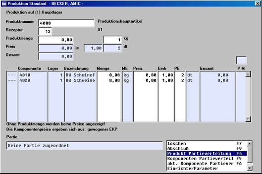

# Partie und Produktion

<!-- source: https://amic.de/hilfe/_partieundproduktion.htm -->

Hauptmenü > Produktion / Umbuchung > Produktionsabwicklung > Produktion oder Produktionszugang erfassen

oder Direktsprung [PROB] oder [PROE]

Durch die Produktion werden unterschiedliche Komponenten zu einem Produkt verarbeitet. Durch diesen Prozess entsteht üblicherweise auf dem Produkt eine neue Partie und die Komponenten werden von bestehenden Partien abgebucht. Diese Verbuchung der Partien im Rahmen einer Produktion ist ab der A.eins Version 4.4. möglich.

Bei der Erfassung des Produktionszuganges stehen für diese Verbuchung nachfolgende Funktionen bereit:

Produkt Partieverteilung

Komponenten Partieverteilung

Akt. Komponente Partieverteilung

Siehe auch:

- [Produkt Partieverteilung](./produkt_partieverteilung.md)
- [Komponenten Partieverteilung](./komponenten_partieverteilung.md)
- [Aktuelle Komponente Partieverteilung](./aktuelle_komponente_partieverteilung.md)
