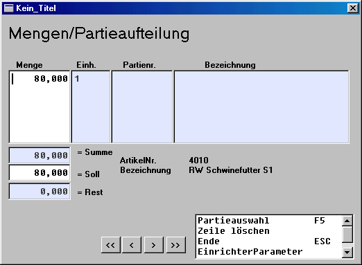
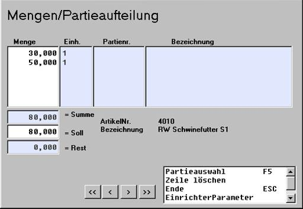
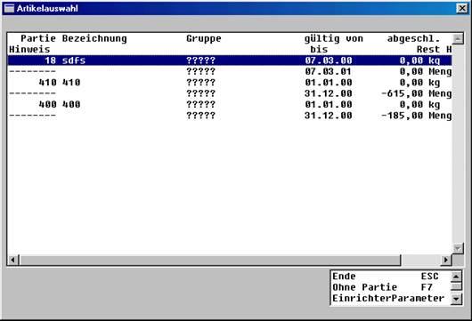
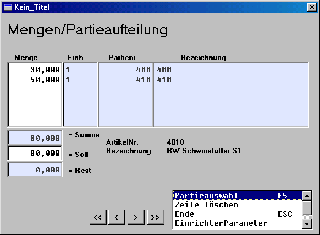
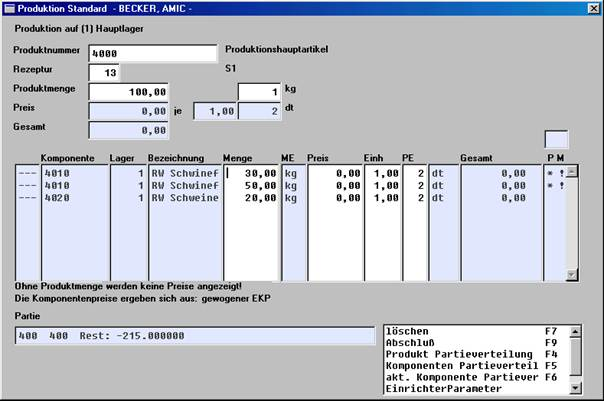

# Komponenten Partieverteilung

<!-- source: https://amic.de/hilfe/_komponentenpartiever.htm -->

Über diese Funktion kann die jeweilige Komponente den einzelnen Partien entnommen werden.

Anfangs wird die gesamte Menge der ersten Komponente vorgeschlagen. Über die Pfeiltasten (&lt;&lt;, &lt;, >, >>) ist ein Wechsel zwischen den Komponenten möglich. Diese Menge wird nun in einzelne Partieteilmengen aufgeteilt. Die „Summe“ ist das Ergebnis der Erfassung, „Soll“ ist die Gesamtmenge dieser Komponente und „Rest“ ist die Differenz daraus.

Nachdem die Mengen aufgeteilt wurden, werden diese Teilmengen den jeweiligen Partien zugeordnet. Über Partieauswahl F5 wird für die Menge (Cursorposition) eine Partie ausgewählt.

Das Einrichten einer neuen Partie bei der Komponentenauswahl ist nicht möglich. Nach erfolgreicher Partieauswahl erscheinen diese Partien dann im Fenster „Mengen/Partieaufteilung“

.

Diese Aufteilung der Komponenten wird ebenfalls in Fenster „Produktion“ übernommen.

