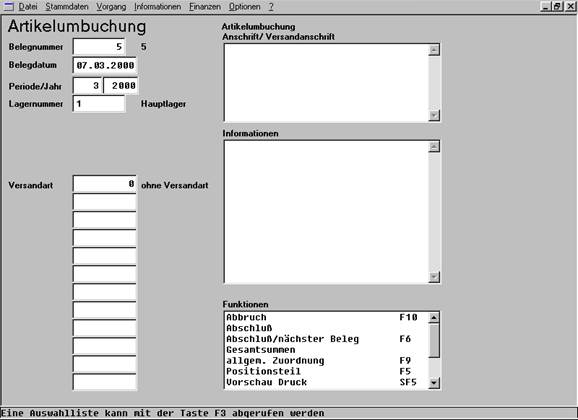
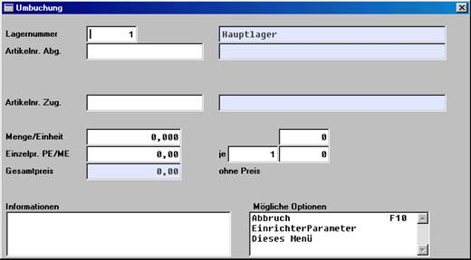

# Partieumbuchung

<!-- source: https://amic.de/hilfe/_partiebewegung_partieumbuchung.htm -->

Hauptmenü > Produktion / Umbuchung > Umbuchungen > Artikel-Umbuchung

oder Direktsprung [ARU]

Auflösung von Partierestbeständen, falsche Partieein- oder Ausbuchung sowie Neustrukturierung der Artikel und Umlagerungen können mögliche Gründe für eine Partieumbuchung sein. Die Partieumbuchung erfolgt über die Artikelumbuchung.

Zunächst erscheint eine Übersicht der bereits getätigten Artikelumbuchungen. Mit der Funktion Artikelumbuchung F8 wird die Partieumbuchung eingeleitet.

Die Abwicklung dieser Artikel- bzw. Partieumbuchung ist ähnlich wie die der Vorgangserfassung.

| Felder |
| --- |
| Belegnummer | Vorschlag einer automatisch Systemnummer aus dem Zählkreis |
| Belegdatum | Vorschlag des Tagesdatums |
| Periode/Jahr | Zum Belegdatum gehörende Periode/Jahr |
| Lagernummer | Lager, in dem diese Partieumbuchung erfolgt |
| Versandart | Hat für die Partieumbuchung keine Bedeutung |

Über die Funktion Positionsteil F5 wird in die Positionsmaske gewechselt. Die Funktion Umbuchung F4 erlaubt Ihnen dann die Positionserfassung.

| Felder |
| --- |
| Lagernummer | Vorschlag aus der Umbuchungs-Kopfmaske |
| Artikelnummer Abg. | Artikelnummer Abgang der Partie |
| Artikelnummer Zug. | Artikelnummer Zugang der Partie |
| Menge/Einheit | Partieumbuchungsmenge und Mengeneinheit |
| Einzelpreis.PE/ME | Einzelpreis je Preiseinheit und Mengeneinheit |

Nach Erfassung der Menge und Mengeneinheit erscheint die automatische Partieauswahl für die Abgangspartie und anschließend (nach Auswahl der Partie) die Partieauswahl für die Zugangspartie.

Der Abschluss dieser Umbuchung ist mit dem Abschluss der Vorgangserfassung identisch. Nachdem für diese Position ein Preis eingegeben und die Position abgeschlossen wurde, wird diese Umbuchung mit dreimal ESC abgeschlossen. Bei Bedarf kann für diese Umbuchungen eigene Nummern- bzw. Zählkreise sowie Formulare hinterlegt werden.
