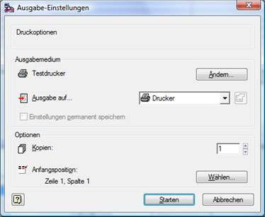

# Druckerstatus-Etikettendruck

<!-- source: https://amic.de/hilfe/_druckerstatusetikett.htm -->

Mittels der Funktion Druckerstatus kann der „Etikettendruck“ gestartet werden. Der Vorteil dieser Funktion liegt in der automatischen Vorschau der Druckaufträge. Es werden alle Druckaufträge des für den Etikettendruck eingestellten Druckers angezeigt.

Sind Druckaufträge vorhanden, können diese mittels der Funktion Alle Druckaufträge löschen F7 gelöscht werden. Direkt im Anschluss daran wird automatisch die Maske für den Etikettendruck geöffnet. Über die Funktion Partieetikett drucken kann aber auch manuell in die Etikettendruck Maske gewechselt werden.

Sind keine Druckaufträge vorhanden wird sofort automatisch die Maske für den Etikettendruck aufgerufen.

