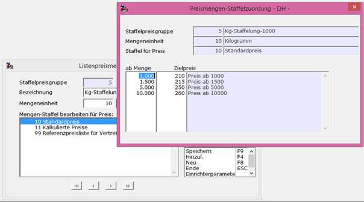

# Definition von Listenpreis-Staffeln

<!-- source: https://amic.de/hilfe/_listenPreisStaffel.htm -->

Preise / Konditionen > Konstanten der Preispflege > Listenpreis-Staffeln

Oder Direktsprung [PRLS]

Eine Listenpreis-Staffel kann in [Listenpreisgruppen](./preisgruppe_fuer_listenpreise.md) zugeordnet werden und dient dem Zweck, einen Listenpreis mengenabhängig gestalten zu können. Dazu wird in einer Listenpreisstaffel jedem mengenabhängig einzurichtenden **Grundpreis**, repräsentiert per [Listenpreisdefinition](./definition_von_listenpreisen.md) in [Preismatrizen](./preismatrix_fuer_listenpreise.md), eine Mengenstaffel definiert, die für Mengenuntergrenzen eine andere Listenpreisdefinition festlegt, unter deren Nummer der dann relevante Preis zu führen ist. 

Die Pflege der Staffelpreise können so im Modul zur [Listenpreispflege](../../artikelstamm_und_artikel/artikel/listenpreise_verkauf_und_einkauf.md) bearbeitet werden.
