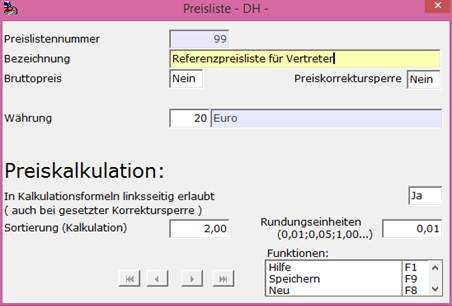

# Definition von Listenpreisen

<!-- source: https://amic.de/hilfe/_listenPreisDefinition.htm -->

Preise / Konditionen > Konstanten der Preispflege > Preilistenbezeichnungen

Oder Direktsprung [PRLB]

Artikel zu einer [Listenpreisgruppe](./preisgruppe_fuer_listenpreise.md) können mehrere Listenpreise haben, die durch Listenpreisdefinitionen zu unterscheiden sind. Verschiedene Listenpreise werden mittels der [Preismatrix](./preismatrix_fuer_listenpreise.md) des Artikels und den [Preisklasse](./preisklasse_fuer_listenpreise.md) Gruppen von Kunden oder Lieferanten zugeordnet.  
    

Neben der identifizierenden Preislistennummer sollte die Listenpreisdefinition mit einer aussagekräftigen Bezeichnung versehen werden. Die Kennzeichnung als Bruttopreis bewirkt in Anwendungen mit Nettopreisen ein Herausrechnen des jeweiligen Steueranteils. Ist die Preiskorrektursperre gesetzt, so können Preise dieser Listenpreisdefinition nicht im Modul zur [Listenpreispflege](../../artikelstamm_und_artikel/artikel/listenpreise_verkauf_und_einkauf.md) geändert werden. Auch ist an dieser Stelle die Währung festgelegt, in der Preise dieser Preisdefinition zu verstehen sind. Für die [Standard-Preiskalkulation](../../zusatzprogramme/preiskalkulation_durchfuehren/index.md) wichtig sind die Angaben, ob ein durch diese Listenpreisdefinition definierter Listenpreis „kalkuliert“ werden darf, also als Ergebnis einer Kalkulationsformel „linksseitig“ auftreten darf, sowie die Sortierung für die Auswahl beim Aufbau von Kalkulationsformeln. Ist letzterer Wert = 0, so soll kein Preis dieser Listenpreisdefinition zur Kalkulation herangezogen werden. Außerdem erfolgt die Angabe, wie Preise dieser Preisdefinition zu runden sind.
