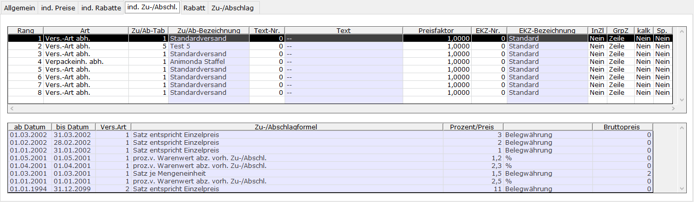

# (Individuelle) Zu-/Abschläge

<!-- source: https://amic.de/hilfe/_indivZuAb_Pflege.htm -->

Allgemeine Hinweise zum Aufruf und zur Arbeitsweise des Moduls sind [hier](./index.md) zu finden.

| Spalte | **Erklärung** |
| --- | --- |
| Rang | Sortierung bei mehreren Zu-/Abschlägen. Wird dieser rausgenommen, kann der Zu-/Abschlag entfernt werden.  
 |
| Art | Art des Zu-/Abschlags  
 |
| Zu/Ab-Tabelle | Nummer der Zu-/Abschlagstabelle in Abhängigkeit von der Art. In dieser sind die eigentlichen Zu-/Abschläge zeitbezogen (und evtl. mengenbezogen) hinterlegt.  
 |
| Zu/Ab-Bezeichnung | Bezeichnung der Zu-/Abschlagstabelle  
 |
| Text-Nr. | Text der beispielsweise im Formular eingerichtet werden kann.  
 |
| Text | Text, der zur Text-Nr. hinterlegt ist. Wenn ein Text mit einem \* versehen ist, ist dieser nicht in der Hauptsprache eingerichtet.  
 |
| Preisfaktor | Menge auf die sich der Zu-/Abschlag bezieht. Nicht bei %-Zu-/Abschlägen relevant.  
 |
| EKZ-Nr. (Erlöskennziffer) | Nummer der Erlöskennziffer beim Ziehen des Zu-/Abschlags. Wenn eine 0 eingetragen wird, wird die Erlöskennziffer des Artikels gezogen.  
 |
| EKZ-Bezeichnung | Bezeichnung der ausgewählten EKZ-Nummer  
 |
| InZl. (In Zeile) | Kennzeichen, ob der Zu-/Abschlag in der Artikelzeile oder als eigene Zeile erzeugt werden soll.  
 |
| GrpR (Gruppenrabatt) | Kennzeichen, ob es sich hierbei um einen Gruppenrabatt handelt.  
 |
| kalk. (Kalkulationskennzeichen) | Kennzeichen, ob es sich um einen kalkulatorischen Zu-/Abschlag handelt, ob dieser also direkt im Preis enthalten ist.  
 |
| Sp. (Sperrkennzeichen) | Möglichkeit der (vorübergehenden) Sperrung des Zu-/Abschlags.  
 |
| Schlüssel | Steuerschlüssel, hinterlegt im Zu-/Abschlagssatz. Wenn eine 0 eingetragen wird, wird der Steuerschlüssel der Warenposition gezogen). Sichtbar in Abhängigkeit von Steuerparameter 330 („Separate Steuer auf Zu-/Abschl. möglich“)  
 |
| Schlüssel-Bezeichnung | Bezeichnung des Steuerschlüssels. Sichtbar in Abhängigkeit von Steuerparameter 330 („Separate Steuer auf Zu-/Abschl. möglich“)  
 |

Die untere Tabelle bezieht sich immer auf die in der oberen Tabelle ausgewählte Zeile und enthält die Informationen zur ausgewählten Zu-/Abschlagstabelle in der ausgewählten Art.

| Spalte | **Erklärung** |
| --- | --- |
| ab Datum | Beginn des jeweiligen Gültigkeitszeitraumes des Zu-/Abschlagssatzes. Bei Überschneidungen wird das größere ab-Datum berücksichtigt  
 |
| bis Datum | Ende des jeweiligen Gültigkeitszeitraumes des Zu-/Abschlagssatzes.  
 |
| Zu-/Abschlags-Formel | Die Zu-/Abschlagsformel bestimmt zusammen mit der Wertangabe (Prozent/Preis) die Art der Zu/-Abschlagsermittlung  
 |
| Prozent/Preis | Preis bzw. Prozentsatz des Zu-/Abschlags.  
 |
| (Bezug) | % oder Belegwährung oder feste Währung (Kombination aus Zu-/Abschlags-Formel, Steuerparameter 363 („Währungsbehandlung ZuAbschl. etc Ware“) und 361 („Währungsnummer für ZuAbschläge etc. Ware“)  
 |
| Bruttopreis | Wert für Bruttobelege bei nichtprozentualem Satz. Bei Wert 0 errechnet sich dieser aus Netto- und Steuersatz  
 |
