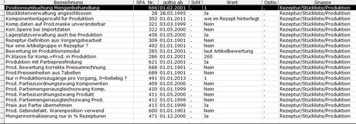

# Steuerparameter (Produktion)

<!-- source: https://amic.de/hilfe/_steuerparameterprodu.htm -->

Hauptmenü > Administration > Steuerung > Steuerparameter zeigen

oder Direktsprung **[SPA]**

Die einzurichtenden Steuerparameter findet man indem man in der Auswahlliste die Bereichsauswahl auf die [Gruppe Rezeptur/Stückliste/Produktion](../../../firmenstamm/steuerparameter/rezeptur_stueckliste_produktion/index.md) abgrenzt.

Zunächst sind die Steuerparameter **[SPA]** einzurichten:

| Steuerparameter |
| --- |
| Parameter 666: Positionsumbuchung Mengenbehandlung | Berechnung des Komponentenanteils in der Maske Positionskalkulation. 0 bedeutet der Anteil wird wie in der Komponente angegeben berechnet. 1 bedeutet Menge wird wie im Rezept angegeben berechnet. |
| Parameter 28: Stücklistenverwaltung angeschlossen | Steuert das Programmverhalten bei Artikeln mit hinterlegten Rezepturen. Die Rezepturen werden nur aufgelöst, wenn hier „Ja“ eingetragen ist. |
| Parameter 302: Komponentenlagerwahl für Produktion | Legt fest, aus welchem Lager die Komponenten für eine Rezeptur genommen werden. Das Lager für die Komponenten ist in der Regel gleich Lager des Produktes, hier ist nur bei speziellen Einrichtungen anderes einzustellen. 0 = wie Zugangslager 1 = wie im Rezept hinterlegt |
| Parameter 321: Komponentendaten auf Produktionsmaske unveränderbar | Falls im Produktionsmodul keine Komponentendaten während der Erfassung verändert werden dürfen ist hier „Ja“ einzustellen. |
| Parameter 322: Korrektursperre bei Importdaten | Werden Daten aus einem vorgelagerten Produktionssystem importiert, sollen sie möglicherweise (i.d.R.) nicht mehr korrigiert werden. |
| Parameter 458: Lagerplatzverwaltung auch bei Produktion | Wenn die Lagerplatzverwaltung aktiviert ist, sollen ggf. auch die Buchungen für Produkt, Komponente und Rezeptur lagerplatzbezogen erfolgen. Dies ist hier dann zu aktivieren. |
| Parameter 309: Rezeptur-Definition aus Vorgangsbearbeit | Die Rezepturdefinition aus der Belegerfassung heraus ist z.Z. noch nicht aktiv; der Parameter zieht noch nicht. |
| Parameter 492: Nur eine Artikelgruppe in Rezeptur? | Artikel können Artikelgruppen zugeordnet werden. Mit diesem Parameter ist es nun möglich zu erreichen, dass nur Artikel einer Artikelgruppe in der Rezeptur enthalten sein dürfen. JA: Es dürfen in einer Rezeptur nur Artikel aus einer Artikelgruppe genommen werden. Nein: Es dürfen in einer Rezeptur Artikel aus mehreren Artikelgruppen genommen werden.     Der Preis des Produktes einer Stückliste kann sich nach dem im Rezept eingestellten Verfahren oder aus der Preisfindung für diesen Artikel ergeben.  |
| Parameter 285+286: Bewertung im Produktionsmodul / Pr.Klasse für Komp.+Prod. in Produktion | Hier wird das Bewertungsverfahren zur Ermittlung von Zu- und Abgangswerten eingestellt. Entscheidet man sich für den letzten, durchschnittlichen (der Periode, des Jahres) oder gewogenen Einkaufspreis bei Parameter 285, ist der Eintrag unter 286 bedeutungslos. Wird dort Listenpreis eingestellt, ist unter 286 die Listenpreisnummer (Lispreisnummer Einkauf) einzustellen. Folgende Bewertungsverfahren stehen zur Verfügung: 1 = Gew. EKP 2 = Letzter EKP 3 = Durchschn. EKP der Periode 4 = Listenpreis 5 = Durchschn. EKP des Jahres 6 = laut Artikelbewertung 100 = per Preisfindung |
| Parameter 621: Produktion mit Partiepreisfindung | Bei „Ja“ wird bei der Preisfindung der Komponenten zunächst geprüft, ob ein Partiepreis vorhanden ist. Falls ja, wird dieser genommen, sonst findet die übliche Preisfindung der Produktion statt. |
| Parameter 688: Produktion Bewertung korrekte Preisumrechnung | Dieser Steuerparameter dient als Vorbelegung im Pfleger für Rezepturen für das Feld: Korrekte Bewertung. Wird im Rezept dort „Ja“ eingestellt, wird eine korrigierte Fassung der Umrechnung der Bewertungspreise aktiviert. |
| Parameter 689: Produktion Preiseinheiten aus Tabellen | Dieser Steuerparameter dient als Vorbelegung im Pfleger für Rezepturen für das Feld: Preise aus Tabellen. Wird im Rezept dort „Ja“ eingestellt, werden alle Preise, die nicht aus Bewertungsmethoden kommen, mit ihren zugehörigen Preiseinheiten und Preismengeneinheiten übernommen. |
| Parameter 491: Nur n Produktionszugänge pro Vorgang, 0=beliebig? | Legt fest, ob mehr als eine Produktionsbuchung pro Beleg erfasst werden kann. |
| Parameter 409+410+411+412: Produktion Partiezuordnungszwang + Partiemengenausgleichszwang | Regeln Buchungszwänge in Verbindung mit der Partiebuchhaltung. Generell gilt bei Eintragung „Nein“, dass Partiezuordnungen nicht erzwungen werden, freie Zuordnungen bei der Erfassung aber möglich sind. Für die Komponenten kann der Zuordnungszwang (409) für alle Artikel oder für die, denen im Artikelstamm das Kennzeichen Partiezwang bzw. Saatgutartikel zugeordnet wurde, eingestellt werden. Der Parameter 410 regelt dann, ob die Mengen Partien vollständig zuzuordnen sind. O.a. Ausführungen gelten entsprechend für das Produkt (411,412): Partiezuordnung für alle Artikel oder aber die mit Partiezwang / bzw. Saatgutartikel gekennzeichneten; Produktionsmengen müssen vollständig zugeordnet werden (oder nicht).  |
| Parameter 415: Preis aus Partie übernehmen | Preise aus Partien werden übernommen, wenn der Preis ungleich 0 ist und in der Rezeptur der Bewertungstyp nicht „anteilsgewichtet“ oder „wertgewichtet“ ist. |
| Parameter 600: Prod. Gebindefakt. Warenposition verwend | Wird dieser Parameter auf „Ja“ gesetzt, dann werden für neue Belege manuell abgeänderte Gebindefaktoren berücksichtigt. Alte Belege bleiben davon unberührt. Es wird die Einstellung „Ja“ empfohlen. |
| Parameter 471: Mengennormalisierung nur in % Rezepturen | Mengennormalisierung: Nur relevant für % Rezepturen; hier sollte der Parameter auf „Ja“ geschaltet sein. |
| Parameter 962: Produktions-Schnellerfassung aktiv | Aktiviert das Modul zur Produktions-Schnellerfassung, wenn hier „Ja“ eingetragen ist. Die Standardeinstellung ist „Nein“. ACHTUNG: Die Schnellerfassung verfügt nicht über den vollen Leistungsumfang, wie er im Standard-Produktionsmodul mittels der Direktsprünge PROB und PROE zur Verfügung steht. |
