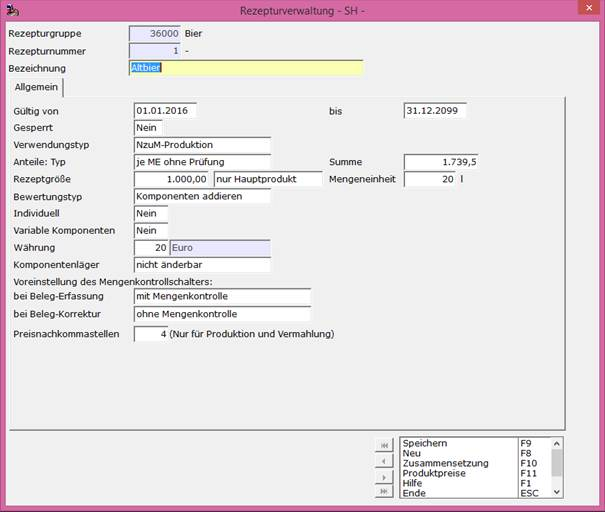
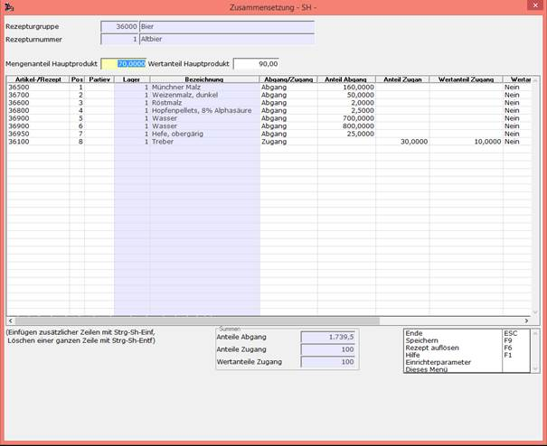
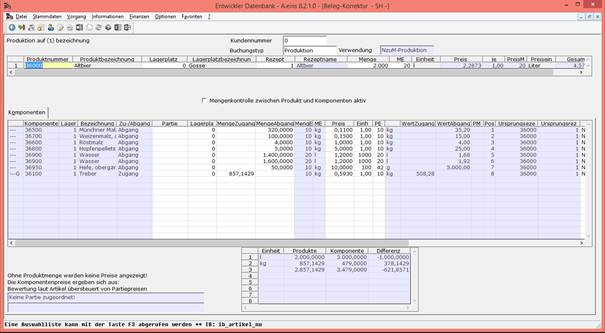

# Beispiel 1 für NzuM-Produktion:

<!-- source: https://amic.de/hilfe/beispiel1frnzumproduktion.htm -->

Anlegen eines Rezeptes zur Rezepturgruppe 36000 mit Rezepturnummer 1 unter **[REZ]** :

Für den Verwendungstyp wurde NzuM-Produktion gewählt.  
Anteile Typ wurde auf ‚je ME ohne Prüfung‘ gesetzt, dass heißt das bei der Zusammensetzung des Rezeptes keine Prüfung der Summe der Komponenten stattfindet.  
Die Rezeptgröße von 1000 Litern bezieht sich nur auf das Hauptprodukt (in unserem Fall Altbier).  
Als Bewertungstyp wurde ‚Komponenten addieren‘ gewählt, dadurch bestimmen die Werte der Komponenten den Wert des Produktes.  
    

Unter Zusammensetzung F10 können danach die Komponenten für das Rezept 1 eingegeben werden. In unserem Beispiel ergibt die Summe der Anteile des Hauptproduktes 1739,5 (siehe unten auf der Maske im Kasten Summen im Feld Anteile Abgang). Die Summe wird hier vom System nicht geprüft, da für den Anteile: Typ ‚je ME ohne Prüfung‘ angegeben wurde (auch wenn das Feld Summe im Rezept im Beispiel mit der entsprechenden Zahl gefüllt wurde).  
Der Mengenanteil des Hauptproduktes wird hier mit 70 angegeben. Für den Treber ist ein Mengenanteil von 30 in der Spalte ‚Anteil Zugang‘ angegeben.  
Der Wertanteil für das Hauptprodukt soll 90 sein, der Wertanteil Zugang für den Treber 10.

Unter [PROE] wird dann die Produktion erfasst.

Der Positionsteil sieht wie folgt aus:

Unter Produktnummer ist die Rezepturgruppe angegeben und unter Rezept wählt man die entsprechende Rezeptur aus, in diesem Fall das Rezept 1. Dann gibt man die Menge an, die produziert werden soll. In diesem Fall sind es 2000 Liter.

Bei den Komponenten in der Spalte ‚Menge Abgang‘ kann man erkennen, dass sich die Mengen für das Hauptprodukt (aus dem Rezept) verdoppelt haben, da die doppelte Menge des Hauptproduktes produziert werden soll. Für die ‚Menge Zugang‘ (den Treber) ergibt sich dann der Anteil 857,1429. Dieser errechnet sich aus der Produktionsmenge (2000 l) geteilt durch den Mengenanteil des Hauptproduktes von 70 multipliziert mit dem Anteil Zugang von 30 aus dem Rezept.

Für den Wertanteil des Hauptproduktes wurde im Rezept 90 angegeben. Der Preis für 2000 Liter vom Hauptprodukt berechnet sich dann aus der Summe des Feldes ‚Wert Abgang‘ für die Komponenten (in unserem Beispiel sind es 5082,80) dividiert durch alle Wertanteile (100) multipliziert mit den Wertanteilen des Hauptprodukts (90) (ergibt 4574,52). Angegeben auf der Maske ist ein Preis pro Liter (4574,52 / 2000) von 2,2873.

Der Bildschirmabzug wurde unter **[PROB]** erstellt.

Die Voreinstellung für die Mengenkontrolle steht hier auf nicht aktiv, so wie es im Rezept 1 für die Beleg-Korrektur angegeben wurde. Wird dann ein Wert geändert passen sich die anderen Werte nicht automatisch an.

In der Gegenzeile (markiert mit G in der ersten Spalte) findet man in der NzuM-Produktion die Nebenprodukte im Feld Zugang.
