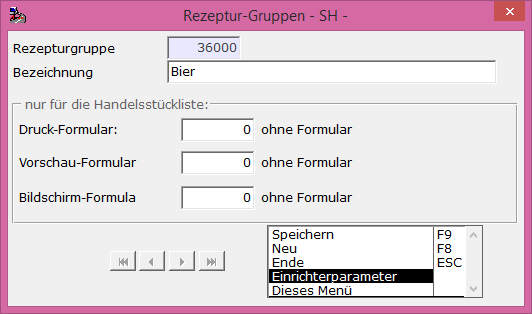

# Beispiele für eine NzuM-Produktion

<!-- source: https://amic.de/hilfe/_examplenzumproduktion.htm -->

Erster Schritt für alle Beispiele ist das Anlegen einer Rezepturgruppe 36000 für Bier unter [REZG]:

Siehe auch:

- [Beispiel 1 für NzuM-Produktion:](./beispiel_1_fuer_nzum_produktion.md)
- [Beispiel 2 für NzuM-Produktion:](./beispiel_2_fuer_nzum_produktion.md)
