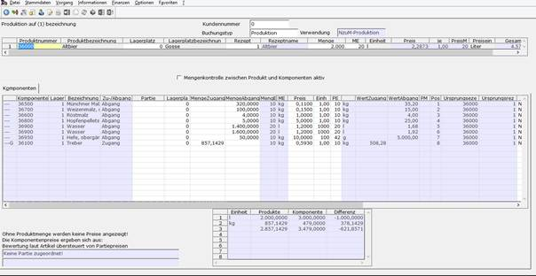

# Felder der Maske

<!-- source: https://amic.de/hilfe/_felderdermaske.htm -->

<table class="AMIC-Tabelle" style="WIDTH: 100%; BORDER-COLLAPSE: collapse" cellspacing="0" cellpadding="0" width="100%" border="0"><tbody><tr><td style="WIDTH: 100%; BACKGROUND: #005d5b; PADDING-BOTTOM: 0pt; PADDING-TOP: 0pt; PADDING-LEFT: 5.4pt; PADDING-RIGHT: 5.4pt" width="100%" colspan="2">
Felder
</td></tr><tr><td style="BORDER-TOP: medium none; BORDER-RIGHT: white 1.5pt solid; WIDTH: 31.54%; BACKGROUND: #bad9d9; BORDER-BOTTOM: medium none; PADDING-BOTTOM: 0pt; PADDING-TOP: 0pt; PADDING-LEFT: 5.4pt; BORDER-LEFT: medium none; PADDING-RIGHT: 5.4pt" valign="top" width="31%">
Kundennummer (Produktionsmaske)
</td><td style="BORDER-TOP: medium none; BORDER-RIGHT: medium none; WIDTH: 68.46%; BACKGROUND: #bad9d9; BORDER-BOTTOM: medium none; PADDING-BOTTOM: 0pt; PADDING-TOP: 0pt; PADDING-LEFT: 5.4pt; BORDER-LEFT: medium none; PADDING-RIGHT: 5.4pt" valign="top" width="68%">
Hier kann man als Information den Kunden hinterlegen für den man z.B. ein Produktionsangebot gemacht hat.
</td></tr><tr><td style="BORDER-TOP: medium none; BORDER-RIGHT: white 1.5pt solid; WIDTH: 31.54%; BACKGROUND: #eff7f7; BORDER-BOTTOM: medium none; PADDING-BOTTOM: 0pt; PADDING-TOP: 0pt; PADDING-LEFT: 5.4pt; BORDER-LEFT: medium none; PADDING-RIGHT: 5.4pt" valign="top" width="31%">
Buchungstyp (Produktionsmaske)
</td><td style="BORDER-TOP: medium none; BORDER-RIGHT: medium none; WIDTH: 68.46%; BACKGROUND: #eff7f7; BORDER-BOTTOM: medium none; PADDING-BOTTOM: 0pt; PADDING-TOP: 0pt; PADDING-LEFT: 5.4pt; BORDER-LEFT: medium none; PADDING-RIGHT: 5.4pt" valign="top" width="68%"><table class="MsoNormalTable" style="BORDER-TOP: medium none; BORDER-RIGHT: medium none; BORDER-COLLAPSE: collapse; BORDER-BOTTOM: medium none; BORDER-LEFT: medium none" cellspacing="0" cellpadding="0" border="1"><tbody><tr><th style="BORDER-TOP: windowtext 1pt solid; BORDER-RIGHT: windowtext 1pt solid; WIDTH: 153.15pt; BORDER-BOTTOM: windowtext 1pt solid; PADDING-BOTTOM: 0pt; PADDING-TOP: 0pt; PADDING-LEFT: 5.4pt; BORDER-LEFT: windowtext 1pt solid; PADDING-RIGHT: 5.4pt" valign="top" width="204">Buchungstyp</th><th style="BORDER-TOP: windowtext 1pt solid; BORDER-RIGHT: windowtext 1pt solid; WIDTH: 153.15pt; BORDER-BOTTOM: windowtext 1pt solid; PADDING-BOTTOM: 0pt; PADDING-TOP: 0pt; PADDING-LEFT: 5.4pt; BORDER-LEFT: medium none; PADDING-RIGHT: 5.4pt" valign="top" width="204">Bedeutung</th></tr><tr><td style="BORDER-TOP: medium none; BORDER-RIGHT: windowtext 1pt solid; WIDTH: 153.15pt; BORDER-BOTTOM: windowtext 1pt solid; PADDING-BOTTOM: 0pt; PADDING-TOP: 0pt; PADDING-LEFT: 5.4pt; BORDER-LEFT: windowtext 1pt solid; PADDING-RIGHT: 5.4pt" valign="top" width="204">Angebot Produktion</td><td style="BORDER-TOP: medium none; BORDER-RIGHT: windowtext 1pt solid; WIDTH: 153.15pt; BORDER-BOTTOM: windowtext 1pt solid; PADDING-BOTTOM: 0pt; PADDING-TOP: 0pt; PADDING-LEFT: 5.4pt; BORDER-LEFT: medium none; PADDING-RIGHT: 5.4pt" valign="top" width="204">Diese Einstellung verwendet man, wenn man ein Produktionsangebot machen möchte.</td></tr><tr><td style="BORDER-TOP: medium none; BORDER-RIGHT: windowtext 1pt solid; WIDTH: 153.15pt; BORDER-BOTTOM: windowtext 1pt solid; PADDING-BOTTOM: 0pt; PADDING-TOP: 0pt; PADDING-LEFT: 5.4pt; BORDER-LEFT: windowtext 1pt solid; PADDING-RIGHT: 5.4pt" valign="top" width="204">Auftrag Produktion</td><td style="BORDER-TOP: medium none; BORDER-RIGHT: windowtext 1pt solid; WIDTH: 153.15pt; BORDER-BOTTOM: windowtext 1pt solid; PADDING-BOTTOM: 0pt; PADDING-TOP: 0pt; PADDING-LEFT: 5.4pt; BORDER-LEFT: medium none; PADDING-RIGHT: 5.4pt" valign="top" width="204">Für die Produktionsplanung, Bestellungen und Aufträge.</td></tr><tr><td style="BORDER-TOP: medium none; BORDER-RIGHT: windowtext 1pt solid; WIDTH: 153.15pt; BORDER-BOTTOM: windowtext 1pt solid; PADDING-BOTTOM: 0pt; PADDING-TOP: 0pt; PADDING-LEFT: 5.4pt; BORDER-LEFT: windowtext 1pt solid; PADDING-RIGHT: 5.4pt" valign="top" width="204">Produktion</td><td style="BORDER-TOP: medium none; BORDER-RIGHT: windowtext 1pt solid; WIDTH: 153.15pt; BORDER-BOTTOM: windowtext 1pt solid; PADDING-BOTTOM: 0pt; PADDING-TOP: 0pt; PADDING-LEFT: 5.4pt; BORDER-LEFT: medium none; PADDING-RIGHT: 5.4pt" valign="top" width="204">Um für die Produktion eine normale Bestandsbuchung durchzuführen.</td></tr></tbody></table>
Der Buchungstyp kann auch schon im Vorgangskopf im Userfeld „Prod.Buchtyp“ (Nummer 4204) eingetragen werden.

Eine Vorbelegung für den Buchungstyp ist in den Optionen <strong>[OPT]</strong> unter dem Wert „VorbelegungBuchungsTypProduktion“ einstellbar.
</td></tr><tr><td style="BORDER-TOP: medium none; BORDER-RIGHT: white 1.5pt solid; WIDTH: 31.54%; BACKGROUND: #bad9d9; BORDER-BOTTOM: medium none; PADDING-BOTTOM: 0pt; PADDING-TOP: 0pt; PADDING-LEFT: 5.4pt; BORDER-LEFT: medium none; PADDING-RIGHT: 5.4pt" valign="top" width="31%">
Verwendung
</td><td style="BORDER-TOP: medium none; BORDER-RIGHT: medium none; WIDTH: 68.46%; BACKGROUND: #bad9d9; BORDER-BOTTOM: medium none; PADDING-BOTTOM: 0pt; PADDING-TOP: 0pt; PADDING-LEFT: 5.4pt; BORDER-LEFT: medium none; PADDING-RIGHT: 5.4pt" valign="top" width="68%"></td></tr><tr><td style="BORDER-TOP: medium none; BORDER-RIGHT: white 1.5pt solid; WIDTH: 31.54%; BACKGROUND: #eff7f7; BORDER-BOTTOM: medium none; PADDING-BOTTOM: 0pt; PADDING-TOP: 0pt; PADDING-LEFT: 5.4pt; BORDER-LEFT: medium none; PADDING-RIGHT: 5.4pt" valign="top" width="31%">
Plan/Lieferdatum
</td><td style="BORDER-TOP: medium none; BORDER-RIGHT: medium none; WIDTH: 68.46%; BACKGROUND: #eff7f7; BORDER-BOTTOM: medium none; PADDING-BOTTOM: 0pt; PADDING-TOP: 0pt; PADDING-LEFT: 5.4pt; BORDER-LEFT: medium none; PADDING-RIGHT: 5.4pt" valign="top" width="68%">
Mit dem Plan/Lieferdatum kann das Lieferdatum (Ausführungsdatum) einer Produktion abweichend vom Vorgangsdatum bestimmt werden. Dieses kann auf der Startseite des Vorgangs angegeben werden, es dient dann allerdings nur zur Vorbelegung für neu erzeugte Produktionen. Wird dort zum Beispiel zunächst unbemerkt ein falsches Datum angegeben, so lässt es sich dieses nach Erfassung einer oder gar mehrerer Produktionen zwar vorgangsseitig ändern. Die bereits erfassten Produktionen behalten aber das ursprüngliche Datum bei. Daher lässt sich per Einrichterparameter <a class="topic-link" href="../../../firmenstamm/einrichterparameter/maskentitel_epa_produkt.md">Plan-/Lieferdatum auf Produktionsmaske</a> das Maskenfeld <i>Plan/Lieferdatum </i>aktivieren. Hier kann, auch bei der Belegkorrektur, ein vom Vorgangstamm abweichendes Datum für die aktuelle Produktion angegeben werden.
</td></tr><tr><td style="BORDER-TOP: medium none; BORDER-RIGHT: white 1.5pt solid; WIDTH: 31.54%; BACKGROUND: #bad9d9; BORDER-BOTTOM: medium none; PADDING-BOTTOM: 0pt; PADDING-TOP: 0pt; PADDING-LEFT: 5.4pt; BORDER-LEFT: medium none; PADDING-RIGHT: 5.4pt" valign="top" width="31%">
Produktnummer
</td><td style="BORDER-TOP: medium none; BORDER-RIGHT: medium none; WIDTH: 68.46%; BACKGROUND: #bad9d9; BORDER-BOTTOM: medium none; PADDING-BOTTOM: 0pt; PADDING-TOP: 0pt; PADDING-LEFT: 5.4pt; BORDER-LEFT: medium none; PADDING-RIGHT: 5.4pt" valign="top" width="68%">
Hier wählt man den Artikel aus, den man produzieren will. Es werden alle Artikel in der <strong>F3</strong>-Auswahl angezeigt, die zu dem Lager gehören und eine Rezepturgruppe hinterlegt haben.
</td></tr><tr><td style="BORDER-TOP: medium none; BORDER-RIGHT: white 1.5pt solid; WIDTH: 31.54%; BACKGROUND: #eff7f7; BORDER-BOTTOM: medium none; PADDING-BOTTOM: 0pt; PADDING-TOP: 0pt; PADDING-LEFT: 5.4pt; BORDER-LEFT: medium none; PADDING-RIGHT: 5.4pt" valign="top" width="31%">
Lagerplatz
</td><td style="BORDER-TOP: medium none; BORDER-RIGHT: medium none; WIDTH: 68.46%; BACKGROUND: #eff7f7; BORDER-BOTTOM: medium none; PADDING-BOTTOM: 0pt; PADDING-TOP: 0pt; PADDING-LEFT: 5.4pt; BORDER-LEFT: medium none; PADDING-RIGHT: 5.4pt" valign="top" width="68%">
Hier kann man den Lagerplatz angeben
</td></tr><tr><td style="BORDER-TOP: medium none; BORDER-RIGHT: white 1.5pt solid; WIDTH: 31.54%; BACKGROUND: #bad9d9; BORDER-BOTTOM: medium none; PADDING-BOTTOM: 0pt; PADDING-TOP: 0pt; PADDING-LEFT: 5.4pt; BORDER-LEFT: medium none; PADDING-RIGHT: 5.4pt" valign="top" width="31%">
Rezeptur
</td><td style="BORDER-TOP: medium none; BORDER-RIGHT: medium none; WIDTH: 68.46%; BACKGROUND: #bad9d9; BORDER-BOTTOM: medium none; PADDING-BOTTOM: 0pt; PADDING-TOP: 0pt; PADDING-LEFT: 5.4pt; BORDER-LEFT: medium none; PADDING-RIGHT: 5.4pt" valign="top" width="68%">
Hier wählt man die Rezeptur an, die man verwenden möchte. Es werden die Mengeneinheit (wenn per <a class="topic-link" href="../../../firmenstamm/einrichterparameter/maskentitel_epa_produkt.md">Einrichterparameter</a> so eingestellt) und die Komponenten des Rezeptes in die Maske übernommen.
</td></tr><tr><td style="BORDER-TOP: medium none; BORDER-RIGHT: white 1.5pt solid; WIDTH: 31.54%; BACKGROUND: #eff7f7; BORDER-BOTTOM: medium none; PADDING-BOTTOM: 0pt; PADDING-TOP: 0pt; PADDING-LEFT: 5.4pt; BORDER-LEFT: medium none; PADDING-RIGHT: 5.4pt" valign="top" width="31%">
Produktmenge / Mengeneinheit
</td><td style="BORDER-TOP: medium none; BORDER-RIGHT: medium none; WIDTH: 68.46%; BACKGROUND: #eff7f7; BORDER-BOTTOM: medium none; PADDING-BOTTOM: 0pt; PADDING-TOP: 0pt; PADDING-LEFT: 5.4pt; BORDER-LEFT: medium none; PADDING-RIGHT: 5.4pt" valign="top" width="68%">
Die Mengeneinheit des Produktes wurde automatisch gefüllt mit der Mengeneinheit des Artikels oder der Rezeptur. Gibt man die Produktmenge an, dann wird das Feld Menge der Komponenten entsprechend der Angaben in der Rezeptur im Feld Anteilstyp gefüllt.
</td></tr><tr><td style="BORDER-TOP: medium none; BORDER-RIGHT: white 1.5pt solid; WIDTH: 31.54%; BACKGROUND: #bad9d9; BORDER-BOTTOM: medium none; PADDING-BOTTOM: 0pt; PADDING-TOP: 0pt; PADDING-LEFT: 5.4pt; BORDER-LEFT: medium none; PADDING-RIGHT: 5.4pt" valign="top" width="31%">
Mengenkontrolle zwischen Produkt und Komponenten aktiv
</td><td style="BORDER-TOP: medium none; BORDER-RIGHT: medium none; WIDTH: 68.46%; BACKGROUND: #bad9d9; BORDER-BOTTOM: medium none; PADDING-BOTTOM: 0pt; PADDING-TOP: 0pt; PADDING-LEFT: 5.4pt; BORDER-LEFT: medium none; PADDING-RIGHT: 5.4pt" valign="top" width="68%">
Ist die Mengenkontrolle aktiviert, dann wird bei Änderung der Menge einer Komponente die Produktmenge mit angepasst.
</td></tr></tbody></table>
