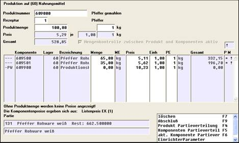
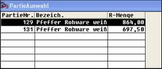
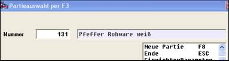
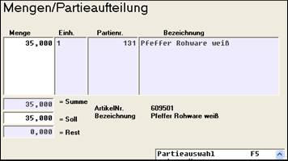

# Produktion mit Partiepflicht

<!-- source: https://amic.de/hilfe/_produktionmitpartiep.htm -->

Ist die Partiepflicht eingeschaltet (siehe SPA), dann prüft das Produktionsmodul auf korrekte Erfassung. In nachfolgendem Beispiel wurde für die Komponenten Partiezwang im Artikel eingerichtet

und der SPA für die Produktion auf Überwachung bei Artikeln mit Partiezwang geschaltet.

In der rechten Spalte wird je Komponente mit ! kenntlich gemacht, ob Partiezwang besteht. Mit \* wird angezeigt, dass die Partiebuchung erfolgte. Auf der Produktionsmaske erfolgt die Erfassung je Position mittels F5.

Es wird dann die Menge eingegeben und mit F5 auf die Partiezuordnung verzweigt. Ist die Partienummer bekannt, wird sie hier eingegeben, ansonsten wird sie mit F3 gesucht. Je Menge ist eine Partie zulässig. Mehrere Partien werden einer Komponente durch Eingabe von jeweiliger Menge und Nr. zugeordnet.
