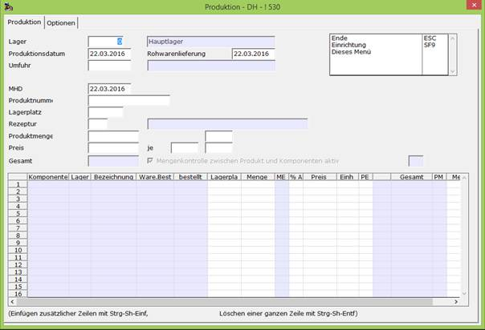

# Produktion Schnellerfassung

<!-- source: https://amic.de/hilfe/_schnellerfassungproduktion.htm -->

Hauptmenü > Produktion / Abwicklung > Produktionsabwicklung > Produktion

oder Direktsprung [PROB] und [PROSE]

Dieses Modul ist nur bei entsprechend eingestelltem Steuerparameter Produktions-Schnellerfassung aktiv.

In den Varianten der Produktion [PROB] steht die Funktion Produktion Schnellerfassung zur Verfügung. Mit dem Direktsprung [PROSE] kann das Modul auch direkt aufgerufen werden.

ACHTUNG: Die Schnellerfassung verfügt nicht über den vollen Leistungsumfang, wie er im Standard-Produktionsmodul mittels der Direktsprünge PROB und PROE zur Verfügung steht.

| Felder Register Produktion |
| --- |
| Lager | |
| Produktionsdatum | |
| Umfuhr | |
| MHD | |
| Produktnummer | |
| Lagerplatz | |
| Rezeptur | Hier wählt man die Rezeptur an, die man verwenden möchte. |
| Produktmenge | |
| Preis | |

| Felder Register Optionen |
| --- |
| Produktinformation | |
| Komponenteninformation | |
