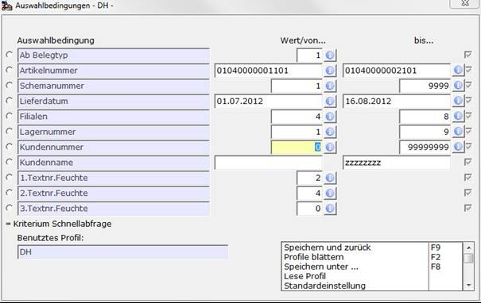

# Aufkauf-/Verkauf-Artikelmengenauswertung

<!-- source: https://amic.de/hilfe/_rwawtsw2_ekvk.htm -->

Hauptmenü > Rohwarenabrechnung > Auswertungen > Aufkauf-Artikelmengen-Auswertung

Hauptmenü > Rohwarenabrechnung > Auswertungen > VK-Artikelmengen-Auswertung

Direktsprung **[LST]** Variante *Rohwarenauswertungen*

Dieser Report liefert für ausgewählte Belege kumulierte Zahlen für Trockenmengen, Nassmenge und Schwund, summiert über den ausgewählten Zeitraum und gesondert für den letzten Tag des ausgewählten Zeitraums. Es werden dabei die Summen pro Artikelnummer gebildet. Zusätzlich werden als Einzelzeilen für jede Artikelnummer die Summen pro Filial-/Lager-Kombination ermittelt.  
Die Nassmenge ist immer die Bruttomenge der Warenposition der Belege. Auch Sekundärpositionen des Artikels in Rohwarebelegen werden berücksichtigt.

Zur Bestimmung der jeweiligen Trockenmenge und der Schwundmenge ist die Angabe der Qualitätstextnummer erforderlich, die für die Berechnung des Feuchtigkeitsabzugs bestimmt ist. Um unterschiedliche Schemaeinrichtungen in einer Auswertung berücksichtigen zu können, ist die Angabe von bis zu drei Qualitätstexten möglich. Werden dabei in einem Abrechnungsschema mehrere der angegebenen Qualitätstexte verwendet, so wird die verbleibende Menge nach Anwendung der Qualität mit der höchsten Abrechnungspositionsnummer, die eine der angegebenen Qualitätstexte nutzt und deren Warenbezug die Lieferposition ist, als Trockenmenge herangezogen.

Dabei ist zu beachten, dass die Schwundmenge die Menge ist, die durch die berücksichtigte Qualität berechnet wurde. Sind in der Reihenfolge des Abrechnungsvorgangs eines Belegs bereits vor dieser Qualität Mengenänderungen durch andere Qualitäten erfolgt, so ergibt die Differenz aus Nass- und Trockenmenge folgerichtig nicht unbedingt die Schwundmenge.

Die Angabe **‚Ab Belegtyp‘** mit den Ausprägungen

- **1** für Lieferscheine
- **2** für Abschlagbelege
- **3** für Folgeabschlagbelege
- **4** für Finalbelege

ermöglicht die Einschränkung der Auswertung auf bereits mindestens per Abschlag abgerechnete Belege oder auch auf bereits finalisierte Belege. Es werden aber immer nur Belege berücksichtigt, die nicht weiterverarbeitet sind. Auch bei der Angabe **‚Ab Belegtyp‘** = 1 (ab Lieferschein) werden bei bereits existenten Belegen zum Beispiel des Typs Abschlag die Abschlagbelege herangezogen.

