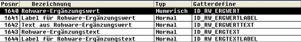

# Ergänzungs-Werte und –Texte in Rohware-Formular-Einrichtungen

<!-- source: https://amic.de/hilfe/ergnzungswerteundtexteinrohwar1.htm -->

Hauptmenü > Administration > Formulare/Abläufe > Formulare > Formulareinrichtung

Direktsprung **[FRM]**

In den Druck-Bereichen 

• 1 Kopf erste Seite

• 2 Kopf Folgeseite

• 11 Kopf erste Seite RW-Sammeldruck

• 12 Kopf Folgeseiten RW-Sammedruck

• 70 Rohwaren Anieferungszeile

• 80 Rohware-Sammeldr. Einzelkopfinfo

• 81 Rohware-Sammeldr. Einzelfußinfo

• 901 Fuß bis vorletzte Seite

• 902 Fuß letzte Seite

• 911 Fuß bis vorletzte Seite RW-Sammeldruck

• 912 Fuß/Abschluß RW-Sammeldruck

können Positionen zur Ausgabe von Rohware-Ergänzungsangaben eingerichtet werden.

Dazu stehen folgende Einrichtungspositionen zur Verfügung:

Für alle Positionen gilt: Im Detail-Bereich des Formulareinrichter-Moduls (FRM) muß im Feld **‚Parameter’** die Zeilennummer der korrespondierenden Definitionszeile aus der Rohwarengruppen-/Abrechnungsschemadefinition für den Ergänzungs-Wert bzw. –Text angegeben werden.

Die Position ‚Label...’ (1641,1644) erzeugt jeweils die Ausgabe der dort definierten Bezeichnung.

Der jeweilige Ergänzungs-Wert bzw. –Text selbst wird mit den Positionen 1640 bzw 1643 eingerichtet. Die Position 1642 für Ergänzungs-Werte erzeugt die Ausgabe des Ergebnisses des in der korrespondierenden Definitionszeile angegebenen privaten SQL-Textes.
