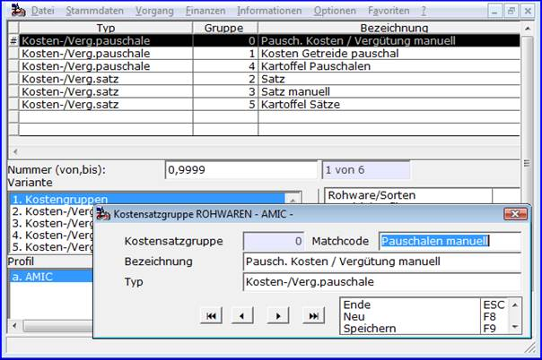
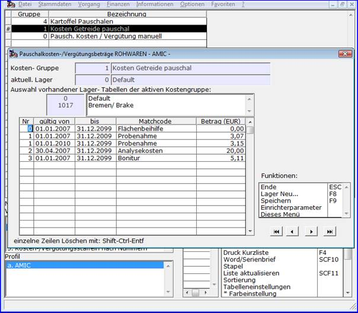
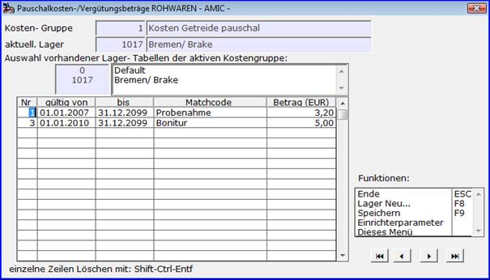
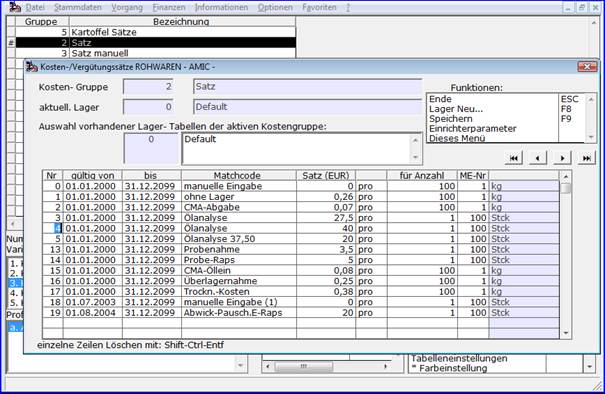
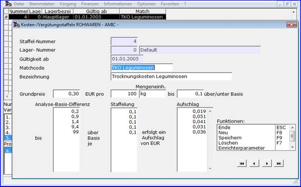

# Rohware-Kostengruppen für Kosten-/Vergütungssätze und -pauschalen

<!-- source: https://amic.de/hilfe/_rohwarekostengruppen.htm -->

Hauptmenü > Rohwarenabrechnung \> Kostengruppen Rohwaren

Unter diesem Menupunkt werden die in den in [Rohwarengruppen](../vorgehensweise_bei_der_einrichtung_von_abrechnungsschemata_s.md#Rohwarengruppendef) deklarierten und in [Abrechnungsschemata](../vorgehensweise_bei_der_einrichtung_von_abrechnungsschemata_s.md#Schemadef) näher definierten [Kosten- und Vergütungspositionen](../vorgehensweise_bei_der_einrichtung_von_abrechnungsschemata_s.md#KPosDef) verwendeten Kosten- und Vergütungspauschalen, Kosten- und Vergütungssätze sowie Kosten- und Vergütungsstaffeln gepflegt. Dabei sind mehrere Pauschalen wie auch Sätze (nicht jedoch Staffeln) zu Kostengruppen zusammenfassbar.  
    

Der **‚Typ‘** gibt an, ob es sich bei den Kostengruppen-Werten um **‚Kosten-/Verg.pauschale‘** oder **‚Kosten-/Verg.satz‘** handelt.  
Die **Kostengruppe ‚0‘** weist dabei eine **Besonderheit** auf: Alle Werte dieser Gruppe dienen bei der Erfassung von Rohwarebelegen nur zur **Vorbelegung** und können **manuell** überschrieben werden.  
    

Pauschalkosten-/Vergütungsbeträge

Hauptmenü > Rohwarenabrechnung \> Kostengruppen Rohwaren > Variante Kosten-/Vergütungspauschalen

Ein in einer Abrechnung heranzuziehender Pauschalwert wird per Kostengruppe und Kostennummer sowie dem größten ‚gültig von‘-Datum, das kleiner als das Beleg-Lieferdatum ist spezifiziert. Gesucht wird dabei zunächst mit der **Lagernummer** des Rohwarebeleges. Wird so kein Eintrag gefunden, so wird der Betrag mit der **Lagernummer ‚0‘** bestimmt. Es müssen für andere Läger als Lager ‚0‘ demnach nur hiervon abweichende Beträge gepflegt werden.

Einträge mit der **Nummer ‚0‘** weisen die **Besonderheit** auf, dass die Werte bei der Erfassung von Rohwarebelegen nur zur **Vorbelegung** dienen und **manuell** überschrieben werden können. Für Pauschalen anderer Nummern gilt dieses nur, wenn sie der Kostengruppe ‚0‘ zugeordnet sind.

    
Kosten-/Vergütungssätze

Hauptmenü > Rohwarenabrechnung \> Kostengruppen Rohwaren > Variante Kosten-/Vergütungssätze

Ein in einer Abrechnung heranzuziehender Kosten-/Vergütungssatz zu einer durch die Kostendefinition näher bestimmten Menge wird per Kostengruppe und Kostennummer sowie dem größten ‚gültig von‘-Datum, das kleiner als das Beleg-Lieferdatum ist spezifiziert. Gesucht wird dabei zunächst mit der **Lagernummer** des Rohwarebeleges. Wird so kein Eintrag gefunden, so wird der Betrag mit der **Lagernummer ‚0‘** bestimmt. Es müssen für andere Läger als Lager ‚0‘ demnach nur hiervon abweichende Beträge gepflegt werden.  
Einträge mit der **Nummer ‚0‘** weisen die **Besonderheit** auf, dass die Werte bei der Erfassung von Rohwarebelegen nur zur **Vorbelegung** dienen und **manuell** überschrieben werden können. Für Kosten-/Vergütungssätze anderer Nummern gilt dieses nur, wenn sie der Kostengruppe ‚0‘ zugeordnet sind.

Kosten-/Vergütungsstaffeln

Hauptmenü > Rohwarenabrechnung \> Kostengruppen Rohwaren > Variante Kosten-/Vergütungsstaffeln

Ein in einer Abrechnung heranzuziehende Kosten-/Vergütungsstaffel zu einer durch die Kostendefinition näher bestimmten Menge wird durch die **Staffelnummer** und **Lagernummer** identifiziert. Gesucht wird dabei zunächst mit der **Lagernummer** des Rohwarebeleges. Wird so kein Eintrag gefunden, so wird die Staffel mit der **Lagernummer ‚0‘** herangezogen.  
Das Abrechnungsmodul bestimmt zur Analysewert/Basis-Differenz der in der Kostendefinition angegebenen Qualitätsreferenz die obere Grenze der Staffelung. Ist dieser Wert kleiner oder gleich 0, so wird grundsätzlich der Wert 0,00 als Kosten-/Vergütungssatz bestimmt. Andernfalls wird auf den Grundpreis der jeweilige Aufschlag in jedem Intervall entsprechend der Staffelung bis zum Erreichen dieser Staffelgrenze addiert. Das Ergebnis ist dann der resultierende Kosten-/Vergütungssatz pro angegebener Anzahl von Mengeneinheiten der Kosten-/Vergütungsposition.

Beispiel: Bei einem angenommenen Wert von 1,6 für die dargestellte Tabelle ergäbe sich ein Kostensatz von 0,953 Euro pro 100 kg.  
Rechnung:  
 Grundpreis 0,300 bis 0,1  
\+ 1. Staffel 0,019 (1 \* 0,019) bis 0,2 = 1 \* 0,1   
\+ 2. Staffel 0,375 (7 \* 0,051) bis 0,9 = 7 \* 0,1  
\+ 3. Staffel 0,205 (5 \* 0,041) bis 1,4 = 5 \* 0,1  
\+ 4. Staffel 0,072 (2 \* 0,031) bis 1,6 = 2 \* 0,1  
Summe 0,953
