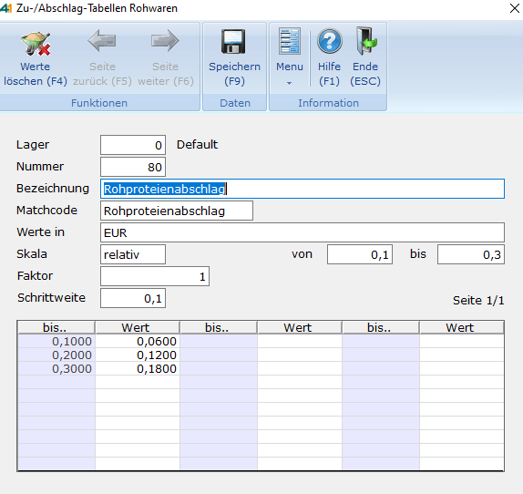

# Rohware-Tabellen für Zu- und Abschläge

<!-- source: https://amic.de/hilfe/rohwaretabellenfrzuundabschlge.htm -->

Hauptmenü > Rohwarenabrechnung \> Tabellen für Zu-/Abschläge RW

In [Rohwarengruppen](../vorgehensweise_bei_der_einrichtung_von_abrechnungsschemata_s.md#Rohwarengruppendef) deklarierte und in [Abrechnungsschemata](../vorgehensweise_bei_der_einrichtung_von_abrechnungsschemata_s.md#Schemadef) näher definierte [Qualitäten](../vorgehensweise_bei_der_einrichtung_von_abrechnungsschemata_s.md#QPosDef) können unter anderem mittels Tabellen für Zu- und Abschläge bei der Abrechnung eines Rohwarebeleges einen Zuschlag oder Abschlag auf Menge oder Preis einer bestimmten Warenposition bewirken. Dabei kann die Ermittlung eines Zu- oder Abschlagwertes auf unterschiedliche Art erfolgen. Grundsätzlich handelt es sich jedoch immer um eine Art LOOKUP-Verfahren, in dem zu einem Indexwert ein Ergebniswert aus einer Tabelle bestimmt wird. Die Angabe im Feld ‚**Werte in**‘ bestimmt zunächst, wie der Ergebniswert der Tabelle zu interpretieren ist:

• **Prozentsatz vom Preis**

• **Prozentsatz von der Menge**

• absolut in Währungseinheiten (zum Beispiel **EUR** bei Euro)  
(festgelegt durch den Steuerparameter ‚Währungsnummer für Rohwaretabellen‘)

• absolut in **Mengeneinheiten** (der bezogenen Warenposition) 

Mit dem Wert im Feld ‚**Faktor**‘ (in der Regel ‚1‘) wird der gefundene Ergebniswert der Tabelle multipliziert.

Der Skalentyp ‚**fix**‘ bewirkt, dass der zugrundeliegende Analysewert direkt als Indexwert herangezogen wird. Die Angabe ‚**relativ**‘ hingegen berechnet den Indexwert als Differenz zwischen Analyse- und Basiswert der Qualität.

Die Angaben in den Feldern ‚**von**‘, ‚**bis**‘ und ‚**Schrittweite**‘ legen die **Indexwerte** der Tabelle für die Pflege fest, zu denen dann Ergebniswerte eingetragen werden.

Die Felder ‚**von‘**, ‚**bis**‘ und ‚**Schrittweite**‘ sind Pflichtfelder. Dort bestimmt man, wie die untere Tabelle aufgebaut wird, von Anfangs - bis Endwert und benötigte Schrittweite.

**Achtung**: Sollte einer der 3 Werte nachträglich geändert werden, gehen alle dort schon eingerichteten Informationen verloren.

 **Zu beachten** ist jedoch, dass das Abrechnungsmodul bei über den hier festgelegten letzten Indexwert auftretendem Indexwert einen Ergebniswert aus den für die letzten beiden Indexwerte eingetragenen (zugeordneten) Ergebniswerten zu ermitteln. Dieses geschieht durch dynamisches Fortschreiben der Tabelle mit der angegebenen Schrittweite und der Differenz der letzten beiden Ergebniswerte. So wäre der Ergebniswert für obiges Beispiel bei einer Analysewert/Basiswertdifferenz von 1,1 = 0,66  
(Indexwert 1,1 – letzter Indexwert 0,3 = 0,8 Indexdifferenz  
 = 8 \* Schrittweite 0,1   
 also 8 \* (letzter Ergebniswert 0,18 – vorletzter Ergebniswert 0,12) = 0,48  
 und daher 0,48 + 0,18 = 0,66 Ergebniswert zu Indexwert 1,1)

Der Ergebniswert von 0,48 wird in dem Beispiel für alle Analysewert/Basiswertdifferenzen ermittelt, die größer als 1,0 und kleiner oder gleich 1,1 sind.

**Besonderheiten der Lagernummer**: Das Abrechnungssystem sucht eine Zu-/Abschlag-Tabelle zunächst mit der Lagernummer des Rohwarebeleges. Ist diese nicht eingerichtet, so wird auf die Tabelle zur Lagernummer ‚0‘ zurückgegriffen.

| Funktion | Bedeutung |
| --- | --- |
| Werte löschen | Löscht alle Werte in den 3 Wertspalten auf der aktuellen Seite. |
| Seite vor | Bei mehr als einer Seite von Zu-Abschlagswerten blättert man weiter auf die nächste Seite. Diese Funktion steht nur zur Verfügung, wenn man nicht auf der letzten Seite von Zu-Abschlagswerten ist. |
| Seite zurück | Bei mehr als einer Seite von Zu-Abschlagswerten blättert man zurück auf die vorherige Seite. Diese Funktion steht nur zur Verfügung, wenn man nicht auf der ersten Seite von Zu-Abschlagswerten ist. |
