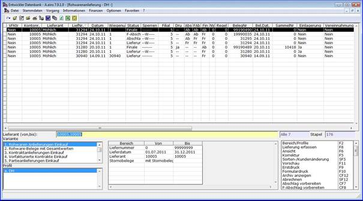

# Auswahllisten zur Rohwarenbearbeitung

<!-- source: https://amic.de/hilfe/auswahllistenzurrohwarenbearbe.htm -->

Hauptmenü > Rohwarenabrechnung > Rohwarenabrechnung > EK-Rohwarenbearbeitung

Direktsprung **[RWB]**

Hauptmenü > Rohwarenabrechnung > Rohwarenabrechnung > VK-Rohwarenbearbeitung

Direktsprung **[RWBV]**

Eine Reihe von Auswahlvarianten ermöglicht die Übersicht der vorhandenen Rohwarebelege nach unterschiedlichen Kriterien und Bearbeitungsmöglichkeiten.

Aus Performance-Gründen sind nicht alle Attribute in allen Varianten dargestellt. Grundsätzlich ist es sinnvoll, mit der zugehörigen Bereichsauswahl die Auswahl der darzustellenden Belege einzuschränken. So weist die Variante ‚*Rohware-Belege mit Gesamtwerten*‘ zum Beispiel Attribute auf, die ‚on the Fly‘ ermittelt werden:

• **GesamtNetto**: Nettosumme des Beleges inklusive der Werte vorhergehender Abschlagbelege

• **GesamtSteuer**: Steuersumme des Beleges inklusive der Werte vorhergehender Abschlagbelege

• **GesamtBrutto**: Bruttowert des Beleges inklusive der Werte vorhergehender Abschlagbelege

• **Bruttomenge**: Liefermenge der Hauptwarenposition des Beleges

• **Nettomenge**: Errechnete Ergebnismenge der Hauptwarenposition des Beleges inklusive der Werte vorhergehender Abschlagbelege

• **Wert gesamt**: Berechneter Wert aus **GesamtNetto / Nettomenge**

• **TeilNetto**: Nettosumme des Beleges abzüglich der Werte vorhergehender Abschlagbelege

• **TeilSteuer**: Steuersumme des Beleges abzüglich der Werte vorhergehender Abschlagbelege

• **TeilBrutto**: Bruttosumme des Beleges abzüglich der Werte vorhergehender Abschlagbelege

• **TeilNettomenge**: Errechnete Ergebnismenge der Hauptwarenposition des Beleges abzüglich der Werte vorhergehender Abschlagbelege

• **Teilwertgesamt**: Berechneter Wert aus **TeilNetto / Nettomenge**

• **Teilwert:**: Berechneter Wert aus **TeilNetto / TeilNettomenge**

Mit Ausnahme der Mengen stehen diese Werte nur für Lieferungen und abgerechnete Belege zu Verfügung.
