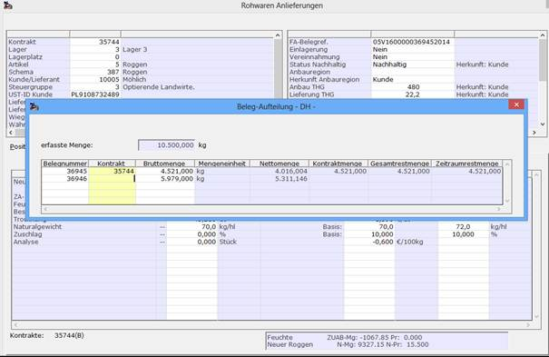
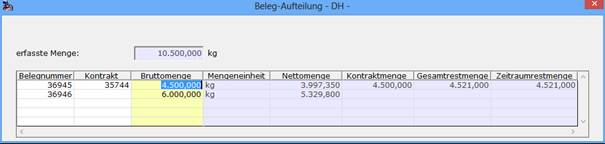
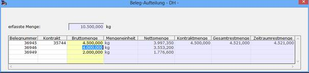
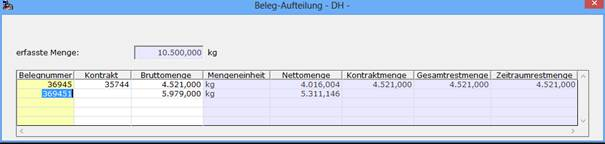
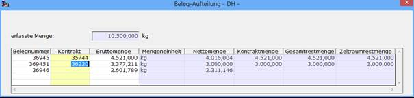
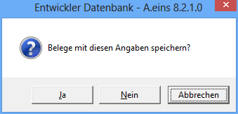

# Optionales Belegsplitting bei Kontraktmengenüberlauf

<!-- source: https://amic.de/hilfe/_rwoptionalbelegsplitting.htm -->

Hauptmenü > Rohwarenabrechnung > Rohwarenabrechnung > EK-Rohwarenbearbeitung > Lieferung erfassen

Direktsprung **[RWB]**

Hauptmenü > Rohwarenabrechnung > Rohwarenabrechnung > VK-Rohwarenbearbeitung > Lieferung erfassen

Direktsprung **[RWBV]**

Wird die Erfassung eines Rohwarelieferscheins abgeschlossen, so kann bei zugeordnetem Kontrakt zur Lieferposition und nicht ausreichender Gesamt-Restmenge oder Zeitraumrestmenge des Kontrakts bezüglich der erfassten Menge bei einem Bruttomengenkontrakt beziehungsweise der errechneten Nettomenge bei einem Nettomengenkontrakt bei entsprechender Einstellung des Rohwareparameters [RWPA] [*Erfassungsbeleg teilen bei Übermenge*](../../rohwareparameter_einrichten/rohwareparameter_uebersicht.md#RWPA_178) das Öffnen einer Maske zur Belegteilung erzwungen werden.

ACHTUNG: Es ist dabei zu beachten, dass manuelle Qualitäts-Zu-/-Abschlag-Ergebnisse und manuelle Kosten-/Vergütungsbeträge auch so in die Folgebelege übernommen werden!

Das A.eins-System schlägt in der ersten Zeile eine Reduzierung der erfassten Menge derart vor, dass die verbleibende Brutto- beziehungsweise Nettomenge der offenen Restmenge oder Zeitraumrestmenge des angesprochenen Kontrakts entspricht. Die zweite Zeile enthält zunächst die Differenzmenge zur ursprünglich erfassten Menge als Bruttomenge, die in einem weiteren zunächst kontraktlosem Vorgang eingestellt wird. Die Werte der Bruttomengenspalte können, zum Beispiel zur Rundung, geändert werden, was aber grundsätzlich zur Neuberechnung der nachfolgenden Zeilen führt.

Dadurch ist gewährleistet, dass die Summe der Bruttomengen immer der der ursprünglich erfassten Menge entspricht. Wird die Bruttomenge der letzten Zeile manuell reduziert, so wird mit der daraus resultierenden Differenzmenge eine zusätzliche Zeile für einen weiteren Beleg erzeugt.

Für alle Zusatzbelege, nicht jedoch für den ursprünglichen Beleg in der ersten Zeile, kann die jeweils vorgeschlagene Belegnummer manuell geändert werden. Diese muss aber entsprechend dem der Vorgangsklassen-/-unterklassen-Kombination zugeordneten Nummernkreis passend gewählt werden.

In der Kontrakt-Spalte kann für jeden Zusatzbeleg wiederum ein passender Kontrakt angegeben werden. Dabei wird wiederum die offene Restmenge sowie die Zeitraumrestmenge des Kontrakts mit der Bruttomenge bei einem Bruttomengenkontrakt beziehungsweise Nettomenge bei einem Nettomengenkontrakt geprüft und gegebenenfalls mit einem weiteren Beleg aufgeteilt.

Mit der ESC-Taste wird die Bearbeitung der Maske beendet und es erscheint eine Abfrage, ob die Belege mit den gemachten Angaben gespeichert werden sollen.

Mit *‚Abbrechen‘* wird in der Maske verblieben, um noch Korrekturen vornehmen zu können. Die Beantwortung mit *‚Nein‘* bewirkt die Rückkehr zur ursprünglichen Erfassungsmaske und der Abfrage, ob der mit der vollen Menge erfasste Beleg trotz Kontraktmengenüberschreitung gespeichert werden soll. Wird dieses abgelehnt befindet man sich wieder im ursprünglichen Erfassungsmodus. Mit der Angabe *‚Ja‘* wird die ursprüngliche Belegerfassung mit speichern des mengenkorrigierten Hauptbelegs und der erzeugten Zusatzbelege abgeschlossen.
