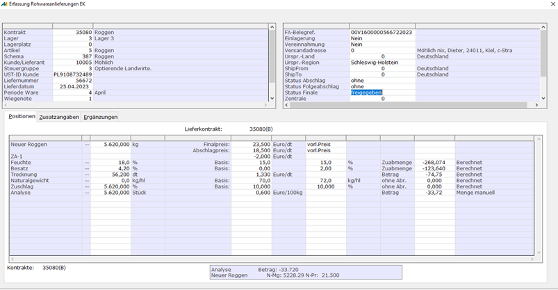

# Rohwarebelege korrigieren

<!-- source: https://amic.de/hilfe/rohwarebelegekorrigieren.htm -->

Hauptmenü > Rohwarenabrechnung > Rohwarenabrechnung > EK-Rohwarenbearbeitung > Korrektur

Direktsprung **[RWB]**

Hauptmenü > Rohwarenabrechnung > Rohwarenabrechnung > VK-Rohwarenbearbeitung > Korrektur

Direktsprung **[RWBV]**

  
Je nach Bearbeitungsstatus und Einstellung der Rohwarenparameter [RWPA] können die Angaben der ausgewählten Rohwarebelege hier abgeändert werden. Dabei ist zu beachten, dass ein bereits entsprechend seiner Stufe abgerechneter Beleg beim Aufruf zu Korrektur wieder in den Status *‚freigegeben‘* zurückgesetzt wird. Bei entsprechender Einstellung des Rohwareparameters [*Abrechnung nach Belegkorrektur*](../rohwareparameter_einrichten/rohwareparameter_uebersicht.md#RWPA_172) kann der Beleg nach erfolgreichem Abschluss der Korrektur aber automatisch durch das Modul in den abgerechneten Zustand versetzt werden.  
Nicht geändert werden können hier die Attribute Kunde bzw. Lieferant, Liefernummer und Lieferdatum.  
Natürlich können z.B. in einem Beleg der Stufe *Finalabrechnung* auch keine Zahlungsbedingungswerte etc. der Stufe *Abschlag* oder *Folgeabschlag* geändert werden.  
Kontraktzuordnungen sowie Lager, Artikel und Abrechnungsschema können bis zu Belegen der ersten Rechnungsstufe geändert werden.  
Bei der Änderung von Lager, Artikel und Abrechnungsschema werden eventuell bereits gemachte Angaben im Positionsteil (Mengen, Preise, Analysewerte etc.) auf ein gegebenenfalls wechselndes Abrechnungsschema übertragen, sofern die Identifizierung der einzelnen Positionen per übereinstimmender Referenznummer laut Abrechnungsschemadefinition gegeben ist.  
Die manuell gesetzten Werte in Menge, Preis und Manuell können nach der Erfassung geändert werden, was zur Neuberechnung der anderen Werte führt.

Es können mit diesem Modul nur Belege korrigiert werden, die als nicht weiterverarbeitet gekennzeichnet sind und nicht Teil eines existierenden Sammeldruckbelegs sind.

Zur Orientierung befindet sich in der ersten Maskenzeile ein Informationsfeld, dass im Korrektur- oder Ansicht-Modus Angaben über den Beleg-Status ausweist. Hier wird neben der aktuellen Belegstufe (Lieferung, Abschlag, Folgeabschlag, Finale) und zugehörigem Belegdatum gegebenenfalls auch die Sammeldrucknummer nebst Sammeldruckdatum ausgewiesen, wenn der Beleg Teil eines Sammeldrucks ist. Bei Stornobelegen wird das Wort ‚Storno‘ vorangestellt.  
Mit einer im Einrichterparameter ‚*Prozedurname für die freie Anzeige*‘ festlegbaren privaten Datenbankfunktion kann diese Anzeige durch einen durch die Datenbankfunktion zurückgelieferten Text ersetzt werden. Einer solchen privaten Datenbankfunktion wird als Parameter die V_Id des Belegs übergeben. Die Definition muss demnach etwa wie folgt vorgenommen werden:

Create function meineFunktion (in in_v_id integer default 0)  
returns char(256)  
BEGIN  
 declare dc_infotext char(256);

 .

 .

 .

 return dc_infotext; 

END

Bei der Korrektur von Rohwarebelegen können wie bei der Erfassung jeder Wert der Qualitäts-Zu-/-Abschlag-Ergebnisse oder Kosten-/Vergütungsbetrages manuell überschrieben werden.
