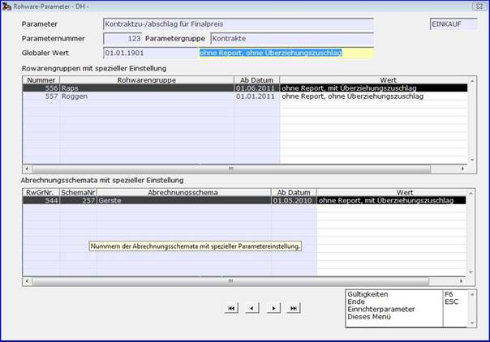

# Rohwareparameter ansehen

<!-- source: https://amic.de/hilfe/_rwparansicht.htm -->

Hauptmenü > Administration > Steuerung > Steuerparameter zeigen > Rohwareparameter ansehen

Direktsprung **[SPA]**

Direktsprung **[RWPA]**

****

Im Kopfbereich der Maske wird der Rohwareparameter mit Bezeichnung, Nummer und Gruppe sowie der Bereich ‚***Einkauf***‘ beziehungsweise ‚***Verkauf***‘ zur Orientierung dargestellt. Die aktuell gültige globale Einstellung des Parameters ist mit Beginn der Gültigkeit und dem Parameterwert angegeben.

Im Maskenbereich ‚***Rohwarengruppen mit spezieller Einstellung***‘ sind alle Rohwarengruppen, die bezüglich des Parameters über eigene Einstellungen verfügen, mit dem derzeit gültigen Wert und dem Beginn der zugehörigen Gültigkeit in aufsteigender Reihenfolge der Rohwarengruppennummer dargestellt.

Entsprechend werden ‚***Abrechnungsschemata mit spezieller Einstellung***‘ in der Reihenfolge ihrer zugehörigen Rohwarengruppennummern und, innerhalb dieser, der Abrechnungsschemanummern dargestellt.

Nach Positionierung des Cursors auf ein ‚***Wert***‘-Feld, kann mit der Funktion ‚Gültigkeiten‘ die zu diesem Parameterwert vorhandene Gültigkeitsliste zur Ansicht aufgerufen werden.
