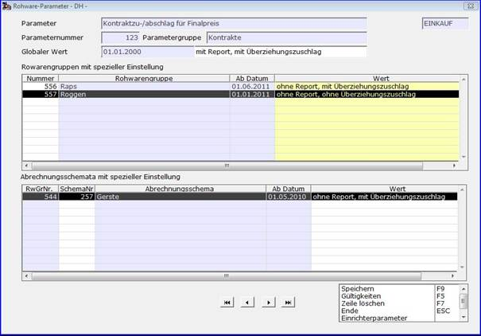

# Rohwareparameter pflegen

<!-- source: https://amic.de/hilfe/_rwparpflegen.htm -->

Hauptmenü > Administration > Steuerung > Steuerparameter zeigen > Rohwareparameter pflegen

Direktsprung **[SPA]**

Direktsprung **[RWPA]**

Im Kopfbereich der Pflegemaske wird der Rohwareparameter mit Bezeichnung, Nummer und Gruppe sowie der Bereich ‚***Einkauf***‘ beziehungsweise ‚***Verkauf***‘ zur Orientierung dargestellt. Die aktuell gültige globale Einstellung des Parameters ist mit Beginn der Gültigkeit und dem Parameterwert angegeben.

Im Maskenbereich ‚***Rohwarengruppen mit spezieller Einstellung***‘ sind alle Rohwarengruppen, die bezüglich des Parameters über eigene Einstellungen verfügen, mit dem derzeit gültigen Wert und dem Beginn der zugehörigen Gültigkeit in aufsteigender Reihenfolge der Rohwarengruppennummer dargestellt.

Entsprechend werden ‚***Abrechnungsschemata mit spezieller Einstellung***‘ in der Reihenfolge ihrer zugehörigen Rohwarengruppennummern und, innerhalb dieser, der Abrechnungsschemanummern dargestellt.

Um spezielle Einstellungen für eine Rohwarengruppe, die sich noch nicht in der Liste befindet, hinzuzufügen, wird im Grid ‚***Rohwarengruppen mit spezieller Einstellung***‘ die betreffende Rohwarengruppennummer in der Spalte ‚***Nummer***‘ eingetragen. Hierfür steht zur Unterstützung der Auswahl eine Item-Box zur Verfügung, die die noch nicht berücksichtigten Rohwarengruppen enthält. Es wird dann zunächst sowohl die aktuelle als auch die Grundeinstellung aus der Gültigkeitsliste der globalen Werteinstellung des Parameters für diese Rohwarengruppe übernommen.

Spezielle Einstellungen für ein Abrechnungsschema werden im Grid ‚***Abrechnungsschemata mit spezieller Einstellung***‘ durch Eingabe der Schemanummer, gegebenenfalls ebenfalls mit Item-Box-Unterstützung, hinzugefügt. Gibt es bereits eine spezielle Einstellung zur Rohwarengruppe des Abrechnungsschemas, so werden aktueller Wert und Grundeinstellung aus dieser, sonst ebenfalls aus der globalen Werteinstellung übernommen. Entgegen früherer Programmversionen ist es nicht mehr erforderlich, zunächst eine spezifische Einstellung der Rohwarengruppe vorzunehme, um spezielle Parameterwerte für ein Abrechnungsschema pflegen zu können.

Soll eine Rohwarengruppe oder ein Abrechnungsschema aus der Liste mit speziellen Einstellungen entfernt werden, so kann dieses durch Positionieren des Cursors auf den Wert der entsprechenden Zeile und Ausführung der Funktion ‚Zeile löschen‘ geschehen. 

Die Änderbarkeit der Parameterwerte auf der Maske wird durch den Erfassungsparameter (EPA) ‚***Parameterwerte auf Hauptmaske***‘ mit folgenden Einstellungen festgelegt:

• **Nur per Gültigkeitsaufruf erlaubt  
**Der Parameterwerte können nur durch Aufruf der Funktion ‚Gültigkeiten‘ zum aktuell fokussierten Maskenfeld vorgenommen werden. Hier wird eine Liste mit allen Gültigkeiten und zugehörigen Werten dargestellt und kann bearbeitet werden.

• **Mit Tagesdatum als Gültigkeitsbeginn  
**Bei dieser Einstellung können die Werte des Parameters direkt auf der Maske geändert werden, es wird jedoch, sofern die Gültigkeit des zu ändernden Wertes nicht mit dem aktuellen Tagesdatum beginnt, ein neuer Gültigkeitssatz zum aktuellen Datum mit dem neuen Wert erzeugt.

• **immer erlaubt**Diese Einstellung bewirkt, dass ein Ändern eines Wertes auf der Hauptmaske die Gültigkeit des ursprünglichen Wertes erhält.

Werte mit Gültigkeitsbeginn ‚01.01.1901‘ können grundsätzlich nicht geändert werden, da diese die Grundeinstellungen des A.eins-Systems beinhalten.

Änderungen des Erfassungsparameters werden erst nach Verlassen und erneutem Aufruf der Maske wirksam.

**Zu beachten:** Alle Änderungen zu einem Rohwareparameter werden erst bei beenden der Bearbeitung für den aktuellen Parameter gespeichert, also beim Blättern, Ausführen der Funktion ‚Speichern‘ oder beim Verlassen der Maske. Im Falle des Verlassens der Maske mit ‚ESC‘ erscheint bei vorhergehenden Wertänderungen eine Abfrage, ob die Daten gespeichert werden sollen. An dieser Stelle besteht die Möglichkeit, die Änderungen zu diesem Parameter durch die Anwahl von ‚Nein‘ zu verwerfen.
