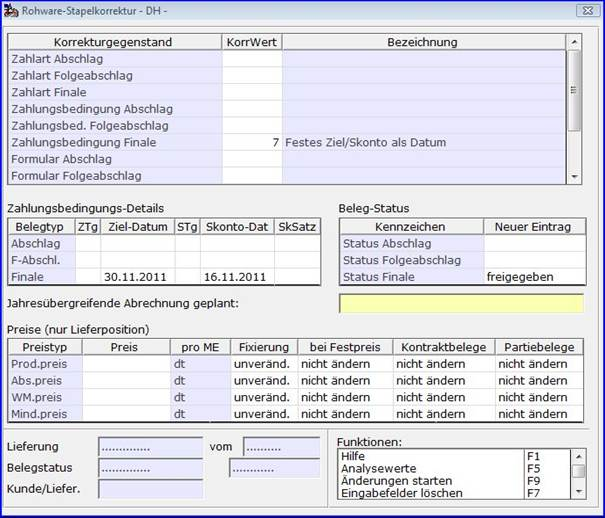

# Stapelkorrektur

<!-- source: https://amic.de/hilfe/stapelkorrektur.htm -->

Hauptmenü > Rohwarenabrechnung > Rohwarenabrechnung > EK-Rohwarenbearbeitung

Direktsprung **[RWB]**

Hauptmenü > Rohwarenabrechnung > Rohwarenabrechnung > VK-Rohwarenbearbeitung

Direktsprung **[RWBV]**

Im Modul Rohwarenbearbeitung können in der Auswahlvariante *‘ Rohwarestapelkorrektur’* Änderungen für mehrere Belege gleicher Stufe in einem Arbeitsschritt durchgeführt werden.

Hier wird mit der Funktion ‚*Stapelkorrektur*’ eine Maske zur Eingabe diverser zu ändernder Daten aufgerufen. Grundsätzlich können nur Lieferungen und nicht gedruckte und nicht gebuchte Abrechnungsbelege der Stufen Abschlag, Folgeabschlag und Finale korrigiert werden, wenn diese noch nicht weiterverarbeitet sind.

Es werden nur Daten zur Änderung angeboten, die aufgrund der Stufe der ausgewählten Belege änderbar sind. So können zum Beispiel in Final-Belegen keine Abschlagdaten geändert werden.  
Analysewerte werden mittels der Funktion ‚*Analysewerte*‘ nur dann zur Änderung angeboten, wenn alle ausgewählten Belege genau einer Rohwarengruppe zugeordnet sind und es sich bei den Belegen um nicht gedruckte und nicht gebuchte Rechnungen handelt. Analysewertkorrekturen für Lieferungen sind an dieser Stelle nicht möglich.  
Die gewünschten Änderungen werden mittels der Funktion ‚*Änderungen starten*‘ in allen ausgewählten Belegen durchgeführt. Wird dabei ein bereits abgerechneter Beleg verändert, so wird das Abrechnungskennzeichen auf ‚*Freigegeben*‘ zurückgesetzt.

Wird in der Stapelkorrektur ein Analysewert, unterer Basiswert oder oberer Basiswert geändert, so wird im zugehörigen zu änderndem Beleg ein gegebenenfalls manuell überschriebener Qualität-Zu-/-Abschlag bzw. Kosten-/Vergütungsbetrag auf nicht manuell zurückgesetzt und neu berechnet.
