# Vorgehensweise bei der Einrichtung von Abrechnungsschemata (Sorten)

<!-- source: https://amic.de/hilfe/vorgehensweisebeidereinrichtun.htm -->

Hauptmenü > Rohwarenabrechnung \> Rohwaren-Verwaltung

Direktsprung **[RWG]**

Die Richtigkeit der Definition von Abrechnungsschemata in der Rohware ist wesentlicher Bestandteil des Gesamtsystems. Gehen Sie dabei wie folgt vor:

1. Zunächst gruppieren Sie Ihre Artikel, die im Einkauf und/oder Verkauf per Rohwarenabrechnung zu behandeln sind in sinnvolle Rohwarengruppen. Ein einzelner Artikel wird im Artikelpflegemodul keiner oder genau einer Rohwarengruppe zugeordnet. Natürlich können mehrere Artikel einer Rohwarengruppe zugeordnet werden. Soll ein Artikel zum Beispiel für unterschiedliche Kunden- oder Lieferantengruppen auf unterschiedliche Art und Weise abgerechnet werden, so werden zu diesem Zweck in der entsprechenden Rohwarengruppe unterschiedliche Abrechnungsschemata angelegt. 

2\. Schreiben Sie alle Abrechnungsschemata (Sorten), die abgerechnet werden sollen, mit folgenden Hinweisen auf ein Blatt Papier:

a) Name des Abrechnungsschemas (z.B. Sorte "Gerste normal")

b) Alle relevanten Qualitätskriterien mit den jeweiligen Basiswerten

- z.B. "Feuchtigkeit", Basis 15,0 bis 15,5 %
- z.B. "Protein", Basis 12,5 %

  c) Alle relevanten Kostenkriterien

- z.B. " Trocknungskosten
- z.B. Probenahmekosten
- z.B. Reinigungskosten

  d) Alle Waren- und Finanzkonten, die von diesem Abrechnungsschema angesprochen werden sollen.

- Artikelnummer

  Sachkonten (Ware / Dienstleistung)

  3. Prüfen Sie in den Programmen WAWI und FIBU, ob alle relevanten Waren- und Finanzkonten vorhanden sind.

  4. Legen Sie in nun die benötigten Rohwarengruppen und Abrechnungsschemata an.

  Rohwarengruppen\-Definition

  Hauptmenü > Rohwarenabrechnung \> Rohwaren-Verwaltung

  Direktsprung **[RWG]**

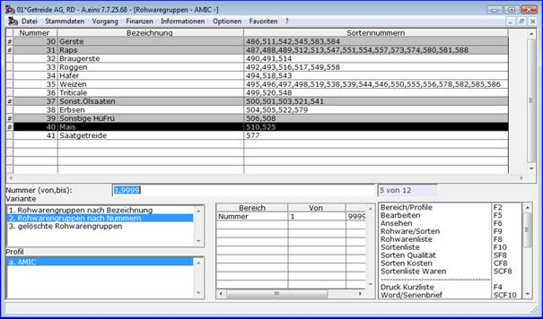

  Mittels der Funktionen ‚**Rohware/Sorten‘, ‚Rohwarenliste‘, ‚Sortenliste‘, ‚Sorten Qualität‘, ‚Sorten Kosten‘** und **‚Sortenliste Waren‘** können diverse CRW-Reports der Rohware-Einrichtungsdetails erstellt werden.  
Die Funktion **‚Bearbeiten‘** ermöglicht die Änderung wie auch die Erstellung neuer Rohwarengruppen. Dabei ist zu beachten, dass eine neue Rohwarengruppe auch als Kopie einer bestehenden Rohwarengruppe erzeugt werden kann. Ist noch keine echte Rohwarengruppe im System vorhanden, so ist als Quelle in der Auswahlliste die (leere) Rohwarengruppe ‚0‘ zu wählen, die aber selbst nicht geändert werden sollte!  
Die Funktion **‚Ansehen‘** ruft dieselbe Maske wie die Funktion Bearbeiten auf, es können jedoch keine Einrichtungsdaten geändert werden. 

  Im Allgemeinen verstehen sich Rohwarengruppen als Generaleinrichtung für eine oder mehrere Rohware-Abrechnungsschemata (Sorten).

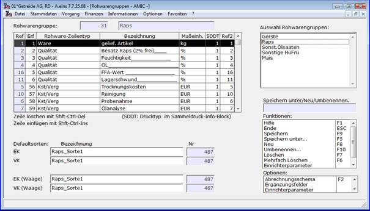

  Hier sind die Abrechnungskriterien zu erstellen, die in den zugehörigen Abrechnungsschemata verwendet werden sollen. Ein einzelnes Abrechnungsschema muss dabei nicht alle Kriterien der Rohwarengruppe berücksichtigen.

  Es wird unterschieden nach Abrechnungstypen:

  Ware Abrechnungsmaterial -> gelieferter Artikel (immer erste Position mit Ref = 1)  
 Sekundärartikel (z.B. Sortierposition, die einem anderen Artikel zugeordnet ist)

  Qualität Qualitäten, die die Bruttomenge und den Bruttopreis beeinflussen können

  Kst/Verg Kosten / Vergütungen

  Neue Rohwarengruppen sind sinnvoll durch ***‘Speichern Unter’*** =Abspeichern unter einem neuen Namen zu erstellen oder durch **‚Neu‘** von Grund auf neu zu erstellen. Die Nummer der Rohwarengruppe wird vom System automatisch vergeben.

  Meist ist eine Anordnung sinnvoll, die eine Fruchtart einer Rohwarengruppe zuordnet. Innerhalb dieser gibt es dann verschiedene Abrechnungsschemata für unterschiedliche Abrechnungsvarianten (Sorten).  
    

Übersicht der Grid-Spalten einer Rohwarengruppe

  Die Referenznummern der Spalte ‚Ref‘ werden immer automatisch vom System vergeben. Sie dienen in Verbindung mit der Rohwarengruppe der eindeutigen Identifizierung einer Rohwaren-Positionszeile in Rohware-Belegen bei Bearbeitung, Abrechnung, Buchungen, Druck und Auswertungen.

  Die Reihenfolge des Aufbaus der Erfassungszeilen in der Rohwaren-Beleg-Bearbeitung legt die Spalte **‚Erf‘** fest. Die 1. Position (Lieferposition vom Typ Ware) sollte den Wert 1 tragen. Unabhängig von den Werten dieser Spalte werden Positionszeilen des Typs Kosten/Vergütung grundsätzlich nach den Waren- und Qualitätspositionen im Rohwaren-Beleg-Bearbeitungsmodul dargestellt.

  Die Spalte **‚Bezeichnung‘** beschreibt je nach Zeilentyp die Position durch die Bezeichnung des zugeordneten [Qualitätstextes](./konstanten_und_tabellen_fuer_die_einrichtung_von_abrechnungs/rohware_kostentexte.md), [Kostentextes](./konstanten_und_tabellen_fuer_die_einrichtung_von_abrechnungs/rohware_kostentexte.md) bzw. den Festtexten ‚gelief. Artikel‘ für die Lieferposition und ‚Warenposition n‘ mit n als fortlaufender Nummer für Sekundärwarenpositionszeilen.

  Die Spalte **‚Maßeinheit‘** ordnet für Waren- und Kosten-/Vergütungszeilen den Mengenangaben eine [Rohwaremaßeinheiten](./konstanten_und_tabellen_fuer_die_einrichtung_von_abrechnungs/rohware_masseinheiten.md) mit Mengeneinheit-Verknüpfung zu. Qualitätszeilen werden hier ebenfalls Maßeinheiten als Maß für die Analyse- und Basiswerte zugeordnet.

  Werden mehrere Abrechnungen per Sammeldruckformular abgerechnet und gedruckt, so wird intern temporär pro Referenznummer zusätzliche virtuelle Positionszeile als Summenzeile aller Positionen dieser Referenznummer erzeugt, die auf Sammeldruck-Formularen gesondert eingerichtet werden können ( Druck-Bereich 85 bis 89 ). In der Grid-Spalte **‚SDDT‘** (Drucktyp im Sammeldruck-Info-Block) ist der Drucktyp einzutragen, der in der Formulareinrichtung auf die zu verwendende Einrichtungs-Variante des jeweiligen Druckbereichs abgebildet wird.

  Die Referenznummer 2 **‚Ref2‘** ist eine frei zu vergebene und jederzeit änderbare innerhalb einer Rohwarengruppe eindeutige Referenznummer, mit deren Hilfe in Sammeldruckformularen zum Beispiel im Druckbereich 81 (Rohware-Sammeldruck-Einzelfußinfo) auf Werte der Positionszeile mit dieser Ref2-Nummer zugegriffen werden kann. Damit lassen sich auch Sammeldruck-Formulare gestalten, auf denen Belege unterschiedlicher Rohwarengruppen zusammengefasst sind, für jeden Einzelbeleg aber nur eine Zeile (alle Infos im [Querformat](./druckbereich_81_sammelformulareinrichtung_quer.md)) gedruckt werden soll. Rohwaren-Zeilen gleichen Inhalts, die in unterschiedlichen Rohwarengruppe sich unterscheidende Referenznummern **‚Ref‘** besitzen, können über die Vergabe übereinstimmender **‚Ref2‘**\-Nummern eindeutig identifiziert werden.

  
Liefer-Warenposition

  Sind noch keine Rohwarenpositionen vorhanden, so wird durch das Eintragen des Wertes ‚1‘ in der Erfassungspositions-Spalte **‚Erf‘** der ersten Grid-Zeile automatisch die **Lieferposition** erzeugt. Diese muss in jeder Rohwarengruppe vorhanden sein und hat als Referenznummer in der Spalte **‚Ref‘** immer den Wert ‚1‘.  
Die Anlieferposition sollte grundsätzlich für die Erfassungsposition **‚Erf‘** den Wert 1 aufweisen, ist immer vom Typ **‚Ware‘**, und wird automatisch durch die **Bezeichnung ‚gelieferter Artikel‘** kenntlich gemacht. Bei der Erfassung von Rohwarebelegen können dieser Position nur Artikel mit der passenden Rohwarengruppenzuordnung zugewiesen werden.  
Die mit der zugordneten **‚**[**Maßeinheit**](./konstanten_und_tabellen_fuer_die_einrichtung_von_abrechnungs/rohware_masseinheiten.md)**‘** verknüpfte **Mengeneinheit** sollte auf jeden Fall mit den **Mengeneinheitsgruppen der Artikel**, denen die Rohwarengruppe zugeordnet wird, **kompatibel** sein.

  
Qualitäts-Position

  Eine Qualitätsposition, Zeilentyp **‚Qualität‘**, dient der Berechnung von mengen- oder preisbezogenen Zu- oder Abschlägen auf eine Warenposition auf der Grundlage von Analysewerten.  
Hier wird in der Spalte **‚Bezeichnung‘** ein eingerichteter [Qualitätstext](./konstanten_und_tabellen_fuer_die_einrichtung_von_abrechnungs/rohware_qualitaetstexte.md) zugeordnet, dessen Bezeichnung in der Spalte dargestellt wird.  
Qualitäten können auch [**Maßeinheiten**](./konstanten_und_tabellen_fuer_die_einrichtung_von_abrechnungs/rohware_masseinheiten.md) zugeordnet werden, die nicht mit einer Mengeneinheit verknüpft sind (zum Beispiel ‚%‘ oder ‚kg/hl‘).

  
Sekundär-Warenposition

  Sekundär-Warenpositionen, Zeilentyp **‚Ware‘**, sind wie die Liefer-Warenposition eigenständige Rohware-Positionen mit eigener Artikelzuweisung (im Abrechnungsschema) deren Menge und Preis sowohl erfassbar aber auch durch Qualitätspositionen errechenbar und veränderbar sind. Als Beispiel hierfür sei eine Kartoffelabrechnung genannt, deren Liefermenge durch Qualitätspositionen in Mengen von Kartoffeln kleiner, mittlerer und großer Größe aufgeteilt wird und auf jeweils eigenen Artikeln gebucht werden sollen.  
Die mit der zugordneten **‚**[**Maßeinheit**](./konstanten_und_tabellen_fuer_die_einrichtung_von_abrechnungs/rohware_masseinheiten.md)**‘** verknüpfte **Mengeneinheit** sollte auf jeden Fall mit den **Mengeneinheitsgruppen der Artikel**, die der Sekundär-Warenposition in den Abrechnungsschemata zugeordnet werden, **kompatibel** sein.  
    

Kosten- und Vergütungsposition

  Kosten und Vergütungspositionen, Zeilentyp **‚Kst/Verg‘**, sind wie Warenpositionen eigenständige Rohware-Positionen mit eigener Artikelzuweisung (im Abrechnungsschema). Diese können auch mit Qualitäten verknüpft werden. Ein Beispiel hierfür ist die Berechnung von Trocknungskosten auf der Grundlage der Qualität Feuchtigkeit.  
Die mit der zugordneten **‚**[**Maßeinheit**](./konstanten_und_tabellen_fuer_die_einrichtung_von_abrechnungs/rohware_masseinheiten.md)**‘** verknüpfte **Mengeneinheit** sollte auf jeden Fall mit den **Mengeneinheitsgruppen der Artikel**, die der Kosten- und Vergütungsposition in den Abrechnungsschemata zugeordnet werden, **kompatibel** sein.  
    

Default-Abrechnungsschemata

  Sind bereits Abrechnungsschemata für die Rohwarengruppe vorhanden, so werden hier Default-Einträge für die Bereiche **EK** (Rohware-Belegerfassung im Einkauf), **VK** (Rohware-Belegerfassung im Verkauf), **EK (Waage)** (Rohware-Belegerzeugung aus der Waagenschnittstelle im Einkauf) und **VK (Waage)** (Rohware-Belegerzeugung aus der Waagenschnittstelle im Verkauf) festgelegt. Diese dienen im Belegerfassungsmodul automatisch nach der Artikelauswahl (und dadurch festgelegter Rohwarengruppe) zur Vorbelegung des zu verwendenden Abrechnungsschemas bzw. werden im Rohware-Belegerzeugungsmodul aus der Waagenschnittstelle dann herangezogen, wenn die Waagenschnittstelle kein spezielles Abrechnungsschema vorgibt.  
    

Auswahl der Rohwarengruppen

  Die in der Auswahlliste gewählten Rohwarengruppen sind in dieser Box aufgeführt und können mit der linken Maustaste zur Bearbeitung bzw. Ansicht angeklickt werden.  
    

Funktionen

  Die Funktion **‚Speicher‘** speichert die aktuell geänderten Angaben zur aktuellen Rohwarengruppe.  
Mit **‚Speicher unter…‘** wird nach Angabe einer neuen Bezeichnung eine Kopie der Rohwarengruppe inklusive der zugehörigen Abrechnungsschemata angelegt.  
Hingegen wird mit der Funktion **‚Neu‘** nach Eingabe einer Bezeichnung eine neue zunächst leere Rohwarengruppe erzeugt und kann sofort bearbeitet werden.  
Die aktuelle Rohwarengruppe kann mit **‚Umbenennen…‘** durch Eingabe einer neuen Bezeichnung umbenannt werden.  
Die Funktion **‚Löschen‘** dient zum setzen des Löschkennzeichens der aktuellen Rohwarengruppe. Diese kann jedoch nur gelöscht werden, wenn es weder Rohwarenvorgänge noch Artikel zur Rohwarengruppe gibt.  
Mit **‚Mehrfach Löschen‘** wird mit Einzelabfrage die Löschfunktion für alle ausgewählten Rohwarengruppen aufgerufen.  
    

Optionen

  Die Bearbeitung bzw. Ansicht der zugehörigen Abrechnungsschemata wird mit **‚Abrechnungsschema‘** aufgerufen.  
Die Einrichtung und Pflege bzw. Ansicht der für alle Abrechnungsschemata der aktuellen Rohwarengruppe gültigen **‚**[**Ergänzungsfelder**](./ergaenzungsfelder_fuer_rohware_belege/index.md)**‘** ist hier aufrufbar.  
    

Abrechnungsschema-Definition

  Hauptmenü > Rohwarenabrechnung \> Rohwaren-Verwaltung > Bearbeiten > Abrechnungsschema

  Direktsprung **[RWG]**

  Mit der Funktion ‚Abrechnungsschema‘ gelangt man in das Modul zur Bearbeitung bzw. Anzeige der Definitionen der Abrechnungsschemata (Sorten).

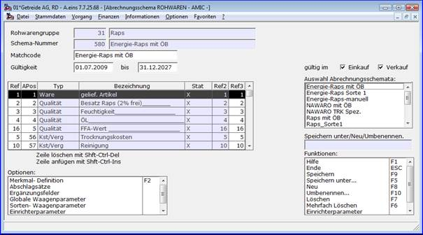

  Aus der Menge der Abrechnungskriterien der [Rohwarengruppe](./vorgehensweise_bei_der_einrichtung_von_abrechnungsschemata_s.md#Rohwarengruppendef) werden hier die für ein spezielles Abrechnungsschema relevanten Merkmale zusammengestellt und deren Wirkungsweisen in der jeweiligen Merkmal-Definition festgelegt. Wichtige Angaben sind auch der **Zeitraum der Gültigkeit** und der **Geschäftsbereich (Einkauf und/oder Verkauf)**, für den das Abrechnungsschema gelten soll.

  Ist noch keine Abrechnungsschema (Sorte) für die aktuelle Rohwarengruppe vorhanden, so wird mit der Funktion **‚Neu‘** und anschließender Eingabe einer Bezeichnung ein Schema angelegt.  
Ist hier noch keine Position vorhanden, so wird durch Eingabe des Wertes ‚1‘ für die Referenznummer in der ersten Spalte der ersten Zeile des Grids oder der zweiten Spalte (Abrechnungsposition) automatisch die Lieferposition erzeugt. 

  Neue Abrechnungsschemata sind auch durch ***‘Speichern Unter’*** =Abspeichern unter einem neuen Namen zu erstellen, wobei eine Kopie des aktuellen Abrechnungsschemas erstellt wird.  
Die Nummer eines Schemas wird vom System automatisch vergeben.

  Weitere Positionen werden dem Abrechnungsschema hinzugefügt, indem die in der Rohwarengruppe vergebene [Referenznummer](./vorgehensweise_bei_der_einrichtung_von_abrechnungsschemata_s.md#Rohwarengruppendef) der Position in der Spalte **‚Ref‘** eingegeben wird. Dieses kann per Auswahl mit der Funktionstaste **F4** auch für mehrere Positionen am Stück geschehen.  
    

Übersicht der Grid-Spalten eines Abrechnungsschemas

  Die Referenznummern der Spalte **‚Ref‘** entspricht immer der [Referenznummer der Rohwarengruppe](./vorgehensweise_bei_der_einrichtung_von_abrechnungsschemata_s.md#Rohwarengruppendef). Sie dienen in Verbindung mit der Rohwarengruppe der eindeutigen Identifizierung einer Rohwaren-Positionszeile in Rohware-Belegen bei Bearbeitung, Abrechnung, Buchungen, Druck und Auswertungen.

  Die Reihenfolge des Berücksichtigung der Positionszeilen bei Abrechnung und Druck von Rohwarenbelegen legt die Spalte **‚APos‘** (Abrechnungsposition) fest. Die 1. Position (Lieferposition vom Typ Ware) sollte den Wert 1 tragen. Unabhängig von den Werten dieser Spalte werden Positionszeilen des Typs Kosten/Vergütung grundsätzlich nach den Waren- und Qualitätspositionen im Rohware-Abrechnungsmodul behandelt.

  Die Spalte **‚Bezeichnung‘** beschreibt je nach Zeilentyp die Position durch die Bezeichnung des zugeordneten [Qualitätstextes](./konstanten_und_tabellen_fuer_die_einrichtung_von_abrechnungs/rohware_qualitaetstexte.md), [Kostentextes](./konstanten_und_tabellen_fuer_die_einrichtung_von_abrechnungs/rohware_kostentexte.md) bzw. den Festtexten ‚gelief. Artikel‘ für die Lieferposition und ‚Warenposition n‘ mit n als fortlaufender Nummer für Sekundärwarenpositionszeilen. Ein **Klick mit der linken Maustaste** in dieser Spalte ruft die Bearbeitungsmaske für die **Detail-Definition** des Merkmals auf.

  Die Spalte **‚Stat‘** (Status) macht durch die Darstellung eines **‚X‘** kenntlich, dass für diese Merkmalszeile eine Detaildefinition angelegt wurde. Merkmale ohne dieses Kennzeichen bedürfen noch der Detail-Definition.  
   
Die Referenznummer 2 **‚Ref2‘** ist die auf [Rohwarengruppenebene](./vorgehensweise_bei_der_einrichtung_von_abrechnungsschemata_s.md#Rohwarengruppendef) frei vergebene Referenznummer 2, mit deren Hilfe in Sammeldruckformularen zum Beispiel im Druckbereich 81 (Rohware-Sammeldruck-Einzelfußinfo) auf Werte der Positionszeile mit dieser Ref2-Nummer zugegriffen werden kann.  
    
Die Referenznummer 3 **‚Ref3‘** ist eine frei zu vergebene und jederzeit änderbare innerhalb eines Abrechnungsschemas eindeutige Referenznummer, mit deren Hilfe in Sammeldruckformularen zum Beispiel im Druckbereich 81 (Rohware-Sammeldruck-Einzelfußinfo) auf Werte der Positionszeile mit dieser Ref3-Nummer zugegriffen werden kann. Damit lassen sich auch Sammeldruck-Formulare gestalten, auf denen Belege unterschiedlicher Rohwarengruppen zusammengefasst sind, für jeden Einzelbeleg aber nur eine Zeile (alle Infos im [Querformat](./druckbereich_81_sammelformulareinrichtung_quer.md)) gedruckt werden soll. Rohwaren-Zeilen gleichen Inhalts, die in unterschiedlichen Abrechnungsschemata sich unterscheidende Referenznummern **‚Ref‘** und **‚Ref2‘** besitzen, können über die Vergabe übereinstimmender **‚Ref3‘**\-Nummern eindeutig identifiziert werden. Damit lassen sich auch Sammeldruck-Formulare gestalten, auf denen Belege unterschiedlicher Abrechnungsschemata und sogar Rohwarengruppen zusammengefasst sind, für jeden Einzelbeleg aber nur eine Zeile (alle Infos im [Querformat](./druckbereich_81_sammelformulareinrichtung_quer.md)) gedruckt werden soll.  
    

Auswahl eines Abrechnungsschemas

  Die zur Rohwarengruppe angelegten Abrechnungsschemata sind in dieser Box aufgeführt und können mit der linken Maustaste zur Bearbeitung bzw. Ansicht angeklickt werden.  
    

Funktionen

  Die Funktion **‚Speicher‘** speichert die aktuell geänderten Angaben zum aktuellen Abrechnungsschema.  
Mit **‚Speicher unter…‘** wird nach Angabe einer neuen Bezeichnung eine Kopie des Abrechnungsschemas angelegt.  
Die Funktion **‚Neu‘** ebenfalls zur Neuanlage eines Abrechnungsschemas.  
Das aktuelle Schema kann mit **‚Umbenennen…‘** durch Eingabe einer neuen Bezeichnung umbenannt werden.  
Die Funktion **‚Löschen‘** dient zum setzen des Löschkennzeichens des aktuellen Abrechnungsschemas. Diese kann jedoch nur gelöscht werden, wenn es keine Rohwarenvorgänge zum Schema gibt.  
Mit **‚Mehrfach Löschen‘** wird jeweils mit Einzelabfrage die Löschfunktion für alle Abrechnungsschemata der Rohwarengruppe aufgerufen.  
    

Optionen

  Die Bearbeitung bzw. Ansicht der zur aktuellen Zeile des Grids gehörigen Detail-Definition des Abrechnungsmerkmals wird mit **‚Merkmal-Definition‘** aufgerufen. Dieses kann auch durch **Klick der linken Maustaste** auf die **Bezeichnung** des Merkmals ausgelöst werden.  
Für Abrechnungsschemata, die in den Rohwareparametern für Abschlag- und Folgeabschlagbelege die Einstellung **‚Abschlagermittlung durch %-Satz‘** aufweisen, kann mit **‚Abschlagsätze‘** die Vorbelegung der Abschlagsätze getrennt nach Einkauf und Verkauf festgelegt werden.

  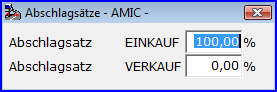  
Die Einrichtung und Pflege bzw. Ansicht der nur für das aktuell Abrechnungsschemata gültigen **‚**[**Ergänzungsfelder**](./ergaenzungsfelder_fuer_rohware_belege/index.md)**‘** ist unter diesem Punkt aufrufbar.  
Die für die Erzeugung von Rohwarebelegen aus der Waagenschnittstelle wichtigen ‚globalen Waagenparameter‘ sowie speziell pro Abrechnungsschema definierten ‚Sorten-Waagenparameter‘ sind ebenfalls von dieser Stelle aus aufrufbar.

  
Merkmal-Detail-Definition der Lieferpositionszeile

  Hauptmenü > Rohwarenabrechnung \> Rohwaren-Verwaltung > Bearbeiten > Abrechnungsschema > Merkmal-Definition

  Direktsprung **[RWG]**

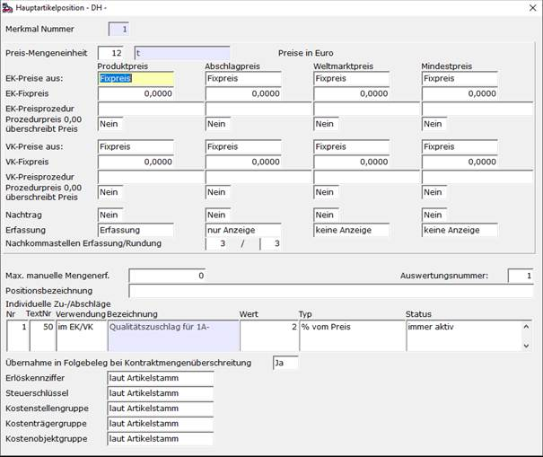

  Die **Preis-Mengeneinheit** ist relevant für die Darstellung der Preise und Zu- und Abschläge hierauf, die sich auf diese Position beziehen und immer für eine Preismengeneinheit gelten. Es sollte unbedingt darauf geachtet werden, dass diese zu den Mengeneinheiten der der Rohwarengruppe zugeordneten Artikel kompatibel ist (d.h. derselben Grundmengeneinheit zugeordnet sind). Gebinde-Einheiten sind hier nicht zulässig. 

  Die **Einstellung für die Preisfindung** gilt immer für die jeweiligen **Anfangspreise** der Warenposition, also vor der Ermittlung von Zu- und Abschlägen durch Qualitäts-Merkmale. Es ist aber zu beachten, dass die hier angegebenen Preise selbst nur dann herangezogen werden, wenn es keine höherwertigen Preise (**Kontraktpreis, Partiepreis, manueller Preis**) für die Belegposition gibt. Ausnahmen sind Preise, die per **Datenbankprozedur** ermittelt werden. Diese überschreiben alle Preise, die nicht manuell sind. Ob dieses auch für einen per Datenbankprozedur ermittelten Preis mit dem Wert = 0,00 gilt, wird durch die jeweilige Einstellung bei den einzelnen Preisarten gesondert festgelegt. Die einzelnen Preisarten haben dabei unterschiedliche Bedeutung. Der **Produktpreis** ist der Ausgangspreis für die **Finalabrechnung** (Endabrechnung), aber bei prozentualer Abschlagermittlung auch für Abschlag- und Folgeabschlagabrechnung. Bei der **Abschlagermittlung durch Abschlagpreis** hingegen ist der **Abschlagpreis** Ausgangspreis für Abschlag- und Folgeabschlagabrechnung. Der **Weltmarktpreis** kann eine Rolle als Bezugsgröße zur prozentualen Ermittlung von Preiszuschlägen oder Preisabschlägen per Qualität spielen. Hingegen stellt der **Mindestpreis** eine Vergleichsgröße dar, die bei der Verwendung der entsprechenden Qualitäts-Abrechnungsart in einer Qualitätsposition zu einer Preiskorrektur führen kann, wenn im Abrechnungsverlauf der aktuelle Preis der Position den Mindestpreis unterschreitet. 

  Die Einstellung **‚Fixpreis‘ legt fest,** dass der im sich darunter befindlichen Preis heranzuziehen ist. Alternativ kann hier auch die Einstellung **‚Preismatrix‘** vorgenommen werden, so dass entsprechend der Kunden-/Lieferantenpreisklassenzuordnung (**Listenpreisklasse, Abschlagpreisklasse, Weltmarktpreisklasse, Mindestpreisklasse** im Kunden-/Lieferantestamm für Einkauf bzw. Verkauf) in der Preismatrix des Artikels der jeweilige Preis ermittelt wird.

  Die Angabe des Namens einer **privaten Datenbankprozedur** ermöglicht die [Preisfindung per Datenbankprozedur](./rohwarequalitaets_und_kostenpositionen_datenbankprozedur_und/rohware_preisfindung_per_datenbankprozedur_bestimmen.md). Dabei wird die Behandlung eines aus der Prozedur erhaltenen 0-Preises gesondert festgelegt: Grundsätzlich erfolgt die Preisfindung zunächst immer aus **Kontraktpreis, Partiepreis, Fixpreis/Listenpreis**, bevor gegebenenfalls die angegebene Datenbankprozedur aufgerufen wird. Ist die Einstellung **Prozedurpreis 0,00 überschreibt Preis = ‚Nein‘**, so kann aufgrund dieser Verfahrensweise eine sehr flexible Preisfindung eingesetzt werden.

  Die Einstellung **Nachtrag** = **‚Ja‘** bewirkt, dass die Preisfindung auch bei der Korrektur und Abrechnung eines Rohwarenbelegs immer neu erfolgt, es sei denn, der entsprechende Preis im Beleg ist dort durch die Einstellung **‚Preis fest‘** fixiert. Dadurch ist es möglich, Belege abzurechnen ohne sie zuvor noch einmal korrigieren zu müssen, obwohl ein oder mehrere Preise zum Zeitpunkt der Erfassung noch nicht bekannt waren. Die Einstellung **‚Nein‘** hingegen bewirkt lediglich eine Vorbelegung des entsprechenden Preises bei der Vorgangserfassung.  
    

  Unabhängig von den Preisfindungseinstellungen werden bei **Einlagerungsbelegen** grundsätzlich **keine Preise** für die Lieferposition gezogen.

  Die Werte **‚Erfassung‘, ‚nur Anzeige‘, ‚keine Anzeige‘** bewirken, dass der jeweilige Preis bei Erfassung und Korrektur von Rohwarebelegen überschrieben werden kann, nur sichtbar ist oder nicht mit angezeigt wird.

  Die Anzahl der im Bearbeitungsmodul angezeigten wie auch der rundungsrelevanten **Nachkommastellen der Menge** ist in den entsprechenden Feldern anzugeben. Diese beiden Angaben dürften in der Regel identisch sein. In Einzelfällen kann es aus optischen Gründen jedoch sinnvoll sein, mehr als die rundungsrelevanten Stellen anzuzeigen (Beispiel: Mengen in dt, Rundung auf 10kg-Basis, Anzeige mit 2 Nachkommastellen). Es ist jedoch darauf zu achten, dass die Darstellung der Nachkommastellen auf Formularen in der Formulareinrichtung gesondert vorzunehmen ist.

  Die Angabe der **‚Maximalen manuellen Mengenerfassung‘** bietet einen gewissen Schutz vor Tippfehlern bei der Belegerfassung. Der Eintrag **‚0‘** erlaubt jedoch eine unbegrenzte Mengeneingabe.

  Die **‚Auswertungsnummer‘,** die es für alle Rohware-Positionszeilen gibt, kann bei der Erstellung von Belegauswertungen zum Zugriff auf bestimmte Positionszeilen herangezogen werden. Diese Angabe wird nicht in den Belegen gespeichert, so dass spätere Änderungen von Auswertungsnummern auch die Ergebnisse betroffener Auswertungen verändern können.

  Die **‚Positionsbezeichnung‘** wird, sofern hier eine angegeben ist, anstelle der Artikelbezeichnung auf der Rohwarenbeleg-Bearbeitungsmaske ausgegeben.

  **Individuelle Zu-/Abschläge** sind qualitätsunabhängige Zuschläge oder Abschläge auf Preis oder Menge der Anlieferposition. Sie werden, bei mehreren in der Reihenfolge der Spalte **‚Nr‘**, in der Erfassungsreihenfolge wie auch der Abrechnungsreihenfolge unmittelbar nach der Lieferposition angewandt. Die **‚Textnummer‘** gibt einen Eintrag der [Qualitätstexte](./konstanten_und_tabellen_fuer_die_einrichtung_von_abrechnungs/rohware_qualitaetstexte.md) an, die bei Erfassung und Druck den auszugebenden Text des jeweiligen Zuschlags oder Abschlags bestimmt. In der Spalte **‚Verwendung‘** wird festgelegt, ob die Zeile im Einkauf, Verkauf oder beiden Bereichen zu verwenden ist. Der **‚Wert‘** ist für Abschläge negativ, für Zuschläge positiv anzugeben und wird durch den **‚Typ‘** interpretiert als **‚% vom Preis‘**, **‚% vom Weltmarktpreis‘**, **‚% von der Menge‘**, **‚Euro je Mengeneinheit‘** bzw. **‚Belegwährungseinheiten je Mengeneinheit‘** oder **‚Mengeneinheiten‘**. Der Wert dient dabei immer nur als Vorbelegung bei der Belegerfassung und kann dort überschrieben werden. In der Spalte **‚Status‘** ist die Wirkung der Zeile auf die Abrechnungsstufe beschrieben: **‚inaktiv‘** zur zeitweiligen Deaktivierung dieses Zu- oder Abschlags, **‚nur bei Abschlagsrechnung‘** beschränkt die Wirkung auf die Belegstufen Abschlag und Folgeabschlag, **‚nur bei Finalabrechnung‘** bewirkt, dass die Anwendung erst bei der Finalabrechnung erfolgt und **‚immer aktiv‘** bewirkt keinerlei Einschränkungen.

  Das Attribut **‚Übernahme manueller Werte in Folgebeleg bei Kontraktmengenüberschreitung‘** bestimmt, ob manuell veränderte Werte der individuellen Zu-/Abschläge bei der [Erzeugung von Zusatzbelegen wegen Kontraktmengenüberschreitung](./rohwarenbearbeitung/rohware_erfassung_mit_belegsplitting_bei_kontraktmengenueber/index.md) bei der Belegerfassung in die Zusatzbelege zu übernehmen sind.

  Die Angaben zur Festlegung von **Erlöskennziffer, Steuerschlüssel** ;**Kostenstellengruppe, Kostenträgergruppe** und **Kostenobjektgruppe** haben die Einstellmöglichkeiten **‚laut Artikelstamm‘** (der entsprechende Wert wird den Angaben zum Artikel entnommen), **‚laut Lieferartikel‘** (der entsprechende Wert wird den Angaben zum Artikel der Lieferposition entnommen) und **‚speziell‘** (in diesem Fall wird der entsprechende Wert gesondert festgelegt).  
 

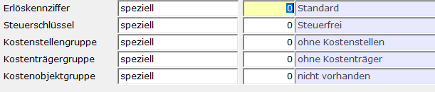

    
Die Felder **Kostenstellengruppe, Kostenträgergruppe** und **Kostenobjektgruppe** sind nur dann verfügbar, wenn die zugehörigen Steuerparameter **Kostenstellen-Lizenz**, **Kostenträgerrechnung angeschlossen** beziehungsweise **Kostenobjekt-Lizenz** aktiviert sind.  
    

Merkmal-Detail-Definition von Sekundär-Warenpositionszeilen

  Hauptmenü > Rohwarenabrechnung \> Rohwaren-Verwaltung > Bearbeiten > Abrechnungsschema > Merkmal-Definition

  Direktsprung **[RWG]**

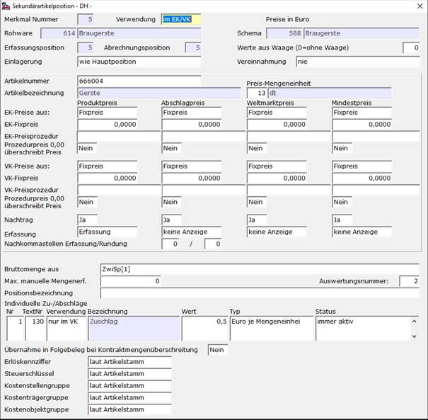

  Die Verwendung der Positionszeile kann im Feld **‚Verwendung‘** auf einen der Bereiche Einkauf und Verkauf beschränkt oder für beide zugelassen werden.

  Für bei der Belegerzeugung aus der Waagenschnittstelle für diese Position zu übernehmende Mengen und/oder Preise ist die Positionsnummer der entsprechenden Einträge im Feld **‚Werte aus Waage‘** anzugeben. Gibt es keine korrespondierende Waagenzeile, so ist hier der Wert **‚0‘** einzutragen.

  Die Einstellung **‚wie Hauptposition‘** für die Felder **‚Einlagerung‘** und **‚Vereinnahmung‘** legt fest, dass bei Einlagerungsbelegen bzw. Vereinnahmungsbelegen das entsprechende Kennzeichen nicht nur für die Lieferposition, sondern auch für die Sekundärwarenposition gelten soll. Wird die in einem Rohwarebeleg mit dieser Definition korrespondierende Positionszeile zur **Einlagerungsposition**, so erfolgt für diese Position grundsätzlich **keine Preisfindung**.

  Im Feld **‚Artikelnummer‘** kann die Artikelnummer des zu buchenden Artikels für diese Position festgelegt werden. Es ist darauf zu achten, dass dieser Artikel auf allen Lägern, für die Belege dieses Abrechnungsschemas erfasst oder erzeugt werden, angelegt wurde. Es muss sich dabei nicht um einen Artikel mit Rohwarengruppe handeln, diese Bedingung gilt nur für Lieferartikel. Wird **keine Artikelnummer** eingetragen, so wird im Beleg derselbe Artikel wie für die Lieferposition herangezogen.

  Die **‚Preis-Mengeneinheit‘** ist relevant für die Darstellung der Preise und Zu- und Abschläge hierauf, die sich auf diese Position beziehen und immer für eine Preismengeneinheit gelten. Es sollte unbedingt darauf geachtet werden, dass diese zu den Mengeneinheiten der zugeordneten Artikel kompatibel ist (d.h. derselben Grundmengeneinheit zugeordnet sind). Gebinde-Einheiten sind hier nicht zulässig. 

  Die **Einstellung für die Preisfindung** gilt immer für die jeweiligen **Anfangspreise** der Warenposition, also vor der Ermittlung von Zu- und Abschlägen durch Qualitäts-Merkmale, die sich auf diese Position beziehen. Es ist aber zu beachten, dass die hier angegebenen Preise selbst nur dann herangezogen werden, wenn es keine höherwertigen Preise (**Kontraktpreis, Partiepreis, manueller Preis**) für die Belegposition gibt. Ausnahmen sind Preise, die per **Datenbankprozedur** ermittelt werden. Diese überschreiben alle Preise, die nicht manuell sind. Ob dieses auch für einen per Datenbankprozedur ermittelten Preis mit dem Wert = 0,00 gilt, wird durch die jeweilige Einstellung bei den einzelnen Preisarten gesondert festgelegt. Die einzelnen Preisarten haben dabei unterschiedliche Bedeutung. Der **Produktpreis** ist der Ausgangspreis für die **Finalabrechnung** (Endabrechnung), aber bei prozentualer Abschlagermittlung auch für Abschlag- und Folgeabschlagabrechnung. Bei der **Abschlagermittlung durch Abschlagpreis** hingegen ist der **Abschlagpreis** Ausgangspreis für Abschlag- und Folgeabschlagabrechnung. Der **Weltmarktpreis** kann eine Rolle als Bezugsgröße zur prozentualen Ermittlung von Preiszuschlägen oder Preisabschlägen per Qualität spielen. Hingegen stellt der **Mindestpreis** eine Vergleichsgröße dar, die bei der Verwendung der entsprechenden Qualitäts-Abrechnungsart zu einer Preiskorrektur führen kann, wenn im Abrechnungsverlauf der aktuelle Preis der Position den Mindestpreis unterschreitet. 

  Die Einstellung **‚Fixpreis‘ legt fest,** dass der im sich darunter befindlichen Preis heranzuziehen ist. Alternativ kann hier auch die Einstellung **‚Preismatrix‘** vorgenommen werden, so dass entsprechend der Kunden-/Lieferantenpreisklassenzuordnung (**Listenpreisklasse, Abschlagpreisklasse, Weltmarktpreisklasse, Mindestpreisklasse** im Kunden-/Lieferantestamm für Einkauf bzw. Verkauf) in der Preismatrix des Artikels der jeweilige Preis ermittelt wird.

  Die Angabe des Namens einer **privaten Datenbankprozedur** ermöglicht die [Preisfindung per Datenbankprozedur](./rohwarequalitaets_und_kostenpositionen_datenbankprozedur_und/rohware_preisfindung_per_datenbankprozedur_bestimmen.md). Dabei wird die Behandlung eines aus der Prozedur erhaltenen 0-Preises gesondert festgelegt: Grundsätzlich erfolgt die Preisfindung zunächst immer aus **Kontraktpreis, Partiepreis, Fixpreis/Listenpreis**, bevor gegebenenfalls die angegebene Datenbankprozedur aufgerufen wird. Ist die Einstellung **Prozedurpreis 0,00 überschreibt Preis = ‚Nein‘**, so kann aufgrund dieser Verfahrensweise eine sehr flexible Preisfindung eingesetzt werden.

  Die Einstellung **‚Nachtrag‘** = **‚Ja‘** bewirkt, dass die Preisfindung auch bei der Korrektur und Abrechnung eines Rohwarenbelegs immer neu erfolgt, es sei denn, der entsprechende Preis im Beleg ist dort durch die Einstellung **‚Preis fest‘** fixiert. Dadurch ist es möglich, Belege abzurechnen ohne sie zuvor noch einmal korrigieren zu müssen, obwohl ein oder mehrere Preise zum Zeitpunkt der Erfassung noch nicht bekannt waren. Die Einstellung **‚Nein‘** hingegen bewirkt lediglich eine Vorbelegung des entsprechenden Preises bei der Vorgangserfassung.

  Die Werte **‚Erfassung‘, ‚nur Anzeige‘, ‚keine Anzeige‘** bewirken, dass der jeweilige Preis bei Erfassung und Korrektur von Rohwarebelegen überschrieben werden kann, nur sichtbar ist oder nicht mit angezeigt wird.

  Die Anzahl der im Bearbeitungsmodul angezeigten wie auch der rundungsrelevanten **Nachkommastellen der Menge** ist in den entsprechenden Feldern anzugeben. Diese beiden Angaben dürften in der Regel identisch sein. In Einzelfällen kann es aus optischen Gründen jedoch sinnvoll sein, mehr als die rundungsrelevanten Stellen anzuzeigen (Beispiel: Mengen in dt, Rundung auf 10kg-Basis, Anzeige mit 2 Nachkommastellen). Es ist jedoch darauf zu achten, dass die Darstellung der Nachkommastellen auf Formularen in der Formulareinrichtung gesondert vorzunehmen ist.

  Die Angabe **‚Bruttomenge aus‘** bestimmt die Anfangsmenge der Warenposition. Ist dieses Feld leer, so ist die Menge bei der Belegerfassung oder Korrektur zu erfassen oder kann bei der Belegerzeugung aus der Waagenschnittstelle entsprechend der Zuordnung im Feld **‚Werte aus Waage‘** übernommen werden. Hier kann jedoch auch eine **Formel** eingetragen werden. Als Operanden dienen dabei Ausdrücke der Form **‚Ware[**n**]‘** und **‚ZwiSp[**n**]‘**, die mittels der Operatoren +, -, \* und \\ miteinander Verknüpft werden. Dabei bedeutet **‚Ware[**n**]‘** = **Menge der Warenposition mit der Referenznummer** n und **‚ZwiSp[**n**]‘** \= **Zwischenspeicher mit der Nummer** n (Zwischenspeicher können durch Qualitätsmerkmale mit den erzeugten Zuschlägen oder Abschlägen versorgt werden). Dabei haben die Einträge **‚Ware‘** und **‚ZwiSp‘** dieselbe Bedeutung wie **‚Ware[1]‘** bzw. **‚ZwiSp[1]‘**

  Die Angabe der **‚Maximalen manuellen Mengenerfassung‘** bietet einen gewissen Schutz vor Tippfehlern bei der Belegerfassung. Der Eintrag **‚0‘** erlaubt jedoch eine unbegrenzte Mengeneingabe.

  Die **‚Auswertungsnummer‘,** die es für alle Rohware-Positionszeilen gibt, kann bei der Erstellung von Belegauswertungen zum Zugriff auf bestimmte Positionszeilen herangezogen werden. Diese Angabe wird nicht in den Belegen gespeichert, so dass spätere Änderungen von Auswertungsnummern auch die Ergebnisse betroffener Auswertungen verändern können.

  Die **‚Positionsbezeichnung‘** wird, sofern hier eine angegeben ist, anstelle der Artikelbezeichnung auf der Rohwarenbeleg-Bearbeitungsmaske ausgegeben.

  **Individuelle Zu-/Abschläge** sind qualitätsunabhängige Zuschläge oder Abschläge auf Preis oder Menge der Anlieferposition. Sie werden, bei mehreren in der Reihenfolge der Spalte **‚Nr‘**, in der Erfassungsreihenfolge wie auch der Abrechnungsreihenfolge unmittelbar nach der Warenposition angewandt. Die **‚Textnummer‘** gibt einen Eintrag der [Qualitätstexte](./konstanten_und_tabellen_fuer_die_einrichtung_von_abrechnungs/rohware_qualitaetstexte.md) an, die bei Erfassung und Druck den auszugebenden Text des jeweiligen Zuschlags oder Abschlags bestimmt. In der Spalte **‚Verwendung‘** wird festgelegt, ob die Zeile im Einkauf, Verkauf oder beiden Bereichen zu verwenden ist. Der **‚Wert‘** ist für Abschläge negativ, für Zuschläge positiv anzugeben und wird durch den **‚Typ‘** interpretiert als **‚% vom Preis‘**, **‚% vom Weltmarktpreis‘**, **‚% von der Menge‘**, **‚Euro je Mengeneinheit‘** bzw. **‚Belegwährungseinheiten je Mengeneinheit‘** oder **‚Mengeneinheiten‘**. Der Wert dient dabei immer nur als Vorbelegung bei der Belegerfassung und kann dort überschrieben werden. In der Spalte **‚Status‘** ist die Wirkung der Zeile auf die Abrechnungsstufe beschrieben: **‚inaktiv‘** zur zeitweiligen Deaktivierung dieses Zu- oder Abschlags, **‚nur bei Abschlagsrechnung‘** beschränkt die Wirkung auf die Belegstufen Abschlag und Folgeabschlag, **‚nur bei Finalabrechnung‘** bewirkt, dass die Anwendung erst bei der Finalabrechnung erfolgt und **‚immer aktiv‘** bewirkt keinerlei Einschränkungen.

  Das Attribut **‚Übernahme in Folgebeleg bei Kontraktmengenüberschreitung‘** bestimmt, ob die manuell erfasste Bruttomenge und manuell veränderte Werte der individuellen Zu-/Abschläge bei der [Erzeugung von Zusatzbelegen wegen Kontraktmengenüberschreitung](./rohwarenbearbeitung/rohware_erfassung_mit_belegsplitting_bei_kontraktmengenueber/index.md) bei der Belegerfassung in die Zusatzbelege zu übernehmen sind.

  Die Angaben zur Festlegung von **Erlöskennziffer, Steuerschlüssel** ;**Kostenstellengruppe, Kostenträgergruppe** und **Kostenobjektgruppe** haben die Einstellmöglichkeiten **‚laut Artikelstamm‘** (der entsprechende Wert wird den Angaben zum Artikel entnommen), **‚laut Lieferartikel‘** (der entsprechende Wert wird den Angaben zum Artikel der Lieferposition entnommen) und **‚speziell‘** (in diesem Fall wird der entsprechende Wert gesondert festgelegt).  
 

    
Die Felder **Kostenstellengruppe, Kostenträgergruppe** und **Kostenobjektgruppe** sind nur dann verfügbar, wenn die zugehörigen Steuerparameter **Kostenstellen-Lizenz**, **Kostenträgerrechnung angeschlossen** beziehungsweise **Kostenobjekt-Lizenz** aktiviert sind.  
    

Merkmal-Detail-Definition von Qualitätsmerkmalen

  Hauptmenü > Rohwarenabrechnung \> Rohwaren-Verwaltung > Bearbeiten > Abrechnungsschema > Merkmal-Definition

  Direktsprung **[RWG]**

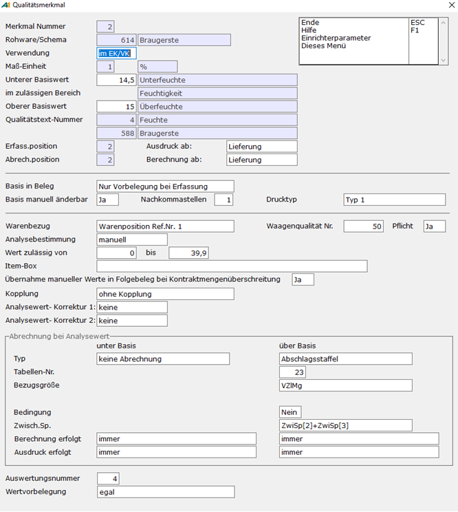

  Die Verwendung der Qualität kann im Feld **‚Verwendung‘** auf einen der Bereiche Einkauf und Verkauf beschränkt oder für beide zugelassen werden.

  Im Feld **‚Ausdruck ab:‘** wird festgelegt, ab welcher Belegstufe (**Lieferung**, **Abschlag**, **Folgeabschlag**, **Finale**) diese Positionszeile auf Formularen grundsätzlich ausgegeben werden soll. Die Berücksichtigung bei der Ausgabe auf Formularen kann auch erfolgen, wenn noch keine Abrechnung (Ermittlung eines Zuschlags oder Abschlags) erfolgt. Daher wird im Feld **‚Berechnung ab:‘** die Belegstufe angegeben, ab der die für diese Qualität festgelegte Abrechnungs-Methode anzuwenden ist. Diese Belegstufe kann nicht kleiner als die Belegstufe für den Ausdruck sein.

  Der Standardbereich für ein Qualitätsmerkmal wird durch die Felder **‚Unterer Basiswert‘** und **‚Oberer Basiswert‘** festgelegt. Ist der **Analysewert** bzw. der **korrigierte Analysewert** des Merkmals **innerhalb dieser Spanne**, so erfolgt **keine Abrechnung**. Für die drei Bezeichnungen des dem in der [Rohwarengruppe](./vorgehensweise_bei_der_einrichtung_von_abrechnungsschemata_s.md#Rohwarengruppendef) dem Merkmal zugeordneten [Qualitätstextblocks](./konstanten_und_tabellen_fuer_die_einrichtung_von_abrechnungs/rohware_qualitaetstexte.md) gilt, dass bei der Ausgabe auf Formularen der dem jeweiligen Bereich zugeordnete Text ausgegeben wird (Beispiel: Unterfeuchte, Feuchtigkeit, Trocknungsschwund).

  Mit der Einstellung im Feld **‚Basis in Beleg‘** wird die Basiswert-Behandlung dieses Merkmals in zugehörigen Rohwarebelegen geregelt. **‚Nur Vorbelegung bei Erfassung‘** bewirkt die Vorbelegung der Basiswerte zu diesem Merkmal bei der Erfassung von Rohwarebelegen und Erzeugung von Belegen aus der Waagenschnittstelle. In diesem Falle gibt die Einstellung im Feld **‚Basis manuell änderbar‘** an, ob die Basiswerte im Beleg manuell änderbar sind (**‚Ja‘**) oder nicht (**‚Nein‘**). **‚Immer Basiswertnachtrag aus Sorte‘** bewirkt, dass die hier eingetragenen Werte in zugehörigen Rohwarebelegen auch bei Korrektur und Abrechnung neu eingetragen werden. Manuelle Basiswertänderungen zu diesem Merkmal im Beleg sind dann nicht möglich. **‚Basiswertbestimmung per DB-Prozedur‘** ermöglicht die Angabe einer [Datenbankprozedur zur Bestimmung der Basiswerte](./rohwarequalitaets_und_kostenpositionen_datenbankprozedur_und/qualitaets_und_kostenmerkmalwerte_per_datenbankprozedur_best.md).  
    
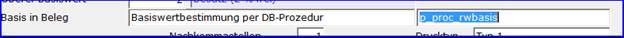  
Auch in diesem Fall sind manuelle Basiswertänderungen zu diesem Merkmal im Beleg nicht möglich.

  Die Angabe im Feld **‚Nachkommastellen‘** bezieht sich auf die Rundung und Darstellung des Analysewertes und der Basiswerte dieses Merkmals in Belegen.

  Die Einstellung im Feld **‚Drucktyp‘** wird beim Formulardruck mit der Qualität korrespondierenden Belegpositionszeile ausgewertet. In den verwendeten Druck-Formularen können **Druckbereichseinrichtungen in mehreren Varianten** erstellt werden. In den Bereichsangaben der Standardvariante 0 erfolgt eine Zuordnung von Drucktyp **‚Typ 1‘** bis **‚Typ 10‘** zur zu verwendenden Variante der Druckbereichseinrichtung. Damit können unterschiedlichen Qualitätstypen auf Druckformularen unterschiedlich dargestellt werden. Zusätzlich kann durch den Drucktyp die Erzeugung einer Zwischensummenzeile für die durch die Qualität beeinflusste Warenposition (Beispiel: **‚Typ 1, eine Zw.Summe‘**) oder Zwischensummenzeilen für alle Warenpositionen (Beispiel: **‚Typ 1, alle Zw.Sm‘**) erzwungen werden. Im Einzelfall kann es auch sinnvoll sein, die Druckausgabe einer Qualität grundsätzlich zu unterdrücken (Einstellung: **‚keine Ausgabe‘**).

  Im Feld **‚Warenbezug‘** wird die Wirkung der Qualität auf eine bestimmte Warenposition zu einer Referenznummer festgelegt. Durch die Abrechnung der Qualität berechnete Zuschläge oder Abschläge verändern Menge oder Preis der bezogenen Warenposition.

  Für einen bei der Belegerzeugung aus der Waagenschnittstelle für diese Position zu übernehmenden Analysewert ist die Positionsnummer des entsprechenden Eintrags im Feld **‚Analysewert aus Waagenqualität Nr.‘** anzugeben. Gibt es keine korrespondierende Waagenzeile, so ist hier der Wert **‚0‘** einzutragen.

  Die **‚Analysebestimmung‘** kann auf unterschiedliche Art und Weise erfolgen. Die Einstellung **‚manuell‘** erlaubt die manuelle Eingabe des Wertes bei Belegerfassung und Korrektur bzw. die Übernahme des Analysewertes aus der Waagenschnittstelle bei der Belegerzeugung aus derselben. Dabei ist eine Beschränkung der Eingabemöglichkeit auf den durch **‚Wert zulässig von‘** und **‚bis‘** festgelegten Bereich zu beachten. Zur Unterstützung bei der manuellen Analysewerteingabe kann eine **‚**[**Item-Box**](./rohwarequalitaets_und_kostenpositionen_datenbankprozedur_und/itembox_unterstuetzung_bei_der_erfassung_von_analysewerten.md)**‘** angegeben werden. Das Attribut **‚Übernahme manueller Werte in Folgebeleg bei Kontraktmengenüberschreitung‘** bestimmt, ob der manuell zu erfassende Analysewert bei der [Erzeugung von Zusatzbelegen wegen Kontraktmengenüberschreitung](./rohwarenbearbeitung/rohware_erfassung_mit_belegsplitting_bei_kontraktmengenueber/index.md) bei der Belegerfassung in die Zusatzbelege zu übernehmen ist. Das gilt auch für manuelle geänderte Qualitäts-Zu-/-Abschlag-Ergebnisse.  
    
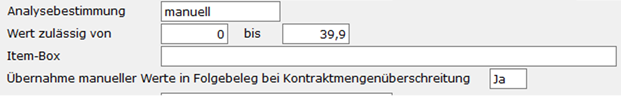

  Es gibt jedoch auch mehrere Möglichkeiten, den Analysewert einer Qualität aus den Werten anderer Qualitäten, Bruttomengen von Warenpositionen oder einer Datenbankprozedur berechnen zu lassen. Mit der Angabe ‚aus Formel‘ können, verknüpft mit dem Plus- oder Minuszeichen, Warenpositionen und andere als die aktuelle Qualitäten angegeben werden.

    
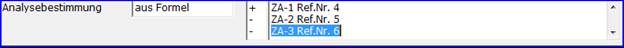

  Dabei steht der Warenpositionsverweis für die Bruttomenge der Warenposition, während Qualitätsverweise bei der Berechnung der Formel durch den jeweiligen Analysewert der Qualität ersetzt werden. Die Analysewertermittlung mit der Variante ‚Durchschnitt‘ liefert als neuen Analysewert den durch die Anzahl der Referenzen dividierten Wert, der wie in der Variante ‚aus Formel‘ bestimmt wird.

    
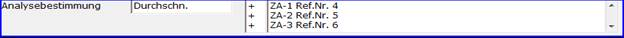

  **‚FixDurchschnitt‘** arbeitet ähnlich wie ‚Durchschnitt‘, jedoch wird durch die **im Beleg zu erfassende Probenanzahl** dividiert, nachdem zuvor nur die ersten dem Wert für **Probenanzahl** entsprechende Referenzen in der Formelauswertung berücksichtigt wurden.

    
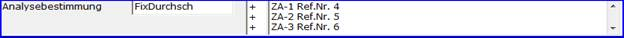

  Die Angabe **‚Formel mit KAW‘** (KAW = Korrigierter Analysewert) berechnet neben dem Analysewert auch den korrigierten Analysewert aus den korrigierten Analysewerten der Referenzqualitäten. Sofern allerdings eine Referenzqualität in der Abrechnungsfolge noch nicht berücksichtigt wurde, wird deren Analysewert als Quelle herangezogen.

    
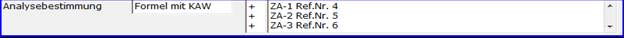

  Soll der [Analysewert der Qualität per Datenbankprozedur](./rohwarequalitaets_und_kostenpositionen_datenbankprozedur_und/qualitaets_und_kostenmerkmalwerte_per_datenbankprozedur_best.md) (‚DB-Prozedur‘) berechnet werden, so wird der Name der Prozedur im nächsten Feld angegeben.

  Bezüglich der Nachhaltigkeitswerte (THG/TSW) der über den Warenbezug der Qualität referenzierten Warenposition kann per Kopplung der Qualität an den gewünschten THG/TSW-Wert der Warenposition dieser als Analysewert dargestellt, erfasst und geändert werden. Dadurch wird eine Einrichtung von Nachhaltigkeitswerten als Abrechnungsposition ermöglicht.

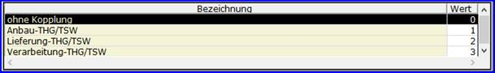

  Erfasste oder per Formel oder Datenbankprozedur berechnete Analysewerte können vor der Berechnung von Zu- oder Abschlägen bezüglich anderer Qualitäten automatisch korrigiert werden, sofern es sich nicht um per Kopplung an Nachhaltigkeitswerte gebundene Analysewerte handelt. Eine solche Korrektur kann zum Beispiel dann gegeben sein, wenn die Bestimmung des Ölgehalts oder des Naturalgewichts einer Ware bei hoher Feuchtigkeit und starker Verunreinigung erfolgt ist, für die Abrechnung aber der entsprechende Wert bei trockener und sauberer Ware benötigt wird. Grundsätzlich gibt es hierfür zwei Methoden, die in den Feldern **‚Analysewert-Korrektur 1‘** und **‚Analysewert-Korrektur 2‘** eingestellt werden können und in dieser Reihenfolge zunächst auf den Original-Analysewert, dann auf den in 1. Stufe korrigierten Analysewert angewendet werden. Für beide Felder gibt es die Einstellungsoptionen **‚keine‘**, die keine Korrektur auslöst, **‚Faktor‘**, die den aktuellen Analysewert per Multiplikation mit näher zu bestimmenden Faktoren korrigiert, **‚Tabelle‘**, die den aktuellen Analysewert durch Werte aus näher zu bestimmenden Tabellen verändert, und **‚DB-Prozedur‘**, die eine durch Angabe ihres Namens bestimmte [Datenbankprozedur zur Berechnung des korrigierten Analysewertes](./rohwarequalitaets_und_kostenpositionen_datenbankprozedur_und/qualitaets_und_kostenmerkmalwerte_per_datenbankprozedur_best.md) nutzt. Wird keine Korrektur durchgeführt, so wird der Wert des korrigierten Analysewertes gleich dem des Original-Analysewertes.

    
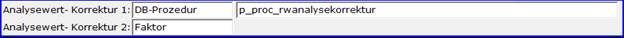 

  Ist für eine Analysewert-Korrektur-Stufe eine der Korrekturmethoden per **‚Faktor‘** oder per **‚Tabelle‘** gewählt, steht für diese Stufe eine in der Option-Box der Maske eine Funktion zum Aufruf der Detailmaske zur Spezifizierung der Methode zur Verfügung.

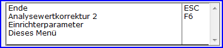

  Bei der **Faktorkorrektur** werden hier die Faktoren und Bedingungen für deren Anwendung festgelegt.

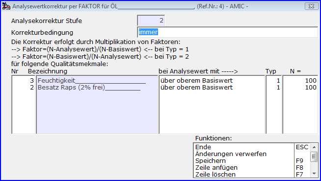

  Zunächst ist m Feld **‚Korrekturbedingung‘** festgelegt, unter welcher Bedingung bezüglich des zu korrigierenden Analysewertes die Korrektur berechnet wird.

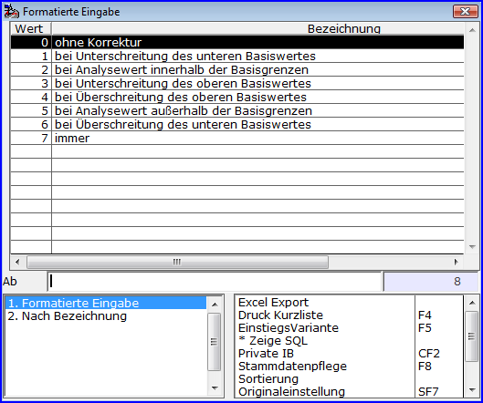

  In der Spalte **‚Nr‘** sind die Referenznummern der Qualitäten aufgeführt, die zur Faktorbildung gemäß der Einstellung in den Spalten **‚Typ‘** und **‚N‘** heranzuziehen sind, wenn bezüglich der Referenzqualität die Bedingung der Spalte **‚bei Analysewert‘** erfüllt ist. So gebildete Faktoren werden im Abrechnungsmodul miteinander und mit dem Eingangswert (= Originalanalysewert bzw. in vorhergehender Stufe korrigierter Analysewert) multipliziert.

  Bei der **Tabellenkorrektur** werden auf der Detailmaske die zu verwendenden [Analysewertkorrekturtabellen](./konstanten_und_tabellen_fuer_die_einrichtung_von_abrechnungs/rohware_tabellen_zur_analysewertkorrektur.md) und Bedingungen zu deren Anwendung festgelegt.  
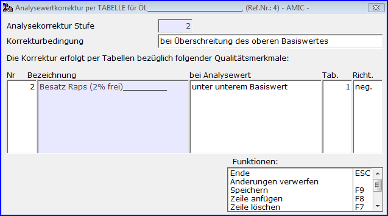

  Zunächst ist im Feld **‚Korrekturbedingung‘** festgelegt, unter welcher Bedingung bezüglich des zu korrigierenden Analysewertes die Korrektur berechnet wird.

  In der Spalte **‚Nr‘** sind die Referenznummern der Qualitäten aufgeführt, die zur Ermittlung eines Korrekturwertes der Korrekturtabelle der Spalte **‚Tab.‘** führen, wenn bezüglich der Referenzqualität die Bedingung der Spalte **‚bei Analysewert‘** erfüllt ist. Die Spalte **‚Richt.‘** (Richtung) mit den Optionen **‚pos.‘** (positiv) und **‚neg.‘** sogen für das korrekte Vorzeichen des Korrekturwertes. Die so gefundenen Werte werden im Abrechnungsmodul dem Eingangswert (= Originalanalysewert bzw. in vorhergehender Stufe korrigierter Analysewert) hinzugefügt bzw. abgezogen. 

  Zur Festlegung der eigentlichen Abrechnungsmethodik des Qualitätsmerkmals stehen zwei Definitionsblöcke zur Verfügung.  
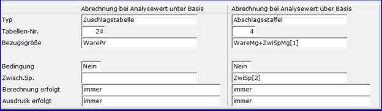

  Im Abrechnungsmodul werden die Angaben im Block **‚Abrechnung bei Analysewert unter Basis‘** herangezogen, wenn der korrigierte Analysewert zum Qualitätsmerkmal kleiner als der untere Basiswert ist. Eine **Ausnahme** besteht bei einem **Analyswert mit dem Wert = ‚0‘**: Dieser gilt als noch nicht erfasst und es erfolgt **keine Berechnung** des Merkmals! Ist der korrigierte Analysewert zum Qualitätsmerkmal größer als der obere Basiswert, so sind die Angaben im Block **‚Abrechnung bei Analysewert über Basis‘** relevant.

  Der **‚Typ‘** bestimmt die Art der Berechnung von eines Zu- oder Abschlags.  
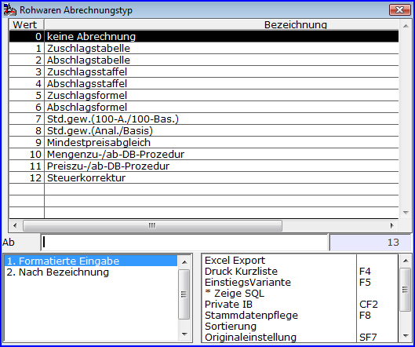

  ‚keine Abrechnung‘ wird dann eingetragen, wenn trotz erfüllter Voraussetzung (korigierter Analysewert kleiner bzw. größer als unterer bzw. oberer Basiswert) für dieses Merkmal nie ein Zuschlag oder Abschlag ermittelt werden soll.  
Die Typen ‚Zuschlagstabelle‘ bzw. ‚Abschlagstabelle‘ sind dann zu wählen, wenn ein Zuschlag bzw. Abschlag mittels einer [**‚Rohwaren-Tabelle für Zu- und Abschläge‘**](./konstanten_und_tabellen_fuer_die_einrichtung_von_abrechnungs/rohware_tabellen_fuer_zu_und_abschlaege.md) zu ermitteln ist, deren Nummer im Feld ‚Tabellen-Nr.‘ anzugeben ist.  
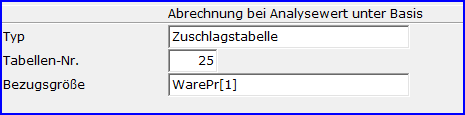 

  Für Tabellen, deren Angaben als **prozentuale Angaben** zu interpretieren sind, bedarf es der Angabe einer **‚Bezugsgröße‘**. Das Abrechnungsmodul berechnet den zu ermittelnden Wert aus der Tabelle und verwendet diesen beim Typ ‚Zuschlagstabelle‘ als Zuschlag, beim Typ ‚Abschlagstabelle‘ mit umgedrehtem Vorzeichen als Abschlag.

  Die Abrechnung eines Merkmals mittels einer [**‚Zuschlagsstaffel‘** bzw. **‚Abschlagsstaffel‘**](./konstanten_und_tabellen_fuer_die_einrichtung_von_abrechnungs/rohware_tabellen_fuer_zu_und_abschlag_staffeln.md) mit der im Feld **‚Tabellen-Nr.‘** eingetragenen Nummer wird immer ein Prozentsatz ermittelt, der auf die anzugebende **‚Bezugsgröße‘** angewendet wird, beim Typ ‚Abschlagstaffel‘ mit umgedrehtem Vorzeichen.  
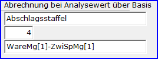

  Auch die Berechnungsmethoden [‚Zuschlagsformel‘ und ‚Abschlagsformel‘](./konstanten_und_tabellen_fuer_die_einrichtung_von_abrechnungs/rohware_formeln_fuer_zu_und_abschlaege.md) ermitteln zunächst einen Prozentsatz und benötigen daher neben der Angabe der ‚Tabellen-Nr.‘ für die Nummer der Formel immer auch eine Angabe der ‚Bezugsgröße‘. Auch hier wird im Abschlagsfall das Vorzeichen des ermittelten Wertes intern gedreht.

    
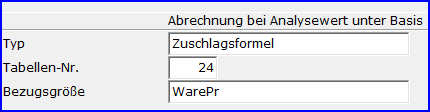

  Die Berechnungsmethode **‚Std.gew.(100-A./100-Bas.)‘** steht für Standardgewichtumrechnung mit Faktor = (100 minus korrigiertem Analysewert) dividiert durch (100 minus unterem bzw. oberem Basiswert). Der so ermittelte Faktor multipliziert mit der **‚Bezugsgröße‘** ergibt einen neuen Wert (Standardgewicht). Die Differenz dieses Wertes und der Bezugsgröße ist als Zuschlagsmenge bzw. Abschlagsmenge das Ergebnis der Methode.

    
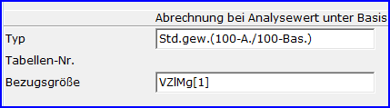

  Die ähnliche Berechnungsmethode **‚Std.gew.(Anal./Basis.)‘** steht für Standardgewichtumrechnung mit Faktor = korrigierter Analysewert dividiert durch unterem bzw. oberem Basiswert. Der so ermittelte Faktor multipliziert mit der **‚Bezugsgröße‘** ergibt einen neuen Wert (Standardgewicht). Die Differenz dieses Wertes und der Bezugsgröße ist als Zuschlagsmenge bzw. Abschlagsmenge das Ergebnis der Methode.

    
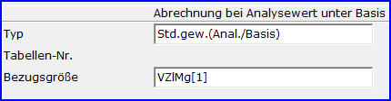

  In der Berechnungsmethode **‚Mindestpreisabgleich‘** wird der in der Abrechnungsfolge gerade aktuelle Preis zur im ‚Warenbezug‘ angegebenen Warenposition mit dessen Mindestpreis verglichen. Ist letzterer höher als der aktuelle Preis, so wird die Differenz als Preiszuschlag erzeugt.

    
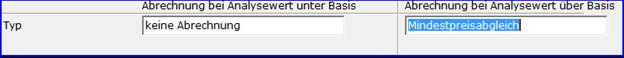

  Notwendig zum Auslösen der Berechnung ist dafür jedoch auch hier die erfüllte Bedingung, dass der zugehörige Analysewert in Relation zu den Basiswerten im richtigen Bereich liegt. Haben beispielsweise unterer und oberer Basiswert den Wert = 0, so wir bei jedem Wert größer 0 des Analysewerts die Berechnung im Beispiel durchgeführt.

  Eine weitere Möglichkeit, Zuschläge oder Abschläge auf Preis oder Menge der im Feld ‚Warenbezug‘ angegebenen Warenposition zu berechnen, ist die Nutzung von dazu bestimmten privaten Datenbankfunktionen [(**‚Preiszu-/ab-DB-Prozedur‘** bzw. **‚** **Mengenzu-/ab-DB-Prozedur‘**](./rohwarequalitaets_und_kostenpositionen_datenbankprozedur_und/qualitaets_und_kostenmerkmalwerte_per_datenbankprozedur_best.md)), deren jeweiliger Prozedurname im Feld **‚DB-Prozedur‘** anzugeben ist.

    
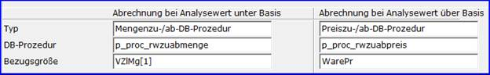

  Wird in der verwendeten Prozedur die Bezugsgröße als Parameter übergeben, so ist diese im Feld **‚Bezugsgröße‘** anzugeben.

  Eine besondere Methode der Qualitätsmerkmalabrechnung stellt der Typ **‚Steuerkorrektur‘** dar.  
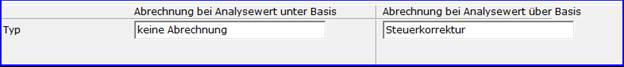

  Notwendig zum Auslösen der Berechnung ist dafür jedoch auch hier die erfüllte Bedingung, dass der zugehörige Analysewert in Relation zu den Basiswerten im richtigen Bereich liegt. Haben beispielsweise unterer und oberer Basiswert den Wert = 1, so wir bei jedem Wert ungleich 0 und ungleich 1 des Analysewerts die Berechnung im Beispiel durchgeführt. Dabei wird der **Analysewert** als **Steuerkorrekturwert** betrachtet und in der zur im Feld ‚Warenbezug‘ angegebenen Warenposition vermerkt. Am Ende des gesamten Qualitätsblocks wird dieser Wert aus der Warenposition gelesen und der zur Warenposition gehörenden Steuersumme addiert bzw. abgezogen. Dadurch ist zum Beispiel bei der Nacherfassung von Eingangsbelegen mit von A.eins abweichender Steuerberechnung ein Ausgleich auf der Ebene der Steuersummen pro Steuersatz möglich.

  Die für einige der Berechnungsmethoden notwendige Angabe einer **‚Bezugsgröße‘** ist jeweils im gleichnamigen Feld einzutragen.

 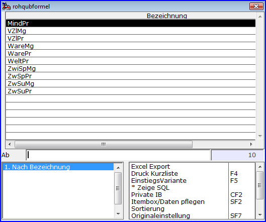

  Dabei bedeuten:

  **MindPr, MindPr[r]  
**Mindestpreis zur Warenposition mit der Referenznummer **r** der Rohwarengruppendefinition.  
Dabei ist **MindPr** eine Kurzschreibweise für **MindPr[1]**.

  **VZlMg, VZlMg[r]  
**Vorzeilenmenge (=aktuell berechnete Menge) der Warenposition mit der Referenznummer **r** der Rohwarengruppendefinition. Dabei ist **VZlMg** eine Kurzschreibweise für **VZlMg[1]**.

  **VZlPr, VZlPr[r]  
**Vorzeilenpreis (=aktuell berechneter Preis) der Warenposition mit der Referenznummer **r** der Rohwarengruppendefinition. Dabei ist **VZlPr** eine Kurzschreibweise für **VZlPr[1]**.

  **WareMg, WareMg[r]  
**Warenmenge (= Einstands- oder auch Bruttomenge) der Warenposition mit der Referenznummer **r** der Rohwarengruppendefinition. Dabei ist **WareMg** eine Kurzschreibweise für **WareMg[1]**.

  **WarePr, WarePr[r]  
**Warenpreis (= Anfangspreis) der Warenposition mit der Referenznummer **r** der Rohwarengruppendefinition. Dabei ist **WarePr** eine Kurzschreibweise für **WarePr[1]**.

  **WeltPr, WeltPr[r]  
**Weltmarktpreis der Warenposition mit der Referenznummer **r** der Rohwarengruppendefinition. Dabei ist **WeltPr** eine Kurzschreibweise für **WeltPr[1]**.

  **ZwiSpMg, ZwiSpMg[i]  
**Zwischenspeichermenge mit der Nummer **i.** Dabei ist **ZwiSpMg** eine Kurzschreibweise für **ZwiSpMg[1]**.

  **ZwSpPr, ZwSpPr[i]  
**Zwischenspeicherpreis mit der Nummer **i.** Dabei ist **ZwSpPr** eine Kurzschreibweise für **ZwSpPr[1]**.

  **ZwSuMg, ZwSuMg[r]  
**Zwischensummenmenge der Warenposition mit der Referenznummer **r** der Rohwarengruppendefinition. Dabei ist **ZwSuMg** eine Kurzschreibweise für **ZwSuMg[1]**.  
Hier wird auf die zuletzt vor dieser Qualität ausgewiesene Zwischensummenzeile zur referenzierten Warenposition verwiesen.

  **ZwSuPr, ZwSuPr[r]  
**Zwischensummenpreis der Warenposition mit der Referenznummer **r** der Rohwarengruppendefinition. Dabei ist **ZwSuPr** eine Kurzschreibweise für **ZwSuPr[1]**.  
Hier wird auf die zuletzt vor dieser Qualität ausgewiesene Zwischensummenzeile zur referenzierten Warenposition verwiesen.

  Mit **Ausnahme** des Berechnungstyps **Steuerkorrektur**‚ können für die Auslösung einer Berechnungsmethode Bedingungen in abhängigkeit andere Qualitäten formuliert werden. Ist dieses gewünscht, so wird dieses durch den Wert **‚Ja‘** im Feld **‚Bedingung‘** eingestellt.  
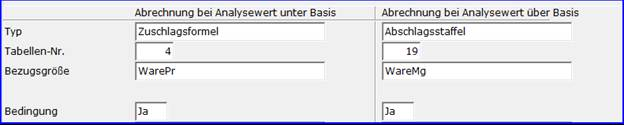

  In diesem Falle befinden sich in der Optionbox der Maske die Funktionen **‚Bedingung unter Basis‘** bzw. **‚Bedingung über Basis‘**, über die die jeweilige Maske zur Detailisierung der Bedingung aufgerufen werden kann.

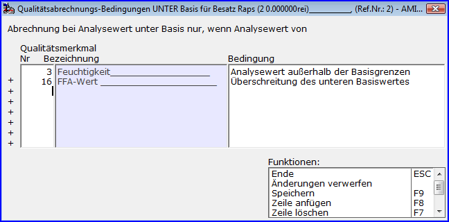

  Hier werden für per Referenznummer in der Spalte **‚Nr‘** bestimmte Qualitäten Bedingungen in der Spalte **‚Bedingung‘** ausgewählt.  
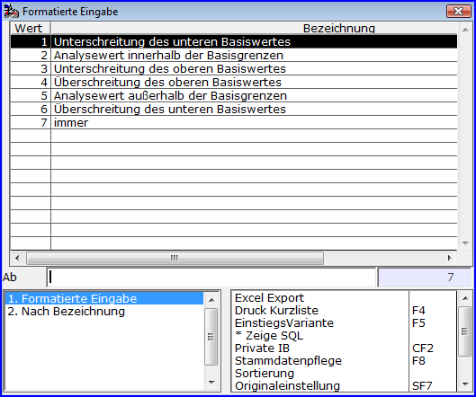  
Mehrere Einträge sind bei der Auswertung mit dem logischen **‚UND‘** verknüpft. Nur wenn alle Bedingungen erfüllt sind, kann die Berechnungsmethode angewandt werden.

  Mit **Ausnahme** des Berechnungstyps **Steuerkorrektur**‚ können für alle Berechnungsmethoden im Feld **‚Zwisch.Sp.‘ Zwischenspeicher** angegeben werden. Ein Zwischenspeicher wird hier mit **ZwiSp** oder **ZwiSp[i]** mit **i** als Ziffer angegeben, wobei **ZwiSp** gleichbedeutend mit **ZwiSp[1]** ist.  
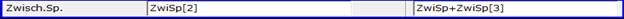

  Soll ein ermittelter Zuschlag oder Abschlag in mehreren Zwischenspeichern abgelegt werden, so sind diese mit **‚+‘** zu verknüpfen. Dabei wird ein Zu-/Abschlag zu den angesprochenen Zwischenspeichern hinzugefügt, so dass zum Beispiel ein ‚Aufsammeln‘ mehrerer Zu- oder Abschläge erfolgen kann. Intern werden die Zwischenspeicher getrennt nach Menge und Preis geführt und die Daten entsprechend dem Ergebnistyp der Berechnungsmethode der Zwischenspeichertyp bedient.

    
Ist die Berechnung oder der Druck der Qualität abhängig davon, ob es sich bei der im Feld **Warenbezug** angegebenen Warenposition um eine Einlagerungsposition, Vereinnahmungsposition oder keines von beiden handelt, so ist dieses in den Feldern **‚Berechnung erfolgt‘** bzw. **‚Ausdruck erfolgt‘** einstellbar.  
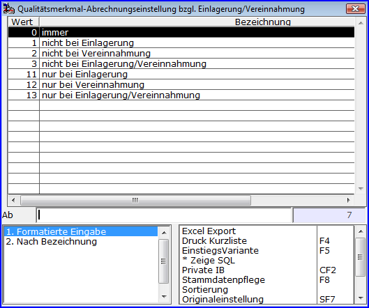

  Unabhängig von dieser Einstellung sind aber Einstellungen in den Feldern **‚Ausdruck ab:‘**, **‚Berechnung ab:‘** und **‚Drucktyp‘**, die die Berechnung oder die Druckausgabe unterdrücken, vorrangig.  
    

  Die **‚Auswertungsnummer‘,** die es für alle Rohware-Positionszeilen gibt, kann bei der Erstellung von Belegauswertungen zum Zugriff auf bestimmte Positionszeilen herangezogen werden. Diese Angabe wird nicht in den Belegen gespeichert, so dass spätere Änderungen von Auswertungsnummern auch die Ergebnisse betroffener Auswertungen verändern können.

  In der **‚Wertvorbelegung‘** kann festgelegt werden, ob die Analysewerte der Qualitäten im Abwicklungsregister der Streckenerfassung für einen neuen Vorgang stehen gelassen werden sollen, wenn der gleiche Artikel nochmals ausgewählt wurde oder ob die Werte gelöscht werden.

Merkmal-Detail-Definition von Kosten-/Vergütungsmerkmalen

  Hauptmenü > Rohwarenabrechnung \> Rohwaren-Verwaltung > Bearbeiten > Abrechnungsschema > Merkmal-Definition

  Direktsprung **[RWG]**

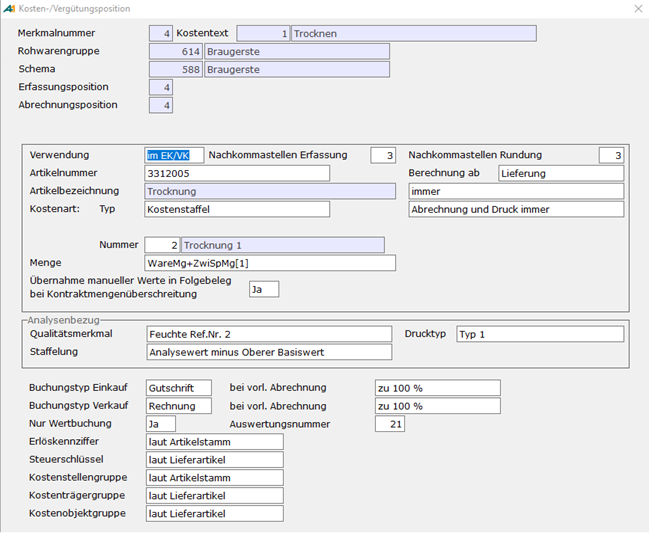

  Die Verwendung der Position kann im Feld **‚Verwendung‘** auf einen der Bereiche Einkauf und Verkauf beschränkt oder für beide zugelassen werden.

  Die Angaben **‚Nachkommastellen Erfassung‘** und **‚Nachkommastellen Rundung‘** beziehen sich auf die Menge der Kosten-/Vergütungsposition bei Erfassung, Abrechnung und Druck.

  Im Feld **‚Artikelnummer‘** kann die Artikelnummer des zu buchenden Artikels für diese Position festgelegt werden. Es ist darauf zu achten, dass dieser Artikel auf allen Lägern, für die Belege dieses Abrechnungsschemas erfasst oder erzeugt werden, angelegt wurde. Es muss sich dabei nicht um einen Artikel mit Rohwarengruppe handeln, diese Bedingung gilt nur für Lieferartikel. Wird **keine Artikelnummer** eingetragen, so wird im Beleg derselbe Artikel wie für die Lieferposition herangezogen.

  Im Feld **‚Berechnung ab:‘** wird festgelegt, ab welcher Belegstufe (**Lieferung**, **Abschlag**, **Folgeabschlag**, **Finale**) diese Positionszeile grundsätzlich berechnet und auf Formularen ausgegeben werden soll.  
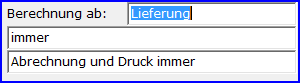

  Ist die Berechnung oder der Druck der Qualität abhängig davon, ob es sich bei Lieferposition des Rohwarebeleges um eine Einlagerungsposition, Vereinnahmungsposition oder keines von beiden handelt, so ist dieses in den Feldern im darunterliegenden Feld einstellbar.

    

  Unterhalb der beiden zuletzt angesprochenen Felder können mehrere durch logisches **‚UND‘** oder **‚ODER‘** verknüpfte Bedingungen formuliert werden, die die Abrechnung und Druck der Position in Abhängigkeit anderer Kosten-/Vergütungspositionen weiter einschränken.

    
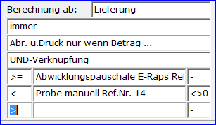

  Die erste Spalte einer Bedingungszeile gibt an, wie der eigene Vergleichswert mit dem der in der zweiten Spalte angegebenen Position zu vergleichen ist.  
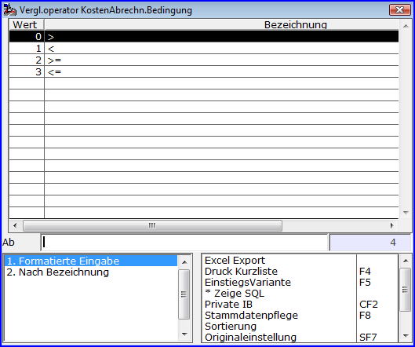  
In der letzten Spalte kann angegeben werden, wann die Bedingung bzgl. des positionseigenen Vergleichswertes berücksichtigt werden soll.  
.  
Dabei bedeutet das Minuszeichen ‚-‘ so viel wie ‚immer die Bedingung auswerten‘.   
Grundsätzlich kann eine Kosten-/Vergütungsposition nur gedruckt werden, wenn der errechnete Betrag der Position ungleich 0 ist.

  Zur Berechnung von Kosten oder Vergütungen wird zunächst der ‚Typ‘ der ‚Kostenart‘ angegeben.

    
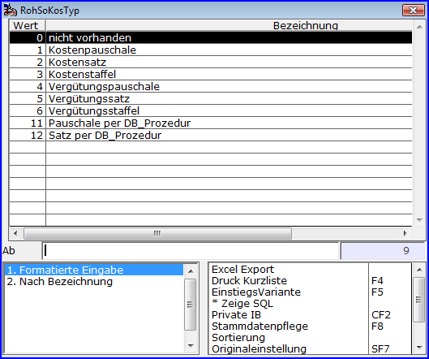

  Im Falle der [**Kostenpauschale** bzw. **Vergütungspauschale**](./konstanten_und_tabellen_fuer_die_einrichtung_von_abrechnungs/rohware_kostengruppen_fuer_kosten_verguetungssaetze_und_paus.md#Pauschalkostentabellen) wird durch Angabe der **‚Gruppe‘** und der **‚Nummer‘** des in der Kostengruppe definierten Pauschalbetrags die Kostendefinition präzisiert. Dabei ist zu beachten, dass bei Gruppe = 0 oder Nummer = 0 der dort hinterlegte Wert bei der Beleg-Erfassung als Vorbelegung interpretiert wird und manuell geändert werden kann.

    
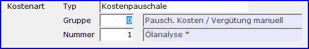

  Die Einstellung [**Kostensatz** bzw. **Vergütungssatz**](./konstanten_und_tabellen_fuer_die_einrichtung_von_abrechnungs/rohware_kostengruppen_fuer_kosten_verguetungssaetze_und_paus.md#Kostensatztabellen) wird ebenfalls durch Angabe der **‚Gruppe‘** und der **‚Nummer‘** des in der Kostengruppe definierten Kosten- bzw. Vergütungssatzes vervollständigt. Auch hier gilt, dass bei Gruppe = 0 oder Nummer = 0 der dort hinterlegte Wert bei der Beleg-Erfassung als Vorbelegung interpretiert wird und manuell geändert werden kann.

    
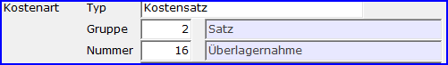

  Wird als Typ [**Kostenstaffel** bzw. **Vergütungsstaffel**](./konstanten_und_tabellen_fuer_die_einrichtung_von_abrechnungs/rohware_kostengruppen_fuer_kosten_verguetungssaetze_und_paus.md#Kostensatzstaffeln) gewählt, so ist im Feld **‚Nummer‘** die zu nutzende Staffel per Nummer anzugeben.

    
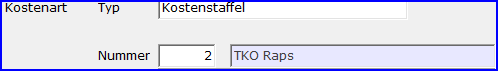

  Es können zur Ermittlung von [Pauschalbeträgen und Kosten- und Vergütungssätzen auch private Datenbankprozeduren](./rohwarequalitaets_und_kostenpositionen_datenbankprozedur_und/qualitaets_und_kostenmerkmalwerte_per_datenbankprozedur_best.md) eingesetzt werden. Hier ist dann unter dem Typ der Name der Prozedur anzugeben.

    
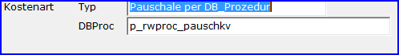

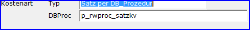

  Sofern es sich bei der Kostenart nicht um eine Pauschale handelt, kann im Feld **‚Menge‘** eingestellt werden, wie die Menge, auf die sich ein Kostensatz bzw. Vergütungssatz beziehen soll, zu bestimmen ist.

    
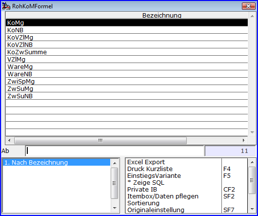

  Neben der Einstellung **‚manuell‘**, die eine manuelle Mengenerfassung bewirkt, kann hier eine Formel mit den angezeigten Elementen zusammengestellt werden, indem diese mitttels der Operatoren **‚+‘ ‚-‘ ‚\*‘** und **‚/‘** verknüpft werden.

    

  Die unterschiedlichen Operanden haben nach Ergänzung um eine Referenznummer in eckigen Klammern dabei folgende Bedeutung:

- **KoMg[r]  
**(Kostenmenge)  
Mit dieser Einstellung wird auf die Menge der Kosten-/Vergütungsposition mit der Referenznummer r zurückgegriffen.

- **KoNb[r]  
**(Kostennettobetrag)  
Der Nettobetrag der Kosten-/Vergütungsposition mit der Referenznummer r wird als Menge der aktuellen Position interpretiert, um z.B. per Kostensatz prozentuale Beträge vom Netto (z.B. CMA) berechnen zu können.

- **KoVZlMg  
**(Kostenvorzeilenmenge)  
Die Menge der vorhergehenden Kosten-/Vergütungsposition wird auch zur Menge der aktuellen Position.

- **KoVZlNB  
**(Kostenvorzeilennettobetrag)Der Nettobetrag der vorhergehenden Kosten-/Vergütungsposition wird als Menge der aktuellen Position interpretiert.

- **KoZwSumme  
**(Kostenzwischensumme)Der Nettobetrag der zuletzt erzeugten Kosten-/Vergütungs-Zwischensumme wird als Menge der aktuellen Position interpretiert.

- **VZlMg, VZlMg[r]  
**(Vorzeilenmenge Ware = aktuelle Menge der Warenposition)Mit dieser Einstellung wird auf die Endmenge der Warenposition mit der Referenznummer r zurückgegriffen. Dabei ist VZlMg gleichbedeutend mit VZlMg[1].

- **WareMg, WareMg[r]  
**(Warenmenge = Einstandsmenge der Warenposition)Mit dieser Einstellung wird auf die Anfangsmenge der Warenposition mit der Referenznummer r zurückgegriffen. Dabei ist WareMg gleichbedeutend mit WareMg[1].

- **WareNB, WareNB[r]  
**(Warennettobetrag)Mit dieser Einstellung wird auf den Endnettobetrag der Warenposition mit der Referenznummer r als Menge der aktuelle Position zurückgegriffen. Dabei ist WareNB gleichbedeutend mit WareNB[1].

- **ZwiSpMg, ZwiSpMg[i]  
**(Zwischenspeichermenge)Der Wert des per Qualitätspositionen versorgten Mengenzwischenspeichers mit dem Index i wir übernommen. Dabei ist ZwiSpMg gleichbedeutend mit ZwiSpMg[1].

- **ZwSuMg, ZwSuMg[r]  
**(Zwischensummenmenge Ware)Die Menge der letzten erzeugten Warenzwischensumme zur Warenposition mit der Referenznummer r wird herangezogen. Dabei ist ZwSuMg gleichbedeutend mit ZwSuMg[1].

- **ZwSuNB, ZwSuNB[r]  
**(Zwischensummennettobetrag Ware)Der Nettobetrag der letzten erzeugten Warenzwischensumme zur Warenposition mit der Referenznummer r wird als Menge herangezogen. Dabei ist ZwSuNB gleichbedeutend mit ZwSuNB[1].

  Ist durch die Definition des Kostenmerkmals einer der Werte  
    

- **Kosten-/Vergütungssatz**
- **Kosten-/Vergütungspauschale**
- **Menge  
    
**

  in Belegen manuell zu erfassen, so bestimmt das Attribut **‚Übernahme manueller Werte in Folgebeleg bei Kontraktmengenüberschreitung‘,** ob die manuell zu erfassenden Werte bei der [Erzeugung von Zusatzbelegen wegen Kontraktmengenüberschreitung](./rohwarenbearbeitung/rohware_erfassung_mit_belegsplitting_bei_kontraktmengenueber/index.md) bei der Belegerfassung in die Zusatzbelege zu übernehmen sind.  
Dieses gilt auch bei manuell geänderten Kosten-/Vergütungssätzen und -Beträgen.

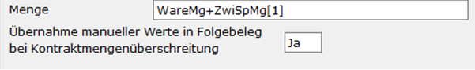  
    

  Insbesondere für die Kostenarten der Typen [**Kostenstaffel** und **Vergütungsstaffel**](./konstanten_und_tabellen_fuer_die_einrichtung_von_abrechnungs/rohware_kostengruppen_fuer_kosten_verguetungssaetze_und_paus.md#Kostensatzstaffeln) ist die Referenz auf ein Qualitätsmerkmal anzugeben, mit dem die Position verknüpft ist und.

    
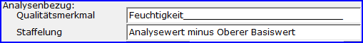

  Diese Referenz kann aber auch bei der Ermittlung von Sätzen oder Pauschalen durch die Kostenarten [**Pauschale per DB_Prozedur** und **Satz per DB_Prozedur**](./rohwarequalitaets_und_kostenpositionen_datenbankprozedur_und/qualitaets_und_kostenmerkmalwerte_per_datenbankprozedur_best.md) genutzt werden.  
Die Angabe im Feld **‚Staffelung‘** legt fest, welcher Wert der Qualität für die Staffelung als Vergleichswert heranzuziehen ist.

    
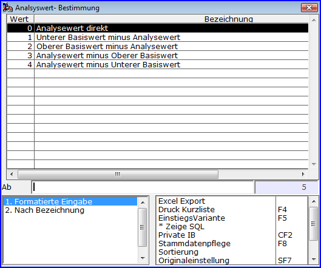

  Die Einstellung im Feld **‚Drucktyp‘** wird beim Formulardruck mit der zum Kosten-/Vergütungsmerkmal korrespondierenden Belegpositionszeile ausgewertet. In den verwendeten Druck-Formularen können **Druckbereichseinrichtungen in mehreren Varianten** erstellt werden. In den Bereichsangaben der Standardvariante 0 erfolgt eine Zuordnung von Drucktyp **‚Typ 1‘** bis **‚Typ 10‘** zur zu verwendenden Variante der Druckbereichseinrichtung. Damit können unterschiedlichen Koste- und Vergütungstypen auf Druckformularen unterschiedlich dargestellt werden. Zusätzlich kann durch den Drucktyp die Erzeugung einer Zwischensummenzeile für den Kosten- und Vergütungsblock erzwungen werden.

    

  Im Einzelfall kann es auch sinnvoll sein, die Druckausgabe einer Position grundsätzlich zu unterdrücken (Einstellung: **‚keine Ausgabe‘**).  
    

  Für die steuerliche Behandlung von Kosten- und Vergütungsmerkmalen ist die Einstellung in den Feldern ‚Buchungstyp Einkauf‘ und ‚Buchungstyp Verkauf‘ maßgeblich. In den meisten Fällen wird hier die Einstellung ‚Gutschrift‘ erforderlich sein, was (aus historischen Gründen ausgehend von Kosten in einem Einkaufsbelege bzw. Vergütungen in einem Verkaufsbeleg) die Minderung des eigentlichen Einkaufsaufwandes bzw. Verkaufserlöses signalisiert und gleichlaufend mit dem Hauptbuchungstyps des Beleges im Einkauf eine (bei Kosten negative) vorsteuerwirksame Positionszeile bzw. im Verkauf eine (bei Vergütung negative) mehrwertsteuerwirksame Positionszeile erzeugt. Entsprechend wird mit der Einstellung ‚Rechnung‘ eine umsatzsteuerlich gegenläufige Buchungszeile erzeugt.

    
  
    

  Bei der Erstellung einer Abschlag- bzw. Folgeabschlagrechnung, die entsprechend der Rohwareparameter-Einstellung des Abrechnungsschemas zu einer Abschlagbetrag-Ermittlung per %-Satz erfolgt, wird für Kosten- und Vergütungspositionen festgelegt, ob diese zu 100% oder auch mit dem Abschlagsatz in die Beleg-Abschlagsumme eingehen.

    
  
    

  Die **‚Auswertungsnummer‘,** die es für alle Rohware-Positionszeilen gibt, kann bei der Erstellung von Belegauswertungen zum Zugriff auf bestimmte Positionszeilen herangezogen werden. Diese Angabe wird nicht in den Belegen gespeichert, so dass spätere Änderungen von Auswertungsnummern auch die Ergebnisse betroffener Auswertungen verändern können.

  **Wichtig** für die Bestandsbuchung einer Kosten-/Vergütungsposition ist die Einstellung im Feld **‚Nur Wertbuchung‘**. Ist kein gesonderter Artikel für die Position im Feld **‚Artikelnummer‘** festgelegt, so wird die Position warenwirtschaftlich auf den Artikel der Lieferposition (Hauptartikel) des Beleges gebucht. In diesem Fall sollte, wenn die Menge der Position nicht gebucht werden soll, die Einstellung **‚Ja‘** vorgenommen werden (Beispiel: Trocknungskosten als Minderung des Wareneinkaufs als Wertbuchung auf den Einkaufsartikel). Die Einstellung **‚Nein‘** löst in jedem Falle auch eine bestandsverändernde Buchung aus, bei Pauschalkosten bzw. Pauschalvergütungen mit der Menge=1!

  Die Angaben zur Festlegung von **Erlöskennziffer, Steuerschlüssel** ;**Kostenstellengruppe, Kostenträgergruppe** und **Kostenobjektgruppe** haben die Einstellmöglichkeiten **‚laut Artikelstamm‘** (der entsprechende Wert wird den Angaben zum Artikel entnommen), **‚laut Lieferartikel‘** (der entsprechende Wert wird den Angaben zum Artikel der Lieferposition entnommen) und **‚speziell‘** (in diesem Fall wird der entsprechende Wert gesondert festgelegt).  
 

    
Die Felder **Kostenstellengruppe, Kostenträgergruppe** und **Kostenobjektgruppe** sind nur dann verfügbar, wenn die zugehörigen Steuerparameter **Kostenstellen-Lizenz**, **Kostenträgerrechnung angeschlossen** beziehungsweise **Kostenobjekt-Lizenz** aktiviert sind.
