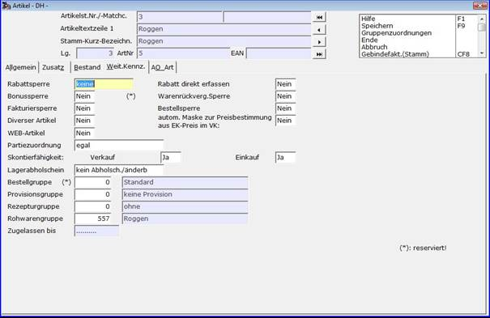

# Zuordnung Artikel zu Rohwarengruppen

<!-- source: https://amic.de/hilfe/zuordnungartikelzurohwarengrup.htm -->

Hauptmenü > Stammdatenpflege \> Artikelstamm > Artikel

Direktsprung **[RWPA]**

Innerhalb des Artikels **[AR]** wird unter *\> weitere Kennzeichen &lt;* die Zuordnung des Artikels zu den eingerichteten Rohwarengruppen **[RWG]** vorgenommen.

