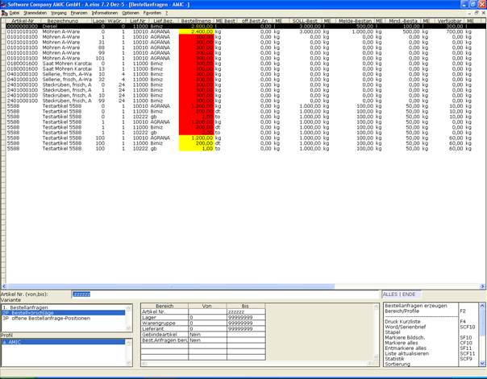
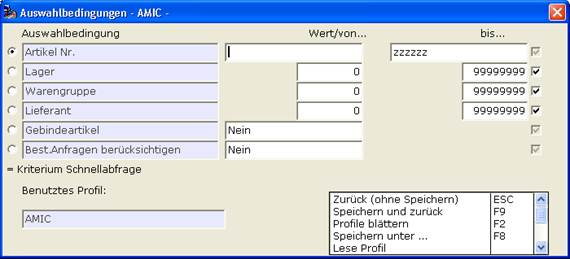

# Bestellvorschlagsliste

<!-- source: https://amic.de/hilfe/bestellvorschlagsliste.htm -->

Die Bestellvorschlagsliste wird erreicht über den Direktsprung [BAB], dort die Variante ‚Bestellvorschläge’ wählen.

Alle Artikel die mindestens einen Lieferanten hinterlegt haben, wo der verfügbare Bestand kleiner dem Meldebestand ist und die weder eine Bestellsperre im ARTIKEL noch im Kunden/Lieferantenstamm haben, werden hier angezeigt.

Die Bestellmenge wird auf Basis der Bestellgröße und der Differenzmenge zwischen verfügbaren Bestand und Soll-Bestand, lagerbezogen ermittelt.

Diese Auswahlliste kann nach verschiedenen Kriterien gefiltert werden.

So ist es zum Beispiel möglich diese Bestellvorschläge auf einen Lieferanten einzugrenzen um gezielt für diesen Lieferanten zu bestellen.

Die Einstellung –Best.Anfragen berücksichtigen- sorgt dafür, dass die Mengen aus offene Bestellanfragen in den verfügbaren Bestand mit eingerechnet werden, da diese Bestellungen in Vorbereitung sind.

Sind für einen Artikel gleich mehrere Lieferanten in der Auswahllist, so wird die Bestellanfrage für den erstgefundenen Lieferanten erstellt. Die Kennzeichnung eines Hauptlieferanten ist nicht vorgesehen!

Mit der Funktion „Anfrage in den Vorgangsimport“ [Shift +F9] werden die Ausgewählten Datensätze in den [VorgangsImport](../../vorgangsimport/index.md) übernommen. Dort können dann die Daten noch verändert werden, bevor diese in eine Bestellung gewandelt werden.

Es besteht bei der Übernahme noch die Möglichkeit die Artikel nach Lager und Lieferant zu splitten. Dazu muss der Steuerparameter 928 mit der Option „BESTELLVORSCHLAEGELAGERTRENNUNG“ auf 1 gestellt werden.

Im Standard wird nur nach Lieferant gesplittet
