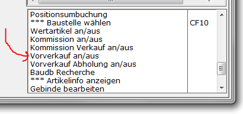
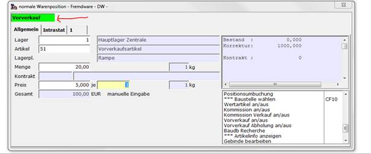
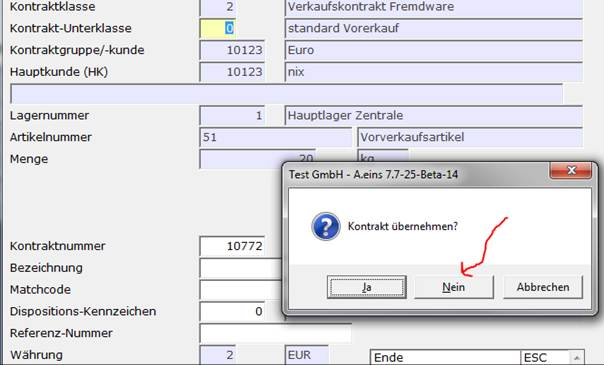
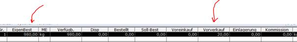
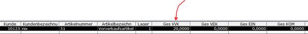
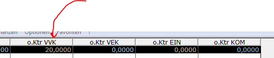
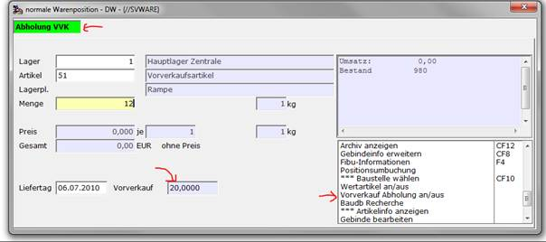

# Artikelsuche

<!-- source: https://amic.de/hilfe/artikelsuche.htm -->

Generell wird davon ausgegangen, dass ausschließlich über Artikelkonten gebucht wird (zum Problem der “Diversen Artikel” siehe weiter unten).

In den Stammdaten hinterlegt sind verschiedene Suchkriterien, anhand derer ein Artikel gefunden werden kann; dies sind z.B.

- Artikelnummer
- Artikelmatchcode(s)
- Strichcodenummer(n)
- Artikelbezeichnung

Am Beispiel der Artikelnummer ergibt sich folgender Ablauf:

Wenn die Artikelnummer korrekt eingegeben wird, erscheint rechts davon die erste Artikeltextzeile. Als nächstes Eingabefeld wird das Mengenfeld abgefragt. Falls es sich nicht um den gewünschten Artikel handelt, kann mit der Pfeil-Taste wieder in das Feld “Artikelnummer” zurückpositioniert und die Eingabe wiederholt werden.

Bei unvollständiger oder falscher Eingabe der Artikelnummer öffnet sich automatisch das Artikelauswahlfenster und es besteht die Möglichkeit, mit alternativen Suchkriterien den Artikel zu finden, indem eine andere Variante gewählt wird.

Im Auswahlfenster ist jedoch auch eine schrittweise Suche möglich. Bei Eingabe der Nummer wird Ziffer für Ziffer geprüft. Wenn eine Eingabe falsch ist, wird sie zurückgewiesen. Mit jeder Eingabe wird eine neue Auswahlliste in der Box dargestellt. Wenn noch nicht alle Stellen eingegeben wurden, die ersten Stellen aber bereits eindeutig sind, wird automatisch eine Liste der Artikel angezeigt, für die diese Ziffern stimmen.

Bei Eingabe von Buchstaben muss vorher auf die Variante Matchcode - Suche geschaltet werden. Für die Suche nach Strichcodenummer muss auf die Variante EAN umgeschaltet werden. Die Bedienung erfolgt analog zur Eingabe der Artikelnummer.

Auch ist es möglich, eine Auswahlvariante direkt im Feld “Artikelnr.” aufzurufen: Mit ***“3.ge”*** werden alle Artikel aufgerufen, in denen ***“ge”*** enthalten ist.

Eine Suchvariante kann auch als Standardvariante gesetzt werden; dann wird immer im Eingabefeld „Artikel“ die Suche nach dem gesetzten Kriterium gestartet. Die „Setzung“ wird durch Markierung der Suchvariante und Betätigung der Funktion „Einstiegsvariante“ ausgelöst. Eine gesetzte Variante kann mit Betätigung von „Einstiegsvariante“ gelöscht werden. Dann ist automatisch die Standardsuche aktiv. Sie ermöglicht sowohl die Suche nach „Artikelnummer“ und „Bezeichnung“.

Diverse Artikel

Auch wenn es Ziel eines Unternehmens ist, eine artikelgenaue Bestands- und Erfolgsrechnung zu organisieren, wird es in vielen Fällen erforderlich sein, Sammelkonten zu führen. Hiermit ist jedoch nicht gemeint, Artikel von Fall zu Fall manuell zu buchen. Vielmehr wird man spezielle Artikelkonten anlegen, über die dann Geschäftsvorfälle, die diese Artikel berühren, abgewickelt werden. Hierdurch ist gewährleistet, dass alle Vorfälle im System ordnungsgemäß erfasst wurden und dass die interne Steuerung, z.B. Verbuchung auf den Steuerkonten, vom System verwaltet wird. Natürlich will man in diesen Fällen einen individuellen Artikeltext vergeben. Die Betä­ti­gung von “F6” Artikeltext ändern ermöglicht hier dann die Korrektur des vorge­ge­be­nen Textes. Zusätzlich kann dieses Verfahren automatisiert werden, indem im Artikel unter „weitere Kennzeichen“ auf „Diverse Artikel“ geschaltet wird. Das Fenster öffnet dann automatisch.

Menge

An dieser Stelle erfolgt die Mengeneingabe. Bitte beachten Sie, dass die Eingabe der Nachkommastellen zur Formulareinrichtung passen muss.

Eingabe der Gesamtmenge

In den meisten Fällen erfolgt eine Gesamtmengeneingabe im Mengenfeld, gesteuert über die Mengeneinheiten. Weitere Fälle sind dann nicht zu beachten.

Mengeneingabe mit Gebinde

Wenn die Verkaufsmengeneinheit eines Artikels als Gebinde definiert wurde, dann öffnet sich nach Aufruf des Artikels ein Erfassungsfenster zur Gebindeerfassung:

Nach Bestätigung der Erfassung mit der **ENTER**\-Taste gelangt man in die Artikelerfassung zurück. Mittels einer speziellen “EPA”-Einstellung kann man jedoch auch dafür sorgen, dass die Eingabe im Feld “Anzahl” fortgesetzt wird. Somit können mehrere Gebinde hintereinander erfasst werden. Diese Form der Erfassung muss mit **ESC** beendet werden.

Eine Teilmengeneingabe ist möglich, indem z.B. “Anzahl” und “Gebindeeinheit” mit 0 erfasst werden und in der “Liefereinheit” die Teilmenge erfasst wird.

Das Ergebnis der Gebindeberechnung wird nach Verlassen des Fensters in das Mengenfeld übernommen. Von dort ab entspricht die Erfassung wieder dem oben beschriebenen Vorgehen.

Häufig ist es sinnvoll, die Auflösung des Gebindes mit anzudrucken, so z.B. auf dem Lieferschein, um dem Lageristen die Aufgabe zu erleichtern. Hierzu muss das Formular entsprechend eingerichtet werden.

Preis

Hier erfolgt die Preiseingabe. Der Preis wird entweder automatisch vorgeschlagen (aus der Preismatrix, aus individuellen Vereinbarungen, etc.) und hier bestätigt oder manuell erfasst. Der Grundpreis (Liste oder individuell) wird bereits mit dem Artikelaufruf angezeigt. Der Kontraktpreis jedoch erst nach Eingabe der Menge, da geprüft werden muss, ob und welcher Preis überhaupt gezogen werden soll.

Wird im Preisfeld **F3** betätigt, werden alternative Listenpreise und Preise aus Angeboten, Aufträgen und Rechnungen dieses Kunden angezeigt, die ggf. auch zur Bepreisung ausgewählt werden können.

Mittels eines Steuerungsparameters (Vorgangspositionen Warenpositionen) kann eine vom Standard abweichende Variante für die Preis-Selektion (**F3** beim Einzelpreis) eingestellt werden, so dass nicht auf die Listenpreise, sondern auf die Preise in vorhandenen, unerledigten Angeboten und Aufträgen (bzw. Bestellanfragen und Bestellungen im Einkauf) für denselben Kunden/Lieferanten, denselben Artikel und ggf. dieselbe Versandanschrift zurückgegriffen wird.

Es ist möglich, dort auf die Standardpreise zurückzuschalten.

**Achtung:** Es wird hierbei natürlich nicht im Angebot bzw. Auftrag eine Disposition vorgenommen, wie bei der Teildisposition mittels **F6**. Es handelt sich also lediglich um eine Preisermittlungs-Hilfe bei der Erfassung.

Bei der automatischen Preisfindung kann durch Anwahl der Funktion “Preisfindung Information” angezeigt werden, wie dieser Preis zustande gekommen ist. Die Preisherkunft (manuell, Liste, Kontrakt,...) wird rechts neben dem Gesamtpreisfeld angezeigt.

Preiseinheit / Mengeneinheit

Der Preis bezieht sich auf “n” “Mengeneinheiten”, z.B. “1 Stück”. Diese Felder sind vorbelegt mit den Angaben des Artikelstamms, können hier jedoch bei Bedarf über­schrieben werden (wenn durch das Parametersystem gestattet). Wenn also ein anderer Preisbezug gewünscht ist, dann werden zuerst die Anzahl der Mengeneinheiten und danach die Mengeneinheit erfasst. A.eins lässt nur Mengeneinheiten zu, die sich auf die gleiche Grundeinheit, wie im Artikelstamm in den Mengeneinheiten definiert, zurückführen lassen, um die Datenkonsistenz zu gewährleisten.

Skontierfähigkeit

Eingabe, ob auf die Position prinzipiell Skonto gewährt wird. Vorbelegt aus den Angaben des Artikelstamms. Erst die Bestimmung der Zahlungsbedingung zum Abschluss entscheidet jedoch darüber, ob tatsächlich Skonto gewährt wird.

Rabatt

Gesteuert über den Artikel (manueller Rabatt zulässig) wird ein Rabatt abgefragt.

Informationen

Rechts im Erfassungsbildschirm befindet sich ein Informationsfenster, das Informationen zum Artikel bereitstellen kann (Gewicht, Preis, etc.). Auch dieser Bildschirm kann frei im Formulareinrichter gestaltet werden.

Erfassung Vorverkauf, Voreinkauf, Einlagerung und Kommission

Die Geschäftsvorfälle Voreinkauf und Kommission sind dem Verkaufsbereich zugeordnet während der Voreinkauf und die Einlagerung dem Bereich Einkauf angesiedelt sind. Sie bestehen in der Regel immer aus den Phasen Geschäftseinleitung und Geschäftsabwicklung:

- Vorverkauf und Vorverkaufsabholung
- Voreinkauf und Anlieferung Voreinkauf
- Einlagerung und Einlagerungsabholung (auch Vereinnahmung der Einlagerung)
- Kommission und Kommissionsverkauf

Die bisher realisierten Geschäftsvorfälle Voreinkauf und Vorverkauf wurden stets durch eine erzwungene Kontraktbuchführung begleitet. Diese Kontrakte registrieren den Saldo aus Zugängen und Abgängen eines Fremdware- / Fremdlagergeschäfts. Mit Ausnahme der Einlagerung, die stets ohne Kontrakte verwaltet wird, werden im Standard auch weiterhin die Vorfälle durch Kontrakte begleitet. Man kann sie jedoch optional abschalten. Bei Vorverkäufen und Voreinkäufen mit abweichenden Lägern bei der Abholung / Anlieferung muss jedoch die Kontraktführung beibehalten werden, wenn der Lagerausgleich durch automatische erzeugte interne Umbuchungen eingerichtet ist!

Bisher lief die Erfassung in der Warenmaske nach folgendem Schema:

Einleitung des Geschäftes ( Voreinkauf, Vorverkauf) durch spezielle Funktion aus der Optionbox im Positionsteil. Geschäftsabwicklung durch Kontraktautomatik oder Kontraktauswahl.

Die benötigten Funktionen in den Optionboxen für Einkauf und Verkauf wurden jetzt als Umschaltfunktionen realisiert (z.B. „Vorverkauf an/aus“). Somit kann eine Vorverkaufswarenposition auch ohne Löschung und Neuerfassung wieder in eine normale Warenposition geändert werden.

Bei kontraktgebunden Fremdware/Fremdlager Vorfällen wird die Abholung / Anlieferung durch die Fakturierung des zugehörigen Kontraktes angestoßen. Für alle nicht kontraktgebundenen Vorfälle muss man selbst durch Anwahl der Funktion „ …an/ aus“ die Anlieferung / Abholung aktivieren. Pro Kunde und Artikel wird intern ein Fremdkonto über nicht kontraktierte Fremdbestände / Fremdwaren geführt. Auf Unterschreitung dieser Bestände wird hingewiesen, sie wird jedoch nicht hart abgelehnt.

Folgendes Beispiel veranschaulicht eine Kombination Vorverkauf / Abholung ohne Vorverkaufskontrakt:

Ausschnitt aus der Optionbox der Waremaske:

Die Funktion Vorverkauf an/aus wurde aktiviert. Der Zustand „Vorverkauf“ wird durch eine „Signallampe“ angezeigt:

Man könnte in diesem Zustand zu jedem Zeitpunkt den Status Vorverkauf an – oder ausschalten.

Bei Abschluss der Warenposition bekommt man laut SPA Einstellung einen Vorverkaufskontrakt vorgeschlagen, er muss aber nicht übernommen werden- wie in diesem Beispiel:

Man erhält dann folgenden bestand ( 1000kg Bestand vorher ):

Die (neue) Bestandsauskunft der Fremdkonten (Fremdkontobestände) weist den Gesamtvorverkauf des Kunden für diesen Artikel wie folgt

Diese Auswertung weist die Fremdkontobestände sowohl als Gesamtbestand als auch unterschieden nach Beständen mit Kontrakt und ohne Kontrakt aus:

Die Abholung dieser Menge muss, da sie ja nicht durch einen Fremdkontrakt registriert ist, manuell per Funktion „Vorverkauf Abholung an/aus“ zugeordnet werden. Das kann vor oder auch nach der Eingabe des Artikels und /oder der Mange erfolgen.

Nach Eingabe der Menge wird immer überprüft, ob für diesen Kunden und diesen Artikel ein Fremdbestand (Vorverkauf oder Kommission) aus nicht kontraktgebundenen Vorfällen vorhanden ist.

Nochmal als Hinweis: Abholungen aus automatisch gezogenen Vorverkaufskontrakten werden nach der Mengenangabe sofort in der Signallampe dargestellt.

Ganz analog verläuft die Erfassung für Voreinkauf, Einlagerung und Kommission. Die entsprechenden Signallampen unterscheiden sich hierbei in Beschriftung und Farbgebung.

**Hinweis**: weitere Signallampen erscheinen nach Situation für Wertartikel (jetzt auch umschaltbar) sowie dem nur selten benutzten Feature Lagerabholung. Die Stellung parallel aufleuchtender Signallampen ist dynamisch.

An dieser Stelle sei noch mal erwähnt, dass einer Warenposition durchaus auch zwei Kontrakte zugeordnet sein können:

Beim Vorverkauf, Voreinkauf und bei Kommission (nicht bei Einlagerung, sie erfolgt immer ohne Registrierung eines Einlagerungskontraktes!) kann es zur Ansprache von zwei Kontrakten kommen.

Beispiel: Ein Kunde hat einen längerfristig angelegten Verkaufskontrakt über einen bestimmten Artikel. Er entscheidet sich, von diesem Artikel eine größere Menge abzunehmen, da er über genügen Barreserven verfügt. Er hat aber nicht die Lagerkapazitäten, muss also die Ware portionsweise abholen. Dieser Fall wird durch einen Vorkauf mit Ansprache des Verkaufskontraktes abgehandelt:

- Der ‚normale‘ Verkaufskontrakt wird abgebucht.
- Der Vorverkaufskontrakt wird angelegt.

Die analoge Konstellation ist auch für den Voreinkauf denkbar.

Zwei Kontrakte können derzeit aus technischen Gründen nur bei der Einleitung eines Fremdware/ Fremdlager Vorfalls angesprochen werden, nicht bei der Endabwicklung. Das ist auch der Grund dafür, dass für Einlagerung komplett auf die Führung von speziellen Einlagerungskontrakten verzichtet wurde. Die Zuordnung eines normalen Einkaufskontraktes kann je nach eigenem Ermessen bei der Einlagerung wie auch bei der ( in der Rohware üblichen ) späteren Vereinnahmung erfolgen.

**Einkaufskontrakt bei Einlagerung**: hier soll überwacht werden, dass eine bestimmte Menge eines Artikels nicht überschritten oder erreicht wird. Da die Ware aber noch nicht ins Eigentum übergegangen ist, kann ein solcher Kontrakt normalerweise nicht zum Engagement mitzählen.

**Einkaufskontrakt bei Vereinnahmung**: Der Kontrakt gilt als Mengen- oder Preiskontrolle eigener Ware.

**ACHTUNG**: Einlagerung und Vereinnahmung sind nur über Bestandssalden verbunden; es kann bei der Vereinnahmung nur die noch offene Restmenge des Artikels ermittelt werden, nicht jedoch, ob und wie viel davon per EK-Kontrakt gebucht wurde.
