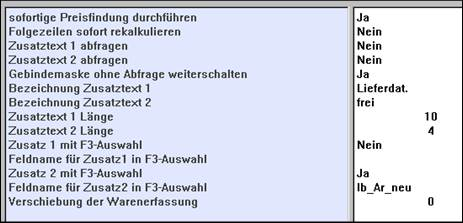

# Erfassungsparameter der Artikelerfassung

<!-- source: https://amic.de/hilfe/erfassungsparameterderartikele.htm -->

Über Erfassungsparameter wird eine Anpassung des Erfassungsablaufes ermöglicht:

Sofortige Preisfindung durchführen

Mit “Ja”, der üblichen Einstellung, erfolgt die Preisfindung sofort. Wenn Preisfindung jedoch in Form einer Nachbepreisung erfolgt, kann “Nein” sinnvoll sein.

Folgezeilen sofort rekalkulieren

Innerhalb des Preisfindungssystems können preisliche Abhängigkeiten zwischen aufeinander folgenden Positionen bestehen. Mit “Ja” werden die Folgezeilen bei Änderung der vorhergehenden Zeilen sofort neu berechnet. Ansonsten geschieht dieses erst bei der Verbuchung mit dem Mandantenserver.

Zusatztext 1 / 2 abfragen

Bis zu zwei zusätzliche auswertbare Informationen können eingegeben werden, wenn diese Parameter auf “Ja” gesetzt werden.

Gebindemaske ohne Abfrage weiterschalten

Bei der Gebindeerfassung wird repetierend abgefragt (Holzliste), so dass sich die Gesamtmenge schrittweise erhöht. Die Gesamtmenge ist Preisgrundlage; die einzelnen Gebindezeilen werden wahlweise angedruckt.

Die Zusatztexte können formatiert werden:

Bezeichnung Zusatztext

In der Positionsmaske werden die Zusatztexte mit dieser Bezeichnung angezeigt.

Zusatztext Länge

Die maximale Eingabegröße des Feldes.

Zusatztext mit F3- Auswahl

Hiermit kann man eine Auswahlbox (Item-Box) zur überprüften Eingabe anbinden.

Feldname für Zusatz mit F3 Auswahl

Eingabe der Bezeichnung der gewünschten F3- Box.

Zusätzlich ist es möglich, den Zusatzfeldern eine Formatierung mitzugeben. Dies geschieht innerhalb der Steuerungsparameter (Vorgangsbearbeitung Warenpos.) unter „Autom. Formatierung für Zusatztext“.

Verschiebung der Warenerfassung
