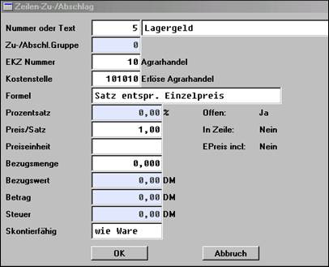
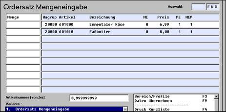
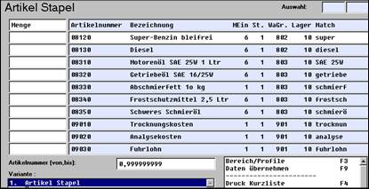
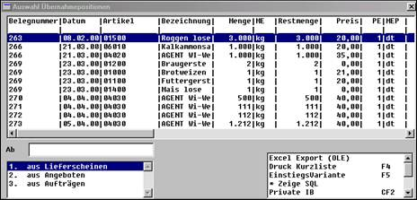
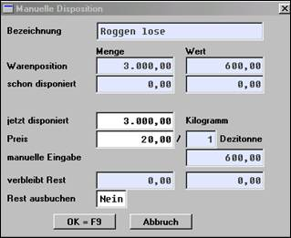
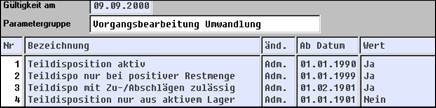
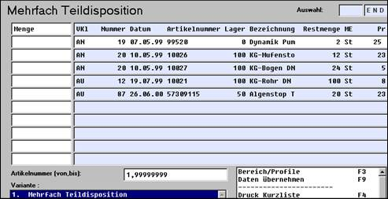

# Weitere Erfassungsmöglichkeiten im Vorgang

<!-- source: https://amic.de/hilfe/weitereerfassungsmgl.htm -->

Zur Erfassung und Gestaltung der Rechnung stehen weitere Funktionen zur Verfü­gung:

Wertartikel (F11)

Alle Möglichkeiten der Artikelerfassung bestehen auch beim Wertartikel. Im Gegensatz zur Artikelerfassung werden hier jedoch ausschließlich wertmäßige Buchungen durchgeführt. Die Mengeneingabe dient lediglich als Rechenhilfe. Mit WA ist es somit möglich, ein Artikelkonto wertmäßig (Boni, Frachten, etc.) zu be- und entlasten, ohne dass Bestandsbuchungen durchgeführt werden.

Texteingabe (F8)

Die Eingabe von Texteingabe erlaubt die Eingabe von Texten. Es öffnet sich ein Erfassungsbildschirm mit maximal 10 Zeilen. Der Text wird direkt erfasst.

Folgende Editiermöglichkeiten bestehen:

Mit der Taste **Einfg** kann zwischen der Funktion “Text in einen bestehenden Text einfügen”, zu erkennen durch den schmalen Cursor, und der Funktion “Text überschreiben” (breiter Cursor) gewechselt werden. Mit **Entf** wird Text zeichenweise von rechts gelöscht. Mit den Cursortasten wie auch der Maus wird innerhalb des Textes positioniert. Die **Enter**\-Taste bewirkt einen Zeilenumbruch am Ende des Textes. Sollen zusammenhängende Textbereiche gelöscht werden, so kann dieser zuerst mit der Maus markiert und dann mit Betätigung von **Entf** komplett gelöscht werden.

Die Übernahme in den Positionsteil erfolgt durch Eingabe von **ESC** und anschließender Bestätigung oder durch Betätigung des “OK”-Feldes. Der Abbruch erfolgt analog hierzu. Sollen mehr als 10 Textzeilen erfasst werden, so wird noch einmal die Funktion Texteingabe aufgerufen.

In der Position “Übernahme bis” wird angegeben, ob bei Umwandlung eines Vorgangs der Text “immer übernommen” werden soll oder ob er nur bei einem bestimmten Vorgangstyp (Angebot, Auftrag, etc.) wirksam werden soll.

Textbaustein

Hiermit kann auf fertig eingerichtete Textbausteine zugegriffen werden. Die zu­lässigen werden nach Aufruf der Funktion angezeigt, von wo sie abgerufen werden können:

In den Textbausteinen ist ebenfalls hinterlegt, wie bei Umwandlungen verfahren werden soll. Wenn in den Textbausteinen Stopppositionen bestimmt wurden, müssen sie bei der Übernahme ausgefüllt (“aufgelöst”) werden.

Zeilen Zu-/Abschlag (F9)

Bei dieser Funktion handelt es sich um manuell ausgelöste Zu- und Abschläge, die entweder als separate Zeile ausgedruckt oder in die letzte Artikelposition eingearbeitet werden. Es bestehen zwei Möglichkeiten, Zu- und Abschläge einzusetzen:

Fest definierte Zu-/Abschläge

Hier sind die erforderlichen Daten (siehe freie Eingabe) in einer Tabelle hinterlegt. Nach Aufruf der Funktion “Zeilen Zu-/Abschlag” wird die Tabellennummer und ggf. der Zu-/Abschlagsatz (Abschläge mit - Betrag/Prozent) eingegeben. Die Erfassung ist damit erfolgt.

Freie Eingabe

Hier werden alle Eingaben manuell durchgeführt, also keine Daten aus Vorbelegungen der “generellen Zu-/Abschläge” übernommen. Mit dieser Erfassungsform besteht große Flexibilität. Wegen des Bedienaufwandes sollte sie jedoch nur in Ausnahmefällen eingesetzt werden. Ausgelöst wird die Funktion, indem im Feld “Nr.” keine Eingabe erfolgt. Folgende Maske erscheint:

Es sind folgende Eingaben erforderlich:

***Nr. / Text:*** Aus den eingerichteten generellen Zu-/Abschlägen kann ausgewählt werden. Die Einrichtung belegt die nachfolgenden Felder vor

***Erlöskennziffern*** zur Verbuchung in der Finanzbuchhaltung; vorgeschlagen wird der Wert aus dem Artikel

***Kostenstelle***, die belastet werden soll; vorgeschlagen wird der Wert aus dem Artikel

***Formel***, die der Berechnung zugrunde liegt:

Prozentsatz, Preis, Einheit

Mit 2 wird also ein prozentualer Abschlag vom reinen Warenwert durchgeführt.

Eingabe des ***Prozentsatz***es (bei Abschlägen), wenn eine Formel mit prozentualem Bezug gewählt wurde

Eingabe des ***Preis/Satz***es, wenn eine entsprechende Formel gewählt wurde

***Bezugsmenge***: Wird abgefragt bei mengenabhängigen Bezügen. Vorgeschlagen wird die aufgelaufene Gesamtmenge

***Bezugswert***: Wird abgefragt bei wertabhängigen Bezügen. Vorgeschlagen wird der aufgelaufene Gesamtbetrag

***Skontierfähig***: Hier wird festgelegt, ob auf einen Zuschlag Skonto gewährt werden soll

Einrichtung einer Vorbelegung

Für die Zu-/Abschlagserfassung kann mit Hilfe der Einrichterparameterfunktion innerhalb der Option Box eine individuelle Vorbelegung vorgenommen werden:

***Zu-/Abschlagstext:*** Vorbelegung des Textes, z.B. Rabatt

***Ausweisung Druck:*** Bei “Ja” wird der Zu-/Abschlag in der Bezugszeile ausgewiesen, bei “Nein” in einer Folgezeile

***Druckform:*** Der Zu-/Abschlag wird offen (ja) ausgewiesen, er ist verdeckt (nein)

***Einzelpreis:*** Der Zu-/Abschlag vermindert den Einzelpreis (ja) im Ausdruck oder nur den Gesamtpreis (nein)

***Berechnungsformel:*** Vorschlagswert für die Berechnungsformel

***nach Nummerneingabe sofort abschließen:*** Bei “Ja” wird mit Eingabe der Tabellennummer die Eingabe beendet, die übrigen Felder werden, da bereits aus der Tabelle vorbelegt, also nicht abgefragt

Mehrere Zu- und Abschläge

Zeilenrabatt

Bedienung und Funktionsweise des Zeilenrabattes entsprechen dem “Zeilenzu- und -abschlag”. Es handelt sich jedoch von vornherein um einen negativen Betrag, also einen Abzug vom Warenwert. Die Eingabe eines negativen Betrages oder Prozentsatzes ergibt dann folgerichtig einen Zuschlag.

Zeilen Fracht

Gruppen

Gruppen anlegen (CF2)

Hierdurch wird es erlaubt, innerhalb eines Vorganges voneinander getrennte Gruppen zu bilden, auf die sich z.B. ein spezieller Rabatt beziehen soll.

“GA” - Gruppe anlegen gibt dem System bekannt, dass eine Gruppenbildung eingeleitet wurde. Es erscheint im Anzeigebereich die Zeile “Gruppenende”. Alle Positionen, die jetzt vor dieser Zeile erfasst werden, gehören dieser Gruppe an; die Zeile “Gruppenende”, sie ist invers dargestellt, verschiebt sich sukzessive nach unten. Zu- und Abschläge werden mit “GZ” - Gruppen Zu-/Abschlag **F10** veranlasst. Die Positionen innerhalb einer Gruppe werden mit den üblichen Funktionen erfasst.

Die Gruppe wird verlassen, indem die Zeile “Gruppenende” (doppelt) angeklickt wird.

Um einen neuen Artikel anschließend an die Gruppe zu erfassen, wird die Zeile “Vorgangsende” aktiviert und anschließend die Funktion “A” - Artikelfakturierung aufgerufen. Um in eine Gruppe wieder hineinzugelangen, wird auf die entsprechende Zeile “Gruppe” positioniert und diese dann mittels “Eingabetaste” oder Mausklick aktiviert. Sie erscheint dann mit allen enthaltenen Informationen auf dem Bildschirm. Alle jetzt aufgerufenen Funktionen berühren wieder nur die Gruppe.

Innerhalb einer Gruppe können wiederum Gruppen-Rabatte und Gruppen-Zu-/Abschläge gewährt werden. Sie wirken sich nur auf die Gruppe aus. Die Verteilung der Gruppenrabatte und -Zu/Abschläge beim Buchen erfolgt entsprechend der in ihnen hinterlegten Berechnungsformel. Betragsbezogene verteilen sich also entsprechend der Betragsanteile, gewichtsbezogene entsprechend des Gewichtsanteils, usw.

Mit ***Gruppe verlassen*** **SF2** gelangt man aus der Gruppenerfassung heraus.

Gruppen Frachten / Rabatte / Zu-/Abschläge

Blöcke

Zwischensumme (CF7)

Hiermit kann eine Zwischensumme gebildet werden. Auf dem Formular erscheinen (in Abhängigkeit von der Einrichtung) der Text “Zwischensumme” sowie der aufgelaufene Betrag.

Wechsel Seite

Der Wechsel einer Formularseite wird automatisch eingeleitet, wenn die vorgesehene Positionszahl erreicht wurde. Unabhängig hiervon kann ein Wechsel der Seite auch manuell mit der Funktion “Wechsel Seite“ ausgelöst werden. Dies wird immer dann sinnvoll sein, wenn z.B. aus optischen Gründen eine neue Seite gewünscht wird. Es erscheinen der Text “Seitenwechsel” und die Zwischensumme.

Status

Der aktuelle Status der Vorgangserfassung wird angezeigt. Dies sind der Nettobetrag, Warenwert, Verpackungskosten, Fracht, Mehrwertsteuer, Skontobeträge, Gesamtbetrag, aufgelaufene Mengeneinheiten, Gewichte und Verpackungseinheiten.

**Wichtig:** Es handelt sich um die aufgelaufenen Werte oberhalb der aktiven Positionszeile im Anzeigebereich. Dahinterliegende Positionen und die aktive Zeile werden nicht berücksichtigt. Den Gesamtstatus erhält man am Ende des Anzeigebereiches. Die aufsummierten Mengen- und Verpackungseinheiten enthalten ggf. nicht vergleichbare (Äpfel und Birnen -) Größeneinheiten. Für die Bildung von Kontrollsummen sind sie aber dennoch gut geeignet.

Korrektur Zeile (F5)

Hiermit wird die Korrektur einer bereits erfassten Position (Artikel, Text, Rabatt, etc.) ermöglicht. Um dies durchführen zu können muss zuerst mittels Mausklick, “+/-” - Taste die gewünschte Zeile im Anzeigebereich aktiviert werden. Es öffnet sich dann automatisch das entsprechende Bearbeitungsfenster, wo die Erfassungsfelder mit den Ursprungswerten vorbelegt sind. Korrekte Werte werden bestätigt, falsche überschrieben.

Die Funktion “Korrektur” wird auch durch “Doppelklick” auf eine Position im Anzeigeteil aktiviert.

Löschen (F7)

Nach Auswahl der zu löschenden Zeile (siehe Korrektur) löst die Eingabe von **F7** die Funktion aus. Gelöscht werden auch die mit der Zeile direkt zusammenhängenden Folgezeilen, so z.B. die weiteren Artikeltextzeilen oder ein ganzer Textblock.

Null - oder Leerzeile

Mit **CF8** kann an beliebiger Stelle im Vorgang eine Leerzeile eingefügt werden. Sie wird vor der Zeile eingefügt, die im Anzeigebereich ausgewählt wurde. Textblöcke oder Artikel mit mehreren Textzeilen werden als eine Einheit betrachtet.

Positionieren

ESC

Beendigung der Erfassung.

+/-

Zeilenweise vor und zurück

Mit “+/-” wird die aktive Position im Anzeigebereich verschoben.

“Strg…, “Strg… können ebenfalls eingesetzt werden, ohne Anwahl über die Funktionsbox

B/E

Beginn und Ende des Positionsteils

Die aktive Position wird an den Anfang bzw. das Ende verschoben.

*Wichtig:*

Bei “+/-” und “B/E” kann sich die aktive Position außerhalb des Anzeigebereiches befinden. Es empfiehlt sich, in diesem Fall den Bildschirm mittels der Bildlaufleiste oder “Strg…, “Strg… zu justieren oder auch für die Aktivierung direkt mit der Maus zu arbeiten.

Blocksummen

Für Blöcke in einer Rechnung, z.B. Gruppen, kann der Status angezeigt werden.

Objekt

Näheres findet sich unter Objektverwaltung.

Ordersätze

Ordersätze gib es im Verkauf und im Einkauf.

Ordersätze sind Unterklassen der Vorgangsklassen

Angebot è Ordersatz-Verkauf

Bestellanfrage è Ordersatz-Einkauf

Mit Hilfe von Ordersätzen kann eine festgeschriebene Artikelpalette kunden- und lieferantenbezogen im Verkauf sowie im Einkauf erfasst werden. Bei der Vorgangserfassung ist dann ein Rückgriff auf diese Palette für alle Kunden bzw. auf den in Bearbeitung befindlichen Kunden möglich.

Es werden keine Preise und keine Mengen abgeschrieben. Der Erfassungsablauf ist wie bei der Vorgangserfassung Angebot/Bestellanfrage.

Mittels eines Steuerungsparameters **[SPA]** [Preise aus Ordersatz übernehmen(SPA204)](../../../firmenstamm/steuerparameter/vorgangsbearbeitung_positionen/preise_aus_ordersatz_uebernehmen_spa_204.md) kann allerdings eingestellt werden, dass bei Benutzung eines Ordersatzes dessen Preis-Informationen in den bearbeiteten Vorgang übernommen werden. Es findet dann keine eigene Preisfindung mit den Daten des Vorgangs statt; die Preisherkunft erhält den Status “Ordersatz”

(so wird die Neukalkulation bei Korrekturen etc. unterbunden).

Siehe hierzu folgende Steuerparameter:

[Automatische Zeilen Rabatte bei Ordersatz(SPA 973)](../../../firmenstamm/steuerparameter/vorgangsbearbeitung_positionen/ordersatz_automatische_zeilen_rabatte_bei_ordersatz_spa_973.md)

Automatische Zeilen Zu-/Abschläge bei Ordersatz(SPA 974)

[Automatische Zeilen Frachten bei Ordersatz(SPA 975)](../../../firmenstamm/steuerparameter/vorgangsbearbeitung_positionen/ordersatz_automatische_zeilen_frachten_bei_ordersatz_spa_975.md)

Nach der Auswahl eines Ordersatzes werden die Artikelpositionen in Form nachfolgender Liste angeboten. In der Spalte Menge sind die gewünschten Mengen einzutragen.

Mit **F9** werden die Ausgewählten Warenpositionen fakturiert.

Übernommen werden aus dem Ordersatz in die Zielwarenposition je nach Steuerparameter folgende Eigenschaften:

- Preis: [Preise aus Ordersatz übernehmen(SPA204)](../../../firmenstamm/steuerparameter/vorgangsbearbeitung_positionen/preise_aus_ordersatz_uebernehmen_spa_204.md)
- Mengeneinheit: [Mengeneinheit aus Ordersatz?(SPA 467)](../../../firmenstamm/steuerparameter/vorgangsbearbeitung_positionen/mengeneinheit_aus_ordersatz_spa_467.md)
- Stückliste: [Ordersatz mit Stücklistenübernahme(SPA 672)](../../../firmenstamm/steuerparameter/vorgangsbearbeitung_positionen/ordersatz_mit_stuecklistenuebernahme_spa_672.md)
- Lagernummer: [Ordersatz-Artikel: Lagerbeibehalten(SPA 561)](../../../firmenstamm/steuerparameter/vorgangsbearbeitung_positionen/ordersatz_artikel_lager_beibehalten_spa_561.md)
- Artikeltext: [Ordersatz: Artikeltext übernehmen(SPA 562)](../../../firmenstamm/steuerparameter/vorgangsbearbeitung_positionen/ordersatz_artikeltext_uebernehmen_spa_562.md)
- Lagerplatz: [Ordersatz: Lagerplatz übernehmen(SPA 685)](../../../firmenstamm/steuerparameter/vorgangsbearbeitung_positionen/ordersatz_lagerplatz_uebernehmen_spa_685.md)
- Addon-Daten: [Ordersatz: WarenbewegungAddon übernehmen(SPA 686)](../../../firmenstamm/steuerparameter/vorgangsbearbeitung_positionen/ordersatz_warenbewegungaddon_uebernehmen_spa_686.md)

Automatisch oder manuell eingerichtete Rabatte, Zu-/Abschläge, oder Frachten im Ordersatz werden **nicht** übernommen.

Artikelstapel

Auch hierbei handelt es sich um eine Erfassungshilfe, ähnlich dem Ordersatz, jedoch nicht kundenindividuell.

Der Zugriff erfolgt hier jedoch auf den gesamten Artikelstamm mit der bekannten Auswahlliste. Welche Artikel angezeigt werden, wird also durch Varianten- und Profileinstellungen definiert.

So hat man hier z.B. die Möglichkeit, ein Sortiment als Vorschlag zu definieren und die Positionen nacheinander abzufragen.

In der linken Spalte besteht die Möglichkeit, die Mengen einzugeben. Die Erfassung wird mit **F9** beendet und die Artikel mit den erfassten Mengen in den Vorgang übernommen. Dabei wird automatisch eine Preisfindung durchgeführt (individuelle Preise, Zu-/Abschläge, etc.) und ggf. auf die Standardgebinde zugegriffen.

Aus der Artikelliste wird nicht abgebucht, es handelt sich also lediglich um eine Erfassungshilfe!

Preisstapel

Die Funktion Preisstapel innerhalb der Vorgangsbearbeitung ermöglicht eine Massenpreispflege in Vorgängen. Dies ist dann hilfreich, wenn ein Vorgang aus vielen Positionen besteht, oder die Trennung von Mengen – und Preispflege erreicht werden soll.

Pflegbar sind an dieser Position nur die Einzelpreise, Folgezeilen werden nicht rekalkuliert.

Die Anwahl des Menüpunktes "Preisstapel" führt dazu, dass alle Artikel des aktuellen Vorgangs in der aktuellen Gruppe mit Preis 0, sowie den zugehörigen Preismengeneinheiten in einer Preispflegemaske angezeigt werden. Sollten sich im aktuellen Vorgang auch Positionen befinden, bei denen ein Preis ungleich 0 vorhanden ist, erfolgt eine Sicherheitsabfrage, ob auch diese Preise durch die Massenpreisänderung korrigiert werden sollen.

Beispiel: Rechnung mit folgenden Artikeln, Preismengeneinheiten und Preisen (die Mengen und Mengeneinheiten sind für das Beispiel nicht relevant)

Ein Aufruf des Preisstapels führt dazu, dass die Frage erscheint: "Sollen auch Artikel mit Preis ungleich 0 in den Preisstapel übernommen werden?"

Bei Antwort mit JA, wird im Preisstapel folgendes angezeigt:

Wenn nun die Preise wie folgt geändert werden, sehen nach Verlassen und Bestätigung die geänderten Zahlen in der ursprünglichen Rechnung so aus:

Wäre die Frage "Sollen auch Artikel mit Preis ungleich 0 in den Preisstapel übernommen werden?" mit NEIN beantwortet worden, dann hätten die Einträge dieses Beispiels in der Preisstapelmaske genau gleich ausgesehen, nach Verlassen des Preisstapels wäre die Ursprungsrechnung aber wie folgt verändert worden:

Vorverkauf

Dieser Vorgang löst die Problematik, Ware bereits vor der Lieferung zu fakturieren. Die Vorverkaufserfassung entspricht dem normalen Ablauf. Mit Ende der Position wird jedoch automatisch ein Vorverkaufskontrakt eröffnet, gegen den später das Liefergeschäft abzuwickeln ist. Vorverkäufe werden wert- aber nicht mengenmäßig verbucht.

Sortiere

Hiermit wird die manuelle Sortierung der Belegpositionen ausgelöst.

Teilumwandlung

Diese Funktion ermöglicht es, Artikelpositionen aus anderen Vorgängen zu über­nehmen. So kann man z.B. einzelne Positionen aus verschiedenen vorgelagerten Vorgängen, z.B. aus verschiedenen Lieferscheinen, manuell in eine Rechnung übernehmen. Bei Anwahl der Funktion werden die offenen Vorgänge mit den Positionen angezeigt.

Die gewünschte Position wird ausgewählt. Danach wird abgefragt, ob die Position in vollem Umfang übernommen werden soll, oder nur die Teilmenge.

Im Feld *“jetzt disponiert”* besteht die Möglichkeit eine Menge u. einen Preis einzugeben. Mit der Bestätigung **F9** der vollen Menge wird die Position in vollem Umfang übernommen (bei Lieferscheinen sicherlich die Regel), bei Eingabe einer kleineren Menge verbleibt im Quellvorgang eine Restposition und die Teilposition wird übernommen. Die Eingabe einer Menge größer als der Ursprungsmenge ist möglich und führt dazu das der Quellvorgang eine negative Restmenge ausweist. (Siehe dazu SPA Vorgangsbearbeitung Umwandlung (2))

Artikelzeilen, die anhängende Folgezeilen (automatische Zu-/Abschläge, etc.) aufweisen, die einer Gebindeberechnung unterliegen oder aus Kontrakten abbuchen, können je nach SPA-Einstellung nur vollständig umgewandelt werden. In diesem Fall wird die Mengeneingabe nicht zugelassen. Die Maske ist in diesem Fall mit “Positionsmenge des Quellvorganges überschrieben.

Teilumgewandelte Vorgänge sind anschließend für Korrekturen gesperrt.

In Abhängigkeit von der ***EPA***\-Einstellung wird die Maske nach Bestätigung von Menge und Preis verlassen oder aber die Eingabe wird mit **ESC** beendet.

Eine “teilumgewandelten Position” kann nicht mehr korrigiert werden. Im Fall einer Fehleingabe muss die Position gelöscht und dann neu teilumgewandelt werden.

Einmal teildisponierte Vorgänge können anschließend nicht mehr über die Funktion “Umwandlung” weiterverarbeitet werden, sie müssen also über die Teildisposition zu Ende bearbeitet werden. Dies liegt darin begründet, dass bei der Teildisposition die Bezüge zwischen den Vorgängen “vererbt” werden, während diese bei der Umwandlung nicht weitergegeben werden. Kopieren ist erlaubt.

Für den Vorgang “Auftrag” besteht die Möglichkeit der Korrektur von “Restmenge” und “geplantem Lieferdatum” über die Auftrag-Restmengenkorrektur.

Teilumwandlung (Disposition einzelner Positionen von einem Vorgang in einen Folgevorgang) ist nur von Vorgängen in Standardwährung möglich. Andernfalls würden plötzlich Lire-Beträge zu DM, was natürlich als unerwünscht anzusehen ist. Teilumwandlung innerhalb einer Fremdwährung ist zunächst ebenfalls NICHT möglich.

Einstellungsmöglichkeiten über die Steuerungsparameter:

Teilumwandlung aktiv: muss auf Ja stehen

Negative Restmengen übern. bei Teildispo= bei Übererfüllung eines Vorganges (negative Restmengen) wird dieser Vorgang nicht als erledigt vermerkt

Teildispo mit Zu-/Abschlägen zulässig: Ja = Mengen - Teildispo erlaubt, Nein= Mengeneingabe nicht erlaubt, Preis änderbar.

Die Teildisposition kann auf das aktive Lager beschränkt werden.

Mehrfachdisposition:

Eine andere Form der Teilumwandlung ist die Mehrfachdisposition:

Mit der **F3**\-Taste lassen sich die Artikelnummer und das Belegdatum eingrenzen. Je nach Vorgang werden alle Vorvorgänge des jeweiligen Kunden / Lieferanten angezeigt.

Durch Eingabe der Mengen kann aus den Vorvorgängen wie z.B. Aufträge, Lieferscheine teilumgewandelt werden.

Mit ***Daten übernehmen*** **F9** werden die Mengen in Vorgangspositionen gewandelt.

Scannerdaten lesen

Bei der Erfassung mit mobilen Geräten ist es möglich, die Daten über eine Bearbeitungsmaske entsprechend der Artikelstapelerfassung zu bearbeiten. Alle Funktionen entsprechen den oben beschriebenen.

Baudatenbank

Zugriff auf die Baudatenbank, die hierzu natürlich vorhanden sein muss.

***Abschluss (zurück auf die Kopfseite)***
