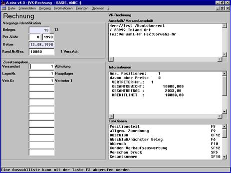

# Erfassungsabschluss

<!-- source: https://amic.de/hilfe/erfassungsabschluss.htm -->

Nach Beendigung der Erfassung gelangt man mit ESC wieder in den Kopfteil der Vorgangserfassung zurück, von wo aus je nach Parametereinstellung die Weiterverarbeitung erfolgt.

Vorschau Druck (SF5)

Diese Funktion ermöglicht es, sich den erfassten Vorgang so wie er ausgedruckt wird, auf dem Bildschirm anzeigen zu lassen. (In der Regel wird die Optik genau wie der Ausdruck gestaltet sein, es ist jedoch auch möglich, ihn völlig anders zu gestalten!) Somit wird vor dem Ausdruck noch einmal eine visuelle Kontrolle ermöglicht. Wenn ein Fehler festgestellt wird, kann über die Funktion Positionsteil F5 wieder zur Erfassung zurückgekehrt werden.

Gesamtsummen (SF10)

Diese Funktion zeigt die Gesamtsummen (Nettobetrag, Warenwert, Zu- Abschlag, Rabatt, Fracht, Mehrwertsteuer, Skonti, Gesamtbetrag, Gewicht, Mengeneinheiten, Verpackung) an.

Es handelt sich um eine reine Anzeigefunktion, Änderungsmöglichkeiten bestehen nicht.

Mit dem Knopf ‚Steuern‘ gelangt man in einen Dialog zur Übersicht aller im Beleg aufgelaufenen Steuerbeträge. Bei Eingangsbelegen ab Stufe Rechnung gibt es hier die Möglichkeit, die Steuerbeträge geringfügig zu ändern, falls auf den Originalbelegen von A.eins abweichend errechnete Steuerbeträge ausgewiesen werden.

Steuer (F11)

Die Rechnungsbeträge werden aufgelöst nach Steuersätzen angezeigt:

Die automatisch berechneten Steuerbeträge je Steuersumme können bei Rechnungsbelegen manuell angepasst werden, um zum Beispiel für nacherfasste Rechnungen, die anderweitig erstellt wurden, etwaige Rundungsdifferenzen zu berücksichtigen. 

Zahlungsbedingung (F8)

Entsprechend der Eintragung im Kundenstamm sowie der Parameter des Artikelstamms werden die Zahlungsbedingungen ermittelt. Sie können hier angezeigt und ggf. korrigiert werden:

Allgemeine Zuordnung (F9)

Diese Funktionsbox enthält weitere Parameter, vorbelegt aus dem Kundenstamm, die für die Preisfindung, statistische Analysen, etc. von Bedeutung sind. Diese Informationen können hier z.T. noch wieder überschrieben werden, z.T. liegen sie fest.

Abbruch (F10)

Die Erfassung wird ohne Speicherung beendet, alle bereits erfolgten (Korrektur-) Buchungen werden rückgängig gemacht.

Abschluss / Nächster Beleg (F6)

Mit F6 wird die Erfassung beendet, es erfolgt folgende Abfrage:

Danach wird noch abgefragt, ob gedruckt werden soll. Die Vorbelegung dieser Abfragen kann in den Erfassungsparametern eingestellt werden.

Nach Bestätigung der Abfragen kann der nächste Beleg erfasst werden.

Abschluss (CF12)

Auch hier handelt es sich um den Abschluss der Erfassung des Beleges. Es wird jedoch anschließend auch die Belegerfassung verlassen.

Andere Vorgangsklasse

Diese Option gestattet es, von einer bereits gewählten Vorgangsklasse auf eine andere unter Mitnahme aller erfassten Daten umzuschalten. Angeboten wird die Option bei der Neuerfassung eines Vorgangs, bevor er also gespeichert ist. Mit der Abspeicherung steht die Funktion nicht mehr zur Verfügung. Es kann dann auf die Umwandlungsfunktionen oder Teildisposition zurückgegriffen werden.

**Beispiel:** Die Warenpositionen wurden als Lieferschein erfasst, es soll aber eine Sofortrechnung erstellt werden. Nach Anwahl dieses Punktes erscheint u.a. Maske, in der die zum Lieferschein alternativen Vorgangsklassen angezeigt werden. Durch Anwahl der gewünschten, in obigem Beispiel “Rechnung”, wird auf diese Klasse umgeschaltet. das betrifft sämtliche Buchungsmechanismen, also Vorgangsnummer, Korrekturbuchungen, etc. Bei sehr umfangreichen Vorgängen kann dies Zeit in Anspruch nehmen.

Nach Abschluss der Umwandlung verbleibt das System in der neuen Vorgangsklasse. In obigem Beispiel also in der Rechnungserfassung!

Es handelt sich hierbei um keine Umbuchung, es wird lediglich der Erfassungsstatus geändert!

Andere Unterklasse (SF11)

Diese Option gestattet es, von einer bereits gewählten Vorgangsunterklasse auf eine andere unter Mitnahme aller erfassten Daten umzuschalten.

Beispiel: Die Warenpositionen wurden als Lieferschein erfasst, es soll aber ein Lagerentnahmeschein erstellt werden. Nach Anwahl dieses Punktes erscheint eine Erfassungsmaske, in der die zum Lieferschein alternativen Vorgangsunterklassen angezeigt werden. Durch Anwahl der gewünschten, in obigem Beispiel “Lagerentnahmeschein”, wird auf diese Unterklasse umgeschaltet. Das betrifft sämtliche Buchungsmechanismen, also Vorgangsnr., Korrekturbuchungen, etc.

Nach Abschluss der Umwandlung verbleibt das System in der neuen Vorgangsunterklasse. In obigem Beispiel also in der Erfassung des Lagerentnahmescheins!
