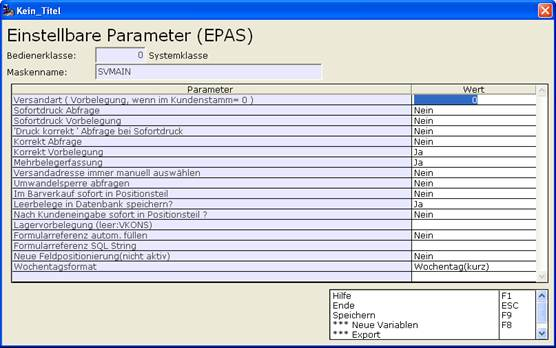

# Vorgangs-Erfassungsparameter

<!-- source: https://amic.de/hilfe/vorgangserfassungsparameter.htm -->

Mit Erfassungsparametern wird der Ablauf der Vorgangserfassung ganz wesentlich beeinflusst. Die Erfassungsparameter im Vorgangskopf haben

folgende Bedeutung:

Versandart

Vorbelegung der Versandart, wenn aus dem Kundenstamm 0 geliefert wird.

Sofortdruck Abfrage und Vorbelegung

Hier wird festgelegt, ob nach der Vorgangserfassung die Abfrage nach dem sofor­tigen Druck erfolgen soll und wie sie vorbelegt ist.

Druck korrekt Abfrage bei Sofortdruck

Einstellmöglichkeit, ob diese Frage beim Sofortdruck erfolgen soll.

Korrekt Abfrage und Vorbelegung

Hier wird festgelegt, ob nach der Vorgangserfassung die Abfrage nach der korrekten Erfassung erfolgen soll und wie sie vorbelegt ist.

Mehrbelegerfassung

Bei “Ja” verbleibt A.eins nach erfolgter Belegerfassung im Erfassungsmodus,

Versandadresse immer manuell auswählen

Bei “Ja” wird die automatische Versandadressenbestimmung ausgeschaltet.

Umwandelsperre abfragen

Bei “Ja” ist keine Wandlung möglich.

Im Barverkauf sofort in Positionsteil

Bei “Ja” wird der Kopfteil übersprungen.

Leerbeleg in Datenbank speichern

Bei „Ja“ wird ein Beleg ohne Positionen gespeichert.

Neue Feldpositionierung

Dieser EPA wird zurzeit noch nicht berücksichtig.

Wochentagsformat

Hier kann das Format des Wochentags eingestellt werden, das neben dem Datum angezeigt wird.
