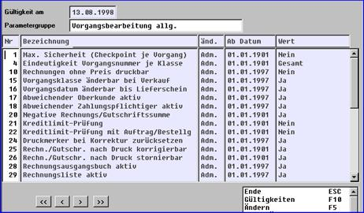
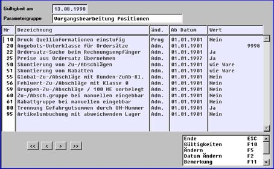
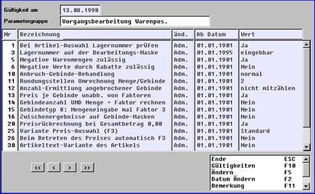

# Vorgangs-Steuerungsparameter

<!-- source: https://amic.de/hilfe/vorgangssteuerungsparameter.htm -->

Steuerungsparameter werden systemübergreifend festgelegt.

Max. Sicherheit (Checkpoint je Vorgang)

Ja/Nein

Eindeutige Vorgangsnummer je Klasse

Jahr

Rechnungen ohne Preis druckbar

**Wirkungsweise:**  
Teilweise oder vollständig unbepreiste Rechnungen können vom Druck ausgeschlossen werden.

**Wertemöglichkeiten:**  
Ja/Nein

Vorgangsklasse änderbar bei Verkauf

**Wirkungsweise:**  
Mit diesem Steuerparameter wird gesteuert, ob die aktuelle Vorgangsklasse in der Vorgangserfassung geändert werden darf.  
**Wertemöglichkeiten:**  
Bei "Ja" kann während der Vorgangserfassung von der aktuellen Vorgangsklasse in eine andere umgeschaltet werden.

Vorgangsdatum änderbar bis Lieferschein

Ja/Nein

Abweichender Oberkunde aktiv

**Wirkungsweise:**  
Mit diesem Steuerparameter wird die Unterscheidung der Liefer- und Rechnungsempfänger gesteuert.  
**Wertemöglichkeiten:**  
Bei "Ja" kann eine automatische Unterscheidung von Lieferempfänger und Rechnungsempfänger erfolgen.

Abweichender Zahlungspflichtiger aktiv

**Wirkungsweise:**  
Mit diesem Steuerparameter wird die Unterscheidung von Rechnungsempfänger und Zahlungspflichtigen gesteuert.  
**Wertemöglichkeiten:**  
Bei "Ja" kann eine automatische Unterscheidung von Rechnungsempfänger und Zahlungspflichtigen erfolgen.

Negative Rechnung/Gutschriftsumme

**Wirkungsweise:**  
Mit diesem Steuerparameter wird gesteuert, ob ein negativer Endbetrag zulässig ist.  
**Wertemöglichkeiten:**  
Bei "Nein" lässt A.eins keine negativen Endbeträge zu.

Kreditlimit-Prüfung

**Wirkungsweise:**  
Dieser Steuerparameter regelt, ob die Limitverwaltung aktiv ist, und wie bei einer Überschreitung mit dem betreffenden Beleg zu verfahren ist.  
**Wertemöglichkeiten:**  
0 = Nein die Kreditlimitüberwachung ist ausgeschaltet  
1 = Warnung Es wird nur ein Warnhinweis ausgegeben  
2 = Sperrung Der Beleg wird wegen Kreditlimitüberschreitung gesperrt und kann auch nicht gedruckt werden.  
3 = Abweisung Ein erfasster Beleg kann nur abgebrochen werden  
**Wechselwirkungen mit andern SPAs:**  
Der Steuerparameter "Kreditlimit Prüfung mit Auftrag und Bestellung" steuert, ab welchem Vorgang bereits die Kreditlimitüberprüfung läuft(s.u.).

Kreditlimit-Prüfung mit Auftrag/Bestellgruppe

**Wirkungsweise:**

Der SPA "Kreditlimit Prüfung mit Auftrag und Bestellung" steuert, ob bereits bei Aufträgen und Bestellungen eine Überprüfung des Kreditlimits erfolgen soll.

**Wertemöglichkeiten:**  
Ja = Es wird bereits ab Auftrag/ Bestellung geprüft  
Nein = Es wird erst später (nach Auftrag/Bestellung) geprüft

**Wechselwirkungen mit andern SPAs:**

Der SPA "Kreditlimit Prüfung" steuert die Kreditlimit Prüfung und ihre Behandlung allgemein.

Druckmerker bei Korrektur zurücksetzen

Rechn./Gutschrift nach Druck korrigierbar

**Wirkungsweise:**  
Mit diesem Steuerparameter wird gesteuert, ob Rechnungen/Gutschriften nach dem Druck noch korrigiert werden können.  
**Wertemöglichkeiten:**  
Bei "Nein" kann die Funktion Korrektur nicht mehr ausgeführt werden.

Rechn./Gutschr. nach Druck stornierbar  
**Wirkungsweise:**

Mit diesem Steuerparameter wird gesteuert, ob Rechnungen/Gutschriften nach dem Druck noch storniert werden können.  
**Wertemöglichkeiten:**  
Bei "Nein" kann die Funktion Stornierung nicht mehr ausgeführt werden.

Rechnungsausgangsbuch aktiv

**Wertemöglichkeiten:**  
Bei "Ja" wird das Rechnungsausgangsbuch aktiviert; es muss gedruckt werden.

Rechnungsliste aktiv

Wirkungsweise:  
Bei der Unterscheidung zwischen Rechnungsempfängern und Zahlungspflichtigem ist die Rechnungsliste die Dokumentation der Rechnungen für den Zahlungspflichtigen.

Versandartabh. Zu-/Abschläge möglich

**Wertemöglichkeiten:**

**JA = Die versandartabhängigen Zu/Abschläge sind möglich**

**Nein = Die versandartabhängigen Zu/Abschläge sind abgeschaltet**

**Wirkungsweise:**

Dieser Parameter steuert die Möglichkeit von Versandartabhängigen Zu/Abschlägen

Bepreisungsdatum identisch Plandatum

**Wirkungsweise:**  
Mit diesem Steuerparameter wird gesteuert, welcher Preis in der Vorgangserfassung genommen wird.  
**Wertemöglichkeiten: Ja/Nein**  
Bei "Ja" wird der zum Plandatum gültige Preis gezogen, bei "nein" hängt der Preis vom Preisdatum ab, das im Vorgang eingegeben wurde. Dazu muss das Eingabefeld (per UFLD) aktiviert werden.

Fiktive Liefermenge aktiv

**Wertemöglichkeiten:**  
Für die Preisfindung bei mengenabhängigen Preisen kann die fiktive Liefermenge aktiviert werden. Sie ist wichtig, wenn ein von der Liefermenge abweichender Mengenbezug berücksichtigt werden muss.

Lagernummer vorbelegt wie letzte Auswahl

unbepreiste Liefersch. = Umwandelsperre

Versandanschrift = Hauptanschr. drucken

**Wirkungsweise:**  
Mit diesem Steuerparameter wird gesteuert, wann die Versandanschrift - wenn sie mit der Hauptanschrift übereinstimmt - gedruckt werden soll.  
**Wertemöglichkeiten:**  
Bei "Ja" wird im Fall gleicher Versand- und Hauptanschrift die Versandanschrift trotzdem gedruckt

Aut. Umbruch Artikeltext beim Drucken  
Wirkungsweise:

**Der Parameter steuert den Zeilenumbruch bei Artikeltextzeilen.**

**Wertemöglichkeiten:**  
**JA =** Beim Ausdruck von Artikeltexten werden die Textzeilen automatisch umgebrochen, wenn das Ausgabefeld im Vorgang eine geringere Länge in der Zeile aufweist als der erfasste Text.  
Nein = Bei Eingabe von "nein" wird der Text abgeschnitten.

Aut. Umbruch Textzeilen beim Drucken

**Wirkungsweise:**  
**Der Parameter steuert den Zeilenumbruch von Textzeilen beim Druck**  
**Wertemöglichkeiten/Funktionen:**  
Ja = Beim Ausdruck von Textzeilen, aber auch Textbausteinen etc., werden die Textzeilen automatisch umgebrochen, wenn das Ausgabefeld im Vorgang eine geringere Länge in der Zeile aufweist, als der erfasste Text.

***Nein =*** Bei Eingabe von "Nein" wird der Text abgeschnitten.

Vorgangstexte zwangsweise vor Hauptteil

**Wirkungsweise:**  
Bei "Ja" werden Texte des Rechnungskopfes (Kommentare etc.) vor dem Einstieg in die Artikelpositionserfassung abgefragt.  
**Wertemöglichkeiten:**  
**Ja/Nein**

Bei EK-Rg aut. nach Positionen in Steuer

Maximale Einkaufs-Steuerkorrektur (Pfg.)

Separate Steuer auf Rabatte möglich

Separate Steuer auf Zu-/Abschl. möglich

Separate Steuer auf Frachten möglich

Max. Vorkomma Mengen (0=ohne Prüfung)

Max. Vorkomma Werte (0=ohne Prüfung)

Max. Vorkomma Preise (0=ohne Prüfung)

Max. Vorkomma Prozente (0=ohne Prüfung)

Filiale in Vor.Konstanten anpassen

Druck Quellinformationen einstufig

**Wirkungsweise:**  
Der Steuerungsparameter bewirkt bei umgewandelten Belegen, dass nur die Quellinformationen von unmittelbaren Vorgängern (also bei Rechnung nur Lieferscheininformationen, nicht aber Auftragsinformationen) gedruckt werden. Dieser SPA wird bei der Sammelumwandlung und auch Einzelumwandlung ausgewertet.  
**Wertemöglichkeiten:**  
Ja=  
Nein=

Angebots-Unterklasse für Ordersätze

Standard 9998

Ordersatz-Suche beim Rechnungsempfänger

**Wirkungsweise:**  
Der Ordersatz kann beim Rechnungsempfänger (ja) oder beim Lieferempfänger gesucht werden.

**Wertemöglichkeiten:**

Ja/Nein

Preise aus Ordersatz übernehmen

Ja/Nein

Skontierung von Zu-/Abschlägen

**Wirkungsweise:**  
**Dieser SPA steuert die Skonti auf Zu/Abschläge**  
**Wertemöglichkeiten:**  
Skonti auf Zu-/Abschläge können folgendermaßen behandelt werden:  
\- wie Ware: sie richten sich nach der Warenposition  
\- nie: auf Zu-/Abschläge werden keine Skonti ermittelt  
\- immer: auf Zu-/Abschläge werden immer Skonti gewährt

Skontierung von Rabatten

Global-Zu-/Abschläge mit Kunden-ZuAb-Kl.

Zu/Absch.gruppe bei manuellen eingebbar

Zu/Absch.gruppe bei manuellen eingebbar

Trennung Gefahrgutsummen durch UN-Nummer

Artikelumbuchung mit abweichendem Lager

Bei Artikel-Auswahl Lagernummer prüfen

Lagernummer auf der Bearbeitungs-Maske eingebbar

**Wirkungsweise:**  
Wenn Mehrlagerverwaltung aktiviert ist und in einem Vorgang von unterschiedlichen Lagern gebucht werden kann, hat dieser Parameter Bedeutung:

0 - ohne Lager  
1 - nur Anzeige des Lagers (ggf. im Vorgangskopf erfasst)  
2 - eingebbar, vorbelegt mit Standardwert / Vorgangskopf  
3 - Einstieg in die Positionserfassung mit der Lagereingabe

Negative Warenmengen zulässig

**Wirkungsweise:**  
Mit diesem Steuerparameter wird gesteuert, ob auch negative Warenmengen erfasst werden dürfen.  
**Wertemöglichkeiten:**  
Bei "Nein" können keine negativen Mengen erfasst werden.

Negative Werte durch Rabatte zulässig  
Wirkungsweise:

Mit diesem Steuerparameter wird gesteuert, ob es durch die Eingabe von Rabatten zu negativen Beträgen kommen darf.  
**Wertemöglichkeiten:**

Bei "Nein" wird ausgeschlossen, dass Rabatte zu negativen Beträgen führen.

Anbruch-Gebinde-Behandlung

**Wirkungsweise:**  
Anbruch - Gebinde können unterschiedlich behandelt werden:

normal

Anbruch

abrunden

aufrunden

aufrunden Stufe 2

Rundungsstellen Umrechnung Menge/Gebinde

Anzahl-Ermittlung angebrochener Gebinde  
Wirkungsweise:  
Standardmäßig wird ein angebrochenes Gebinde intern mit 0 ausgegeben, so dass ein angebrochenes Gebinde als  
0 Gebinde à x Einheiten in der Gebindeinformation ausgewiesen wird.  
Wertemöglichkeiten:

Preis je Gebinde unabh. von Faktoren

Gebindeanzahl UND Menge = Faktor rechnen

Zwischenergebnisse auf Gebinde-Masken

Bezugsgröße zur Mengenbestimmung der Folgeartikel  
**Wirkungsweise:**  
Dieser Steuerparameter steuert die Festlegung der Bezugsgröße bei der Mengenbestimmung eines Folgeartikels für Gebindeartikel  
**Wertemöglichkeiten:**  
je Menge (Voreinstellung)  
je Gebinde

In der Einstellung **'je Gebinde'** geht die Gebindeanzahl in die Berechnungsformel ein.

Beim Betreten des Preises automatisch F3

Variante Preis-Auswahl (F3)

**Wirkungsweise:**  
In der Vorgangsbearbeitung kann im Feld "Preis" mittels F3 Preisinformation abgerufen werden:  
0 - Standard: Anzeige der gültigen Preismatrix  
1 - Auftrag/Angebot: Anzeige der in gültigen Angeboten/Aufträgen für  
diesen Artikel gespeicherten Preise  
**Wertemöglichkeiten:**

Artikeltext-Variante des Artikels

Zusätzlich

Aut.Formatierung für Zusatztext 1

char

Aut.Formatierung für Zusatztext 2

Position gilt als "unbepreist"

**Wirkungsweise:**  
Hier wird festgelegt, wie der Parameter "unbepreist" zu interpretieren ist:  
\- manuelle Preiseingabe  
\- Einzelpreis 0,00  
\- Preis o. Wert 0

Diese Angabe hat Konsequenzen in Auswertungen, wenn z.B. unbepreiste Positionen in Vorgängen ausgewiesen werden sollen!  
**Wertemöglichkeiten:**

Zu-/Abschläge auch bei manuellem Preis

Zu- und Abschläge auch bei manuellem Preis

Mit diesem Steuerparameter wird gesteuert ob automatische Zu- und Abschläge auch bei manueller Preiseingabe erfolgen.  
**Wertemöglichkeiten:**

Bei "Ja" wird auch bei manueller Preiseingabe ein automatischer Zu-/Abschlag gezogen.

Rabatte auch bei manuellem Preis

Vorgangserfassung am Beispiel Rechnung

Generell wird eine Rechnung in drei Schritten erfasst:

Rechnungskopf mit Anschrift, Datum, usw.

Positionsteil mit den Artikelpositionen, usw.

Rechnungsabschluss mit Zahlungsbetrag, Zahlungsbedingungen, usw. 

Innerhalb dieser Abschnitte stehen wiederum verschiedene Bearbeitungsfunktionen (Korrektur, Vorschau, etc.) in Auswahlboxen zur Verfügung. Sie können über Anklicken mit der Maus manuelles Ansteuern mittels Cursortasten oder Funktionstasten (die wichtigsten) aufgerufen werden.
