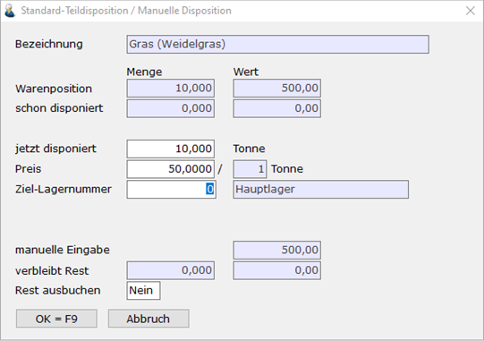

# Standard-Teildisposition

<!-- source: https://amic.de/hilfe/standardteildisposition.htm -->

Mithilfe der Standard-Teildisposition ist es möglich, Artikelpositionen aus anderen Vorgängen teilweise zu übernehmen. So können einzelne Positionen aus verschiedenen vorgelagerten Vorgängen, z.B. aus verschiedenen Aufträgen, manuell in z.B. einen Lieferschein übernommen werden.

Bei der Anwahl der Funktion werden alle offenen Vorgänge mit ihren Positionen angezeigt; die für die Standard-Teildisposition zur Auswahl stehen. Es können Bestellungen, Angebote und Aufträge ausgewählt werden.

Die gewünschte Position wird ausgewählt. Danach wird abgefragt, ob die Position in vollem Umfang übernommen werden soll. **Im Feld „jetzt disponiert“** besteht eine Eingabemöglichkeit (Einschränkungen s.u.), wenn keine Nebenbuchhaltung angesprochen wurde. Bei dieser echten Teildisposition ist die Maske mit ,,Standard-Teildisposition / Manuelle Disposition" überschrieben. **Im Feld „Preis“** kann ein abweichender Preis eingegeben werden.

Mit der Bestätigung des vollen Betrages wird die Position in vollem Umfang übernommen, bei Eingabe eines kleineren Betrages verbleibt im Quellvorgang eine Restposition und die Teilposition wird übernommen. Die Eingabe einer Menge größer als der Ursprungsmenge ist nicht möglich, wenn der Steuerparameter 32 „Über-Disposition zulässig“ auf „Nein“ steht.

Artikelzeilen, die anhängende Folgezeilen (automatische Zu-/Abschläge, etc.) aufweisen, die einer Gebindeberechnung unterliegen oder aus Kontrakten abbuchen, können nur vollständig umgewandelt werden. In diesem Fall wird die Mengeneingabe unterbunden. Die Maske ist in diesem Fall mit ,,Standard-Teildisposition / Positions-Disposition" überschrieben.

Teilumgewandelte Vorgänge sind anschließend für Korrekturen gesperrt.

Das Feld „Ziel-Lagernummer“ ist nur dann sichtbar, wenn es sich bei der Quellposition um ein Angebot mit Sortimentslager handelt (siehe [Standard-Teildisposition von Angeboten mit Sortimentslager](./standard_teildisposition.md#TeildispoAngebotSortimentslager)).

Hinweis:

Das Lieferdatum kann aus Angeboten und Aufträgen nicht gewonnen werden. Es wird zunächst mit dem Belegdatum vorbelegt. Ist in dem Beleg jedoch ein abweichendes Lieferdatum festgelegt worden, so wird dieses für die Vorbelegung des Lieferdatums dieser Position verwendet.

**Preisbezug in der Standard-Teildisposition**

Wenn der erfasste Artikel einen Preisbezug in der Mengeneinheit verwendet, so sehen Sie Felder in der dritten Spalte „Preisbezug“. Hier können Sie neben der zu disponierenden Menge auch einen Preisbezug disponieren. Der Wert der Warenposition wird im Fall eines Preisbezugs im Verhältnis des Gesamtwerts zum Gesamtpreisbezug und des disponierten Preisbezugs berechnet.

Wird eine Menge disponiert, so kann ein Preisbezug vorbelegt werden. Dies geschieht durch eine Prozedur, die in der [Formularzuordnung auf der Registerkarte „Position“](../formularzuordnung/position.md) im Feld „Entryprozedur Preisbezug“ eingetragen wird.

**Standard-Teildisposition von Angeboten mit Sortimentslager**

Steht der Steuerparameter [Angebot auf Sortimentslager zulassen](../../firmenstamm/steuerparameter/vorgangsbearbeitung_allg/angebot_auf_sortimentslager_zulassen_spa_1051.md) auf „Ja“, so können Angebote gegen das Sortimentslager geschrieben werden. Bei der Teilposition von Angebotspositionen mit Sortimentslager ist zu beachten, dass die Angabe eines abweichenden Ziellagers erforderlich ist. Hierzu kann in dem Feld „Ziel-Lagernummer“ mithilfe der F3-Taste ein abweichendes Ziellager ausgewählt werden. Das Ziellager wird immer mit der Lagernummer aus den Vorgangskonstanten vorbelegt.

Die Änderung der Lagernummer von dem Sortimentslager zu dem abweichenden Ziellager erfolgt gemäß dem [Behandlungsschema für den Lagernummernwechsel](../vorgangsbearbeitung/aenderung_der_lagernummer/behandlungsschema_lagernummernaenderung.md). Das Behandlungsschema kann über die Formularzuordnung [FRZ] hinterlegt werden. Wurde kein Behandlungsschema angegeben, so wird das Standard-Schema „Lagernummernwechsel“ herangezogen.

Bei der Auswahl eines Ziellagers ist zu beachten, dass der Artikel auf dem Ziellager existiert. Die Überprüfung ist abhängig von den Einstellungen in dem entsprechenden Behandlungsschema (siehe [Artikelfindung](../vorgangsbearbeitung/aenderung_der_lagernummer/behandlungsschema_lagernummernaenderung.md#BEH_Artikelfindung)). Existiert der Artikel nicht auf dem Ziellager, so kann eine Teildisposition nicht erfolgen. Ausnahme:

Wurde in dem Behandlungsschema festgelegt, dass der Artikel im Ziellager angelegt wird, so kann ein Lager ausgewählt werden, auf dem der entsprechende Artikel nicht existiert (siehe [Artikel im Ziellager anlegen](../vorgangsbearbeitung/aenderung_der_lagernummer/behandlungsschema_lagernummernaenderung.md#BEH_ArtikelAnlage)).
