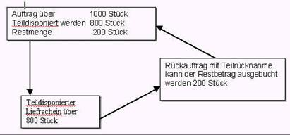
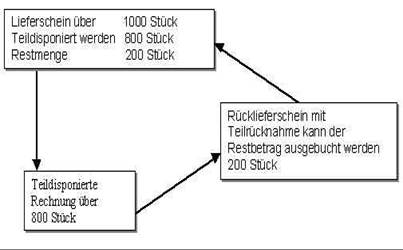
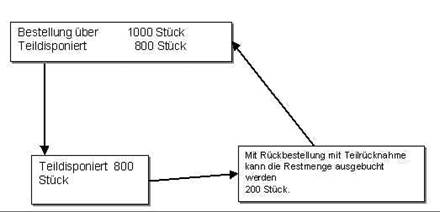
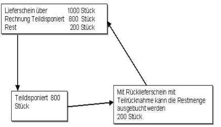

# Teildisposition ändern/stornieren

<!-- source: https://amic.de/hilfe/teildispositionndernstornieren.htm -->

Rückabwicklung für die [Standard-Teildisposition](./standard_teildisposition.md) und [Mehrfachteildisposition](./mehrfachteildisposition.md).

Um Mengen aus Aufträgen, Lieferscheinen und Bestellungen auszubuchen, die teildisponiert wurden, gibt es je nach Vorgang unterschiedliche Korrekturmöglichkeiten.  
Nach der Teildisposition hat man die Möglichkeit, den übernommenen Artikel zu korrigieren, früher gab es als Korrektur nur die Alternative, die Position komplett zu löschen und neu zu erfassen.

So lassen sich bei diesen Positionen evtl. Nebenbuchhaltungen wie Kontrakte, Partien und sonstige Infos nachtragen.

**Hierbei gelten folgende Grundsätze:**

Bei Rücklieferungen teildisponierter Mengen wird immer auf der Ebene des jeweiligen Beleges **"ausgebucht"** (Bei "**Rückauftrag erfassen"** z.B. ist die Ebene Auftrag)

Wird eine Restmenge **"ausgebucht"**, so bleibt der Urbeleg erhalten und es wird ein neuer "Storno Beleg" erstellt, da innerhalb der Urbelege die Positionszeilen, von denen teildisponiert wurde, nicht mehr änderbar sind.  
(Bsp.: Bei einem Auftrag wird die Restmenge nicht mehr benötigt)

Soll bei einem Beleg z.B. bei einem bereits teilumgewandelten Auftrag die Menge erhöht werden, so ist dies in der Positionszeile aus der umgewandelt wurde nicht mehr möglich. Diese Änderung kann durch Eingabe einer neuen Positionszeile im Auftrag erfolgen.

Mit den folgenden Funktionen lassen sich die teilumgewandelten Vorgänge verändern bzw. ausbuchen bei den aus der Teilumwandlung entstandenen Belegen z.B. Lieferscheinen mit den bekannten Möglichkeiten wie Korrektur in der Positionszeile des Belegs, oder der Stornierung des Beleges Änderungen vorzunehmen.

Rückauftrag erfassen

Mit der Funktion Rückauftrag erfassen kann auf der Ebene des Auftrages entweder die Menge des Auftrages nach einer Teildisposition geändert oder ganz ausgebucht werden.

Hierzu wird die Funktion ***Rückauftrag erfassen*** im Auswahlbildschirm Aufträge bearbeiten aufgerufen.

Im Erfassungsbildschirm wird der Kunde gewählt und in den Positionsteil gewechselt.

Dort werden dann die Funktionen ***Rücknahme*** und ***Teilrücknahme*** angeboten sowie die ***Artikeleingabe*** mit **F4,** wo eine Rücknahme erfasst werden kann, ohne sich auf Teildispositionen zu beziehen.

Die reine Mengeneingabe erfolgt wie in der Teildisposition/Teilumwandlung, so dass die zur Erklärung diese Dokumentation herangezogen wird.

Hierbei kann eine teildisponierte Positionszeile nicht mehr verändert werden (siehe auch [Grundsätze](./teildisposition_aendern_stornieren.md#Grundsätze)).

Der Ablauf folgt hier folgendem Schema:

Rücklieferung erfassen

Da in einigen Betrieben aus organisatorischen o.a. Gründen auf die Ebene des Auftrages verzichtet wird, gibt es diese Ebene der Teilumwandlung, die analog zur Teilumwandlung innerhalb der Aufträge erfolgt, wobei die Belegstufen hier Lieferschein und Rechnung sind.

Mit der Funktion Rücklieferschein erfassen kann auf der Ebene des Lieferscheins die Menge des Lieferscheines nach einer Teildisposition geändert werden.

Hierzu wird die Funktion ***Rücklieferschein erfassen*** im Auswahlbildschirm der Lieferscheinbearbeitung aufgerufen.

Im Erfassungsbildschirm wird der Kunde gewählt und in den Positionsteil gewechselt.

Dort werden dann die Funktionen ***Mehrfachrücknahme*** und ***Teilrücknahme*** angeboten, sowie die ***Artikeleingabe*** mit **F4,** wo einen Rücknahme erfasst werden kann, ohne sich auf Teildispositionen zu beziehen.

Die reine Mengeneingabe erfolgt analog zu der Teildisposition/Teilumwandlung, so dass zur Erklärung diese Dokumentation herangezogen wird.

Bei Lieferscheinen, die aus einem teilsdisponiertem Vorgang entstanden sind, kann auf diesem Lieferschein storniert oder Positionen geändert werden (siehe auch [Grundsätze](./teildisposition_aendern_stornieren.md#Grundsätze)).

Der Ablauf folgt hier folgendem Schema:

Rückbestellung erfassen

Mit der Funktion ***Rückbestellung erfassen*** kann auf der Ebene der Bestellung entweder die Menge der Bestellung nach einer Teildisposition geändert, oder komplett ausgebucht werden.

Hierzu wird die Funktion Rückbestellung erfassen im Auswahlbildschirm der Bestellungsbearbeitung aufgerufen.

Im Erfassungsbildschirm wird der Lieferant gewählt und in den Positionsteil gewechselt.

Dort werden dann die Funktionen ***Rücknahme*** und ***Teilrücknahme*** angeboten, sowie die ***Artikeleingabe*** mit **F4**, wo einen Rücknahme erfasst werden kann, ohne sich auf Teildispositionen zu beziehen.

Die reine Mengeneingabe erfolgt wie in der Teildisposition/Teilumwandlung, so dass die zur Erklärung diese Dokumentation herangezogen wird.

(siehe auch [Grundsätze](./teildisposition_aendern_stornieren.md#Grundsätze))

Der Ablauf folgt hier folgendem Schema:

Rückeinkauflieferschein erfassen

Mit der Funktion ***RückEingangsLieferschein erfassen*** kann auf der Ebene des Lieferscheins entweder die Menge des Lieferscheins nach einer Teildisposition geändert oder komplett ausgebucht werden.

Hierzu wird Funktion ***RückEingangsLieferschein erfassen*** im Auswahlbildschirm der Bestellungsbearbeitung aufgerufen.

Im Erfassungsbildschirm wird der Lieferant gewählt und in den Positionsteil gewechselt.

Dort werden dann die Funktionen ***Rücknahme*** und ***Teilrücknahme*** angeboten, sowie die ***Artikeleingabe*** mit **F4,** wo einen Rücknahme erfasst werden kann, ohne sich auf Teildispositionen zu beziehen.

Die reine Mengeneingabe erfolgt wie in der Teildisposition/Teilumwandlung, so dass die zur Erklärung diese Dokumentation herangezogen wird.

(siehe auch [Grundsätze](./teildisposition_aendern_stornieren.md#Grundsätze))

Der Ablauf folgt hier folgendem Schema

