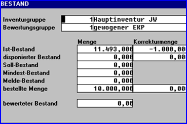

# Verbuchung im Warenwirtschaftssystem

<!-- source: https://amic.de/hilfe/verbuchungimwarenwirtschaftssy.htm -->

In Abhängigkeit von der Vorgangsklasse erfolgen die Verbuchungen im Warenwirtschaftssystem:

Warenverkauf

| Angebot | keine Buchung |
| --- | --- |
| Auftrag | disponierte Menge, Dispositionsbestand, Auftragsbestand |
| Lieferschein | IstBestand, gelieferte Menge bei Übernahme aus Auftrag,  
Auftragsbestand, disponierte Menge |
| Rechnung | IstBestand, gelieferte Menge, fakturierte Menge, Umsatz,  
Rohertrag, bei Übernahme aus Lieferschein keine IstBestandsbuchung |
| Gutschrift | IstBestand, gelieferte Menge, fakturierte Menge, Umsatz, Rohertrag |
| Sonstige | Bei der Abbuchung aus Vorgängen, Kontrakten, Partien und anderen  
Nebenbuchhaltungen erfolgen auch dort entsprechende Buchungen |

Wareneinkauf

| Bestellanfrage | keine Buchung |
| --- | --- |
| Bestellung | disponierte Menge, Dispositionsbestand, Bestellbestand |
| E-Lieferschein | IstBestand, eingegangene Menge bei Übernahme aus Bestellung,  
Bestellbestand, disponierte Menge |
| E-Rechnung | IstBestand, eingegangene Menge, fakturierte Menge, Einkaufsumsatz, Bewertungspreis, bei Übernahme aus Lieferschein keine IstBestandsbuchung |
| E-Gutschrift | IstBestand, gelieferte Menge, fakturierte Menge, Einkaufsumsatz, Rohertrag |
| Sonstige | Bei der Abbuchung aus Vorgängen, Kontrakten, Partien und anderen Nebenbuchhaltungen erfolgen auch dort entsprechende Buchungen |

Interne Buchungen

Je nach Typ mengen- und wertmäßige Buchungen. Hierbei handelt es sich um Warenumbuchungen, Stücklistenauflösungen etc.

Zeitpunkt der Aktualisierung

Die Buchungen werden zentral vom Mandantenserver durchgeführt. Vom Arbeitsplatz werden diesem Server abgeschlossene Vorgänge, z.B. fertig gestellte Rechnungen, übermittelt. Mit der weiteren Verbuchung hat der Arbeitsplatz also nichts zu tun. In sehr zeitkritischen Umgebungen, so z.B. beim Telefonverkauf, wo die verfügbaren Mengen immer aktuell sein müssen, können aus folgenden Gründen Verzögerungen bei der Bestandsaktualisierung auftreten:

Die Ware ist bereits in einem Auftrag disponiert worden, der Auftrag wurde jedoch noch nicht abgeschlossen, der Mandantenserver ist überlastet.

Um diese Probleme zu vermeiden, erfolgt bei der Vorgangserfassung bereits bei der Positionserfassung je Position eine Verbuchung in der “Korrekturmenge” (Istbestand, disponierter Bestand, bestellte Menge). Diese steht für Informationszwecke und interne Prüfungen (z.B. Verfügbarkeit des Bestandes) zur Verfügung. Mit der Verbuchung des gesamten Vorgangs werden die Buchungen in der Korrekturmenge wieder rückgängig gemacht.

