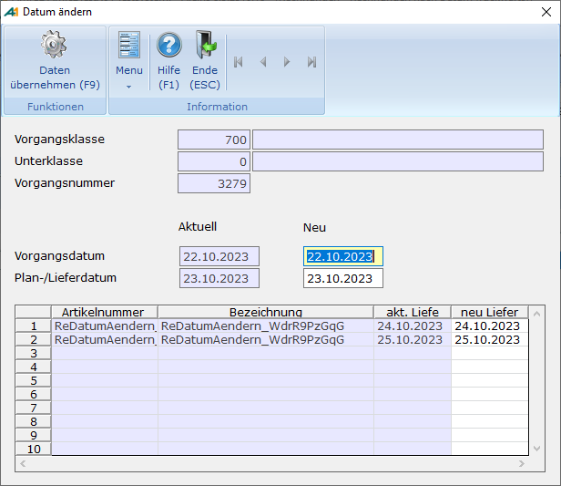

# Belegdatum ändern

<!-- source: https://amic.de/hilfe/_belegdatumaendern.htm -->

Hauptmenü \> Warenverkauf > Rechnung > Rechnungsbearbeitung

oder Direktsprung <strong>**[REB]**</strong>

Hauptmenü \> Wareneinkauf > Eingangsrechnung > Eingangsrechnungen bearbeiten

oder Direktsprung <strong>**[ERB]**</strong>

Mithilfe dieser Funktion ist es möglich das Beleg- und Lieferdatum von Eingangs- und Ausgangsrechnungen nachträglich zu ändern.

Dies ist nur möglich, wenn die Rechnung nicht durch eine Umwandlung entstanden ist.

Ebenso zu beachten ist, dass beim Ändern des Datums Preise, Rabatte, Pariezuordnungen, Kontraktzuordnungen nicht neu bestimmt werden. Es wird lediglich eine zusätzliche Abfrage ausgegeben.

