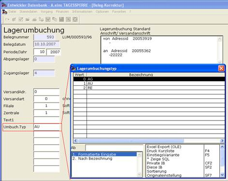
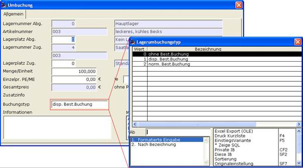

# Lagerumbuchung

<!-- source: https://amic.de/hilfe/lagerumbuchung.htm -->

Lagerumbuchungen werden unter dem Direktsprung [LGU] verwaltet. Sie werden als Vorgänge gespeichert. A.eins stellt folgende Bearbeitungsfunktionen zur Verfügung:

- Erfassen F 8 Erfassung einer neuen Lagerumbuchung
- Erstdruck F9 Erstdruck einer Lagerumbuchung.
- Formulardruck F10 Wiederholungsdruck
- Korrektur F5 Korrektur einer Lagerumbuchung
- Vorschau F11 Druckvorschau
- Stornieren F7 Stornieren (Löschen) der Lagerumbuchung
- Freigabe/Sperren Freigabe / Sperren für weitere Bearbeitung
- FiBu Übertrag Übergabe an die Finanzbuchhaltung

Lagerumbuchungen können in drei verschiedenen Buchungstypen erfasst werden.

| Stufe | Kurz | Lang | Buchungstyp |
| --- | --- | --- | --- |
| Angebot | AG | ohne Best.Buchung | Die Umbuchung ist Bestandsunwirksam |
| Auftrag | AU | disp.Best.Buchung | Die Umbuchung ist dispositiv. |
| Rechnung | RE | norm.Best.Buchung | Die Umbuchung ist Bestandswirksam. |

Der Buchungstyp kann im Vorgangskopf als UFLD (Feld 4501) oder in der Umbuchungsposition gepflegt werden.

Im Kopfteil:

Oder im Positionsteil:

[Siehe auch Erfassung des Positionsteils bei Umbuchungen](../../erfassungs_und_bearbeitungsfunktionen/artikelerfassung_f4/zusaetzliche_erfassung_bei_umbuchungen.md)

Hinweise:

Durch die Option "maxBuchuntstypUmbuchung - Maximaler Buchungstyp bei Umbuchung" kann für den Bediener eingeschränkt werden, welchen maximalen Buchungstyp der Bediener verwenden darf.

Der Erfassungsparameter 'Beim Verlassen Zugangs-/Abgangs-Menge und -Betrag verproben' mit der Standardeinstellung 'Ja' der Lagerumbuchungsmaske bewirkt bei dieser Einstellung eine Übereinstimmungsprüfung der Beträge und Mengen von Zugang und Abgang bei Verlassen der Umbuchungsmaske. Bei Abweichungen wird eine Warnmeldung erzeugt. Ist die Abweichung ungewollt, so muss die Position zur Korrektur aufgerufen werden.
