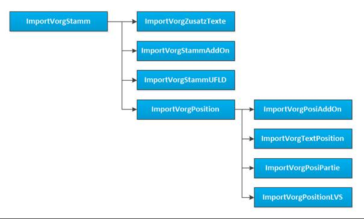

# Vorgangsimport mit openTRANS

<!-- source: https://amic.de/hilfe/_OTVorgimport.htm -->

**A.eins kann nur XML im openTRANS-Standard 2.1 importieren.**

Ausgangsdaten im XML-Format

Ausgangsdaten liegen unter Umständen im XML-Format vor. XML allein ist jedoch nur die Anweisung, Daten strukturiert darzustellen. Eine Definition, welche Daten wo zu finden ist, ist damit jedoch nicht getroffen. Ein XML-Dokument allein ist noch nicht geeignet, Daten daraus zu importieren.

Andere XML-Dateien können mit sog. Stylesheets zu openTRANS-Dateien konvertiert werden. Diese Stylesheet-Dateien müssen in einem Verzeichnis abgelegt werden, auf das der Importprozess zugreifen darf.

So können z.B. SAP-IDOCs oder andere XML zu openTRANS konvertiert werden. Diese Stylesheets können naturgemäß keine Konverter „von der Stange“ sein, da es in jedem Quell-System Individualitäten und verschiedene Versionen gibt.

Interpretation der Daten

Die Daten stammen aus einer definierten Quelle. Sie enthalten Informationen, die vom Absender übertragen werden sollen. Jedoch sind die verwendeten Artikel- Partie- und Kundennummern die des Absenders und nicht unbedingt die des eigenen Systems. Auch Mengeneinheiten werden in den beiden Systemen unterschiedlich interpretiert. Aus diesem Grund ist es notwendig ein C#-Makro zur Interpretation der Daten zu schreiben.

Das C#-Makro für den Vorgangsimport gehört zu den Makros, die vom System aufgerufen werden und deshalb bestimmte Interfaces implementieren müssen. Siehe auch Hilfe zu C#-Makros.

Dieses Makro bekommt als Parameter ein Datenobjekt des eingelesenen Vorgangs übergeben und gibt die gelesenen Daten als eine Liste von Datenobjekten zurück, die die zu importierenden Vorgangsinformationen enthalten.

So ist es zum Beispiel möglich, eine Bestellung zugleich in eine Lagerumbuchung und einen Ausgangslieferschein zu wandeln, wenn die Bestellung hier eine Lagerumbuchung als vorangehenden Schritt erfordert.

Die erwähnten Datenobjekte, die als Ergebnis des Makros erstellt werden, ähneln nicht zufällig der Datenstruktur der Tabellen der Vorgangsimportschnittstelle. Auf diese Weise lässt sich eine bestehende Schnittstelle hier in gewohnter Weise verwenden.

Geplantes Beispiel !

Ein Beispielmakro finden Sie in der Datenbank unter dem Namen AMIC_VIMP_DEMO. In diesem wird beispielhaft ein Vorgangsimport erklärt. Alle auftretenden Fragestellungen können jedoch auch hier nicht beantwortet werden.

Siehe auch:

- [Einrichtung eines openTRANS-Imports](./einrichtung_eines_opentrans_imports.md)
- [Zeitgesteuerter Importprozess](./zeitgesteuerter_importprozess.md)
