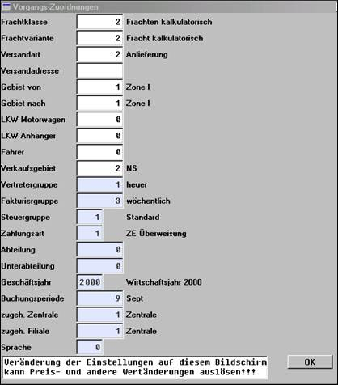

# Funktionen Vorgangserfassung Kopf

<!-- source: https://amic.de/hilfe/funktionenvorgangserfassungkop.htm -->

Abbruch (F10)

Abbruch der Erfassung, zurück zum Ausgangsmenü.

Abschluss

Vorgang wird gespeichert. Zusätzlich besteht die Möglichkeit zur Durchführung eines Sofortdrucks.

Abschluss mit Signatur (UMSCHALT+STRG+F8)

Vorgang wird unter Verwendung einer integrierten Signatur abgeschlossen. Zusätzlich besteht die Möglichkeit zur Durchführung eines Sofortdrucks

Abschluss / Lieblingsdruckerdruck (STRG+F5)

Diese Funktion ermöglicht es, ausgewählten Vorgängen für den Druck einen anderen als den Standarddrucker zuzuordnen. Zusätzlich kann zum Ausdruck ein anderes Formular durch Markieren der Unterklasse gewählt werden.

Abschluss / Nächster Beleg (F6)

Vorgang wird zunächst gespeichert. Zusätzlich besteht die Möglichkeit zur Durchführung eines Sofortdrucks. Waren in der übergeordneten Auswahlliste weitere Belege markiert, so erfolgt ein Wechsel zum nächsten Beleg in der Auswahl.

Allgemeine Zuordnung (F9)

Abfrage von Informationen zu diesem Bereich (siehe unten).

Hier werden sowohl generelle, nicht mehr änderbare, sowie änderbare Einstellungen angezeigt. Da Veränderung von Einstellungen auf dieser Maske möglicherweise Preis- und Wertänderungen auslösen können, müssen Änderungen hier mit Bedacht durchgeführt werden.

Andere Unterklasse / Andere Vorgangsklasse (UMSCHALT+F11)

Hier kann auf eine andere als die gerade verwendete Vorgangsklasse / Vorgangsunterklasse umgeschaltet werden: Mit einem Vorgangsklassenwechsel von Rechnung zu Angebot wird aus einer Rechnungserfassung ein erfasstes Angebot unter Mitnahme aller Werte; dabei wird der Nummernkreis des Angebotes gezogen. Nach dem Vorgangsklassenwechsel befindet man sich in der Zielvorgangsklasse. Will man weiter Rechnungen erfassen, muss man dahin zurückkehren.

Mit dem Unterklassenwechsel kann z.B. ein anderes Formular gezogen werden. Mit dem Wechsel von Rechnung auf Barverkauf werden allerdings auch Funktionen und Buchungsabläufe, wie Zahlungsverkehr aufgerufen.

Anschriften aktualisieren

Steht der Steuerparameter „[Anschriften archivieren?](../../firmenstamm/steuerparameter/kundenstammdaten/anschriften_archivieren_spa_574.md)“ auf „Ja“, so werden in den Vorgängen die zum Zeitpunkt der Vorgangserfassung gültigen Anschriften gespeichert. Wird die Kundenhauptanschrift nach der Erfassung des Vorgangs geändert, so wird die Anschrift im Vorgang nicht automatisch aktualisiert. Die ursprüngliche Anschrift bleibt zunächst im Vorgang bestehen.

Beim Aufruf der Funktion ***Anschriften aktualisieren*** werden die Hauptanschrift, die Anschrift des Rechnungsempfängers, sowie die Anschrift des Zahlungspflichtigen im Vorgang aktualisiert. Der Anwender muss diesen Schreibvorgang gesondert bestätigen. Es besteht zudem die Möglichkeit, speziell für den aktuellen Vorgang erfasste, manuelle Anschriften mit der Kundenhauptanschrift zu überschreiben. Gesondert erfasste Versandanschriften für den aktuellen Vorgang können auf diese Weise allerdings nicht aktualisiert werden.

**Hinweise:**

Ab der Stufe „Rechnung“ kann die Anschrift des Vorgangs nicht aktualisiert werden, wenn der Vorgang über eine abweichende Rechnungsempfänger-Adresse verfügt. In diesem Fall erscheint die Meldung „Hauptanschrift kann nicht aktualisiert werden!“.

Verfügt der Vorgang über eine manuelle Vorgangsanschrift, so erscheint eine Abfrage, ob die manuelle Vorgangsanschrift mit der Kundenhauptanschrift überschrieben werden soll:

Wird die Frage mit „Nein“ beantwortet, so werden die Anschrift des Rechnungsempfängers und/oder die Anschrift des Zahlungspflichtigen trotzdem aktualisiert, wenn diese nicht mit der manuellen Vorgangsanschrift übereinstimmen. Am Ende erscheint eine Meldung, welche Anschriften insgesamt aktualisiert wurden. Im Beispiel:

Die Änderungen werden erst nach dem Speichern des Vorgangs wirksam.

Daten neu anzeigen (STRG+F6)

Die Daten der UFLD-Felder, des Infofeldes und des Adressfeldes werden neu angezeigt.

Etiketten (Formulardruck)

Es kann ein Formular mit Informationen des Vorgangsstamms gedruckt werden. Hierzu muss im Formulareinrichter ein Formular des Typs 4 (Kundenetikett) eingerichtet sein.

Gesamtsummen (UMSCHALT+F10)

Anzeige der Endsummen des aktuellen Beleges, vorrangig Netto, Warenwert, Zu-/Abschläge und Steuern. Ferner werden Informationen zu Mengeneinheiten und Gebinden zusammengestellt.

Kunden anzeigen (F4)

Von hier kann in den Kundenstamm verzweigt werden, um dort ggf. eine Anschrift zu ändern oder einen Kunden neu zu erfassen. Ebenso ist es möglich, über die Menüleiste Kunden, Artikel etc. während der laufenden Erfassung einzugeben.

Kunden – Etikett (STRG+F11)

Für einen einzelnen oder mehrere ausgewählte Kunden können Etiketten gedruckt werden.

Kunden – Verkaufsauswertung (UMSCHALT+F12)

Es wird in die Verkaufsauswertung (VKA) mit der Nummer des bearbeiteten Kunden verzweigt.

Kundeninfo KUI (STRG+F10)

Anzeige der Informationen aus dem individuellen Kundeninformationssystem für den ausgewählten Kunden.

Kundennummer wechseln

Möglichkeit zur Bestimmung eines anderen Kunden für die Vorgangserfassung.

Lagerwechsel

Wechsel von Lagernummer und/oder Lagerplatznummer.

Manuelle Adresse (UMSCHALT+F6)

Hier kann eine vom Kundenstammsatz abweichende Anschrift, nur für den aktuellen Vorgang, hinterlegt werden.

Manuelle Versandadresse

Hier kann eine vom Kundenstammsatz abweichende Versandanschrift, nur für den aktuellen Vorgang, hinterlegt werden.

Positionsteil (F5)

Wechsel in den Positionsteil.

Schnellerfassung (STRG+F7)

In der Schnellerfassung können für den aktuell gewählten Kunden Positionen, bestehend aus Menge, Artikelnummer und Preisinformationen in Tabellenform schnell erfasst und gespeichert werden.

Stapelende

Aktueller Vorgang wird zunächst gespeichert. Zusätzlich besteht die Möglichkeit zur Durchführung eines Sofortdrucks. Waren in der übergeordneten Auswahlliste weitere Belege markiert, so wird deren Verarbeitung abgebrochen und dann zur Auswahlliste zurückgekehrt.

Steuer (F11)

Aufstellung wesentlicher Steuerinformationen des Beleges, vorrangig Nettobetrag, Steuerbetrag und anzuwendende Steuersätze.

Texte / Kommentare (STRG+F8)

Hier werden Texte und Kommentare für den Rechnungskopf und -abschluss automatisch oder manuell abgerufen: Im Feld “Eingabe” werden nacheinander Informationen für die Stopppositionen abgefragt (siehe dazu “[Textbausteine](../../zusatzprogramme/vorgangstexte/anwendung_vorgangstexte/vorgangstext_pfleger/textbaustein_pfleger.md)”). Für manche Vorgangstypen sind Texte/Kommentare allerdings nicht vorgesehen.

Tourzuordnung

Der Vorgang wird einer Tour zugeordnet. Siehe dazu Tourverwaltung.

Vorschau Druck (UMSCHALT+F5)

Die spätere Druckausgabe des aktuellen Vorgangs wird angezeigt.

Warengruppen

Übersicht der vorhandenen Warengruppen.

Zahlungsbedingung (F8)

Anzeige und Bearbeitungsmöglichkeit der Zahlungsbedingung beim Vorgangsabschluss.
