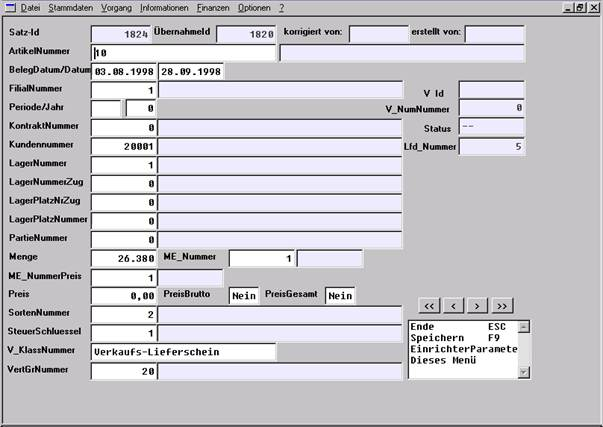

# Belegerzeugung aus importierten Vorgangsdaten

<!-- source: https://amic.de/hilfe/belegerzeugungausimportiertenv.htm -->

Weiterverarbeitung der einem Datenträger importierten Vorgangsdaten

Mit dem Direktsprung [VUEB] (Vorgang-Übergabe) wird eine Auswahlliste geöffnet.

Variante 1 - Belegerzeugung

In Variante 1 (Belegerzeugung) werden die importierten Datensätze (z.B. aus dem Datenträger von der Waage), die in die Vorgänge importiert werden sollen, angezeigt. In der Option-Box steht die Funktion zur Belegerzeugung zur Verfügung.

  

Belege erzeugen

Mit Hilfe des Pascal-Scriptes „VorgangEinspielung“ werden die Vorgänge aus der Zwischentabelle in das Vorgangswesen von Aeins importiert. Fehlerhafte Sätze werden entsprechend markiert. Treten Fehler auf, so enthält das Fehlerprotokoll die zugehörigen Angaben.

Falls nacheinanderfolgende Roh-Belege in den erforderlichen Details übereinstimmen (Kunde, Datum, Belegnummer etc.), wird daraus nur ein Vorgang mit mehreren Warenpositionen erzeugt.

Die Belegnummer des erzeugten Beleges wird in die Roh-Daten zurückgeschrieben und kann unter Variante 2 angesehen werden.

FEHLERCODES, die im Fehlerprotokoll ausgegeben werden

#1 Das V_DATUM konnte nicht korrekt ermittelt werden.

#2 Die BELEGNUMMER konnte nicht eingetragen werden.

#3 3a,b Preis konnte nicht gelesen werden. 3c Bruttokennzeichen konnte nicht eingetragen werden.

#4 Die Preiseinheit konnte nicht eingetragen werden.

#6 Falsche Mengeneinheit Mengeneinheitsnummer, ME_Nummer nicht vorhanden?

#7 Falsche Mengeneinheit Preismengeneinheitsnummer, ME_NummerPreis nicht vorhanden?

#8 Falsche Kontraktnummer, Kontrakt nicht vorhanden?

#9 Falsche Partienummer, Partie nicht vorhanden?

#10 Falsche Perinummer

#11 Falsche Jahrnummer

#12 Es wurde versucht, einen Brutto-Einzelpreis anzulegen.

#13 Position konnte nicht angelegt werden, weil Artikel, Lager oder Mengenangabe nicht korrekt ist.

#17 Falscher Steuerschlüssel!

#18 Falscher Lagerplatz

#19 Falsche Lagerplatznummer Abgang bei Umlagerung

#20 Falsche Lagerplatznummer Zugang bei Umlagerung

#21 Falsche Lagernummer Abgang bei Umlagerung

#22 Falsche Lagernummer Zugang bei Umlagerung

#23 LKW_Nummer konnte nicht gesetzt werden

#24 Wiegenummer konnte nicht gesetzt werden

Variante 2 - Vorgang-Übergabe

In Variante 2 (Vorgang-Übergabe) werden die importierten Datensätze (z.B. aus der Waage), die in die Vorgänge importiert werden sollen, angezeigt. Ferner sind auch alle Datensätze mit Fehlerstatus oder Erledigtstatus sichtbar.

FEHL: Belerz Rücksetzen SF8

Ermöglicht es, in der Belegerzeugung fehlerhafte Sätze zurückzusetzen.

Ändern / Ansehen

Bestimmte Daten eines Übernahmesatzes können geändert bzw. angesehen werden. Bei Auswahl dieser Funktion erscheint die folgende Bildschirmmaske:

