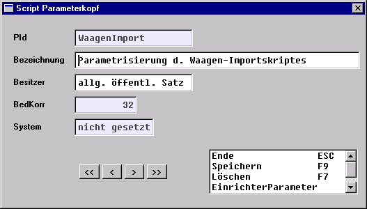

# Auswahlliste ScriptParameter

<!-- source: https://amic.de/hilfe/auswahllistescriptparameter.htm -->

Die Auswahlliste *ScriptParameter* zeigt die Kopfsätze der Scriptparameter-Sätze an. Jede Gruppe von Scriptparametern (alle Parameter für ein spezielles Script) wird durch einen Kopfsatz repräsentiert.

Der Aufruf des Einstieges in die Anwendung *ScriptParameter* erfolgt durch den *Direktsprung [SCPA]*.

  

Die Varianten dieser Auswahlliste sind *Script-Parameter* und *\*\*\* System-Script-Parameter.* Letztere Variante steht nur ENTWICKLERN zur Verfügung.

Die **Option-Box** stellt folgende Funktionalitäten bereit:

Aufruf des **Pflegers** zur Neuerfassung, Änderung, Ansicht und Löschung von Kopfsätzen (Löschen lässt sich ein Kopfsatz nur, wenn es keinen Detailsatz gibt. Zum Löschen inklusive aller Detailsätze steht dem Support die unten beschriebene Funktion **\*\* Mit Details löschen** zur Verfügung.

**PId:** ParameterId. Hier ist eine Eindeutige Kurzbezeichnung anzugeben, anhand derer die Parametersätze von einem Script aus angesprochen werden können. Diese PId muß bei privaten Parametersätzen immer mit “p_” beginnen!

**Bezeichnung:** Eine Klartextbeschreibung der Parametersammlung

**Besitzer:** 0: allgemeiner öffentlicher Parametersatz; 1: privater Parametersatz

(Anmerkung: Durch restriktive Sicherheitsvorkehrungen können im Normalbetrieb nur private Parametersätze bearbeitet werden, und dies auch nur durch besonders berechtigte Bediener)

**BedKorr:** BedienerId desjenigen Bedieners, der zuletzt Änderungen am Datensatz durchgeführt hat. (wird automatisch belegt).

**System:** System-Kennzeichen, 0: nicht gesetzt; 1: gesetzt.

Datensätze mit gesetztem System-Kennzeichen können nur herstellerseitig im Hause AMIC bearbeitet werden.

Verzweigung in die detaillierte Darstellung der einzelnen Parameter-Datensätze zu einem markierten Kopfsatz (Auswahlliste *ScriptParameterDetails*) s. u.

**Ausdruck** einer Crystal-Reports-Liste der **Script-Parameter**

  

Reportdatei ist **SCPARAM.RPT**.

**\*\* Duplikat erzeugen.** Diese Funktion steht nur Benutzern mit Mindestberechtigung Support zur Verfügung. Mit dieser Funktion wird eine Gruppe von Scriptparametern dupliziert und unter einem anderen Namen (andere ScriptPId) gespeichert.

**\*\* Mit Details löschen:** Diese Funktion steht nur Benutzern mit Mindestberechtigung Support zur Verfügung. Mit dieser Funktion wird eine Gruppe von Scriptparametern einschließlich aller Detailsätze gelöscht. Die Funktion ist nicht auf die Gruppe mit der ScriptPId „WaagenImport“ anwendbar!

**\*\* Duplikat n. WaagenImport:** Diese Funktion steht nur Benutzern mit Mindestberechtigung Support zur Verfügung. Eine Gruppe von Scriptparametern wird unter der ScriptPId „WaagenImport“ dupliziert. Sollte bereits eine Scriptparametergruppe „WaagenImport“ existieren, so wird davon eine Sicherheitskopie unter „WaagenImport_C“ angelegt. Existierten auch letztere Datensätze, so wird die Ausführung der Funktion abgebrochen. (Dies ist ein spezielles Feature für die Waagenschnittstelle)

**\*\* WaagenImport Standard:** Diese Funktion steht nur Benutzern mit Mindestberechtigung Support zur Verfügung. Aus der Datei ..\\SQL\\WAAGEN_DEFAULT.SQL werden die Scriptparameter mit der ScriptPId „WaagenImport“ eingelesen. Diese Funktion dient zur erstmaligen Installation einer Waagenimportschnittstelle. Sollte bereits eine Scriptparametergruppe „WaagenImport“ existieren, so wird davon eine Sicherheitskopie unter „WaagenImport_C“ angelegt. Existierten auch letztere Datensätze, so wird die Ausführung der Funktion abgebrochen. (Dies ist ein spezielles Feature für die Waagenschnittstelle).
