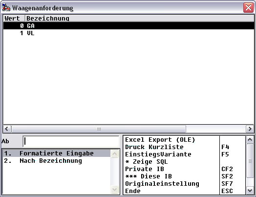
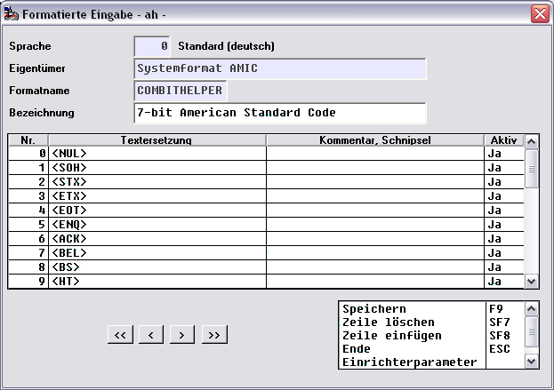
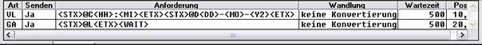
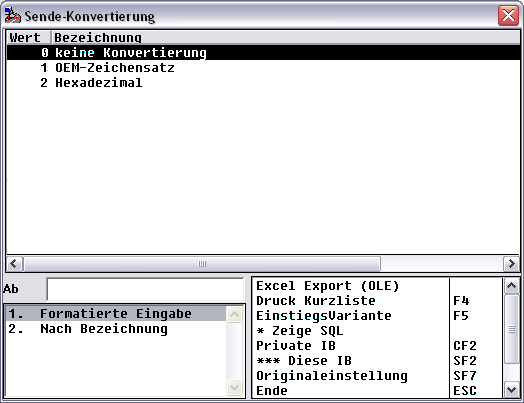

# Registerkarte Anforderung

<!-- source: https://amic.de/hilfe/_waagenprofil_reg_anford.htm -->

| Anforderung | |
| --- | --- |
| ID | |
| [Art](./registerkarte_anforderung.md#Anforderung_art) | Folgende Arten gibt es: 0 = GA (Gewichtsanforderung) 1 = VL |
| Senden | Hiermit kann man einstellen, ob eine GA oder VL auch wirklich gesendet werden soll. Sehr interessant für Entwicklungs- und Debug-Zwecke. Andernfalls müsste man evtl. ein schwer erarbeitetes VL löschen … |
| Anforderung | Hier gilt das im Wesentlichen schon unter „[Art](./registerkarte_anforderung.md#Anforderung_art)“ Gesagte. &lt;WAIT> wartet eine Sekunde, bevor es fortfährt. Dieses Feature ist für „träge“ Waagen-Systeme unverzichtbar. Eventuell muss man mehre &lt;WAIT>-Sequenzen absenden |
| Antwort | ??? |
| [Wandlung](./registerkarte_anforderung.md#Anforderung_wandlung) | Beeinflusst mögliche Transformationen der Anforderungszeichenketten |
| Wartezeit | Vorgabe einer Zeit in Millisekunden, nach dessen Ablauf die Übertragung der Anforderungszeichenkette als gescheitert gelten darf. Es sind in aller Regel kurze Zeiten zu erwarten (>= 100 Millisekunden); man sollte mit kleineren Zeiten vorsichtig umgehen, und sich diese durch die Praxis bestätigen lassen … |
| Pos | Sortierungskriterium für die Reigenfolge der VL. Da es höchstens eine GA geben darf, wird diese wenn auch immer erst am Ende der VL verschickt. Sollte es in Zukunft Waagensysteme geben, die noch einen „Nachlauf“ benötigen, muss das noch implementiert werden! |

Art

GA: Gewichtsanforderung

Das Kommando, das die Waage benötigt, um die Gewichtsdaten zu übertragen.

Im obigen Beispiel benötigt die Waage das Kommando „&lt;ENQ>“.

Hierbei ist eine Besonderheit zu beachten: Die so genannten „Nicht-Druckbaren-Zeichen“ werden durch „&lt;Nicht-Druckbares-Zeichen>“ verklauseliert.

Konkret bedeutet dies, dass der Wage nicht die Zeichen „&lt;“, „E“, „N“, „Q“, „>“ geschickt werden, sondern das hinterlegte Nicht-Druckbare-Zeichen.

Das ganze Manöver deshalb, um die Kommunikation in einer übersichtlichen Repräsentation zu halten.

Die Umschlüsselung erfolgt über das Format „COMBITHELPER“.

Ist keine GA angegeben, dann fordert Aeins dazu auf, die Waage manuell zum Senden zu bringen.

VL:

Einige Waagen benötigen vor der eigentlichen Gewichtsanforderung noch ein „Waage-Up“ oder es ist nötig, bestimmte Parameter, wie z.B. Datum und Uhrzeit vom Host zur Waage zu übertragen.

Dafür gibt es hiermit die Möglichkeit das abzuwickeln.

Es sind beliebig viele VL möglich, aber immer nur eine GA!

Im obigen Bespiel wird also vor der GA eine VL gesendet. Man erkennt die Nicht-Druckbaren-Zeichen &lt;STX> und &lt;ETX>, sowie eine Erweiterung des COMBITHELPER-Konzeptes auf

&lt;HH> wird in die aktuelle System-Stunde umgewandelt

&lt;MI> wird in die aktuelle System-Minute umgewandelt

&lt;DD> wird in den aktuellen System-Tag umgewandelt

&lt;MO> wird in den aktuellen System-Monat umgewandelt

&lt;Y2> wird in das aktuelle System-Jahr ( 2-stellig) umgewandelt

An Y2 erkennt man das sich nach den Wäge-Systemen zu richten hat, und nicht nach irgendwelchen Jahr2000-Problematiken …

Wandlung

Beeinflusst mögliche Transformationen der Anforderungszeichenketten.

Momentan sind folgende implementiert:

0 : keine Konvertierung 

1 : OEM-Zeichensatz

 Wandelt alle Zeichen von ANSI nach OEM

2 : Hexadezimal

 Wandelt alle Zeichen vor Übertragung in ihre hexadezimale Repräsentation

In den meisten Fällen ist „keine Konvertierung“ ( 0 ) eine gute Wahl!
