# Registerkarte Ergebnis

<!-- source: https://amic.de/hilfe/_waagenprofil_reg_ergebnis.htm -->

| Ergebnis | |
| --- | --- |
| Regulärer Ausdruck | Siehe [Regulärer Ausdruck](./registerkarte_ergebnis.md#Ergebnis_regexp) |
| G | Siehe [G](./registerkarte_ergebnis.md#Ergebnis_g) |
| Rückgabe als | Siehe [Rückgabe als](./registerkarte_ergebnis.md#Ergebnis_rueckgabe) |
| NBV | Siehe [NBV/NBZ](./registerkarte_ergebnis.md#Ergebnis_nbvnbz) |
| NBZ | Siehe [NBV/NBZ](./registerkarte_ergebnis.md#Ergebnis_nbvnbz) |
| Zuordnung | Siehe [Zuordnung](./registerkarte_ergebnis.md#Ergebnis_zuordnung) |
| Pos | Hier kann man einfach die Reihenfolge festlegen, in der die regulären Ausdrücke abgearbeitet werden sollen |
| | |
| [Beispiel](./registerkarte_ergebnis.md#Ergebnis_beispiel) | siehe [Beispiel](./registerkarte_ergebnis.md#Ergebnis_beispiel)… |
| | |
| Wiegung | Mit F11 können Sie eine Testwiegung durchführen |
| | |
| Übernahme von Terminal | Hier können Einstellungen von anderen Terminals via F3-Auswahl übernommen werden. |

Beispiel

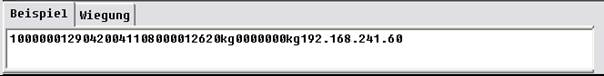

Der eigentliche Arbeitsbereich, in dem man sich an Hand eines Wiegebeispiels, also einer möglichen Rückgabe einer GA, an die Interpretation bzw. Zuordnung der Daten heranmachen kann. Die Beispieldaten gewinnt man durch Dokumentation, einer Wiegung(!) oder …

Obiger Inhalt möge vorerst als „Beispiel“ dienen. Man erkennt bei näherem Hinsehen Datenfragmente für Gewichtsdaten, einer IP. Geübte Waagenprofil-Hersteller erkennen auch noch eine Datumsangabe. Nun gilt es diese Rückgabe in Ihre Bestandteile zu „zerlegen“.

Im Falle der Waagenprofile geschieht das mit regulären Ausdrücken. Dieses System wurde gewählt, um größtmöglichste Einfachheit und zugleich Flexibilität bei der Formulierung der Abhängigkeiten zu erreichen.

Regulärer Ausdruck

Was ist ein „Regulärer Ausdruck“?

Reguläre Ausdrücke sind Ausdrücke, die nach bestimmten Regeln (die man im Falle der Waagenprofile nicht alle kennen muss!) zusammengesetzt sind und die durch Ihre Interpretation Muster abdecken.

Es seien einige exemplarische Erläuterungen gemacht:

„Aeins32“ ist ein regulärer Ausdruck, er trifft zum Beispiel auf die Zeichenketten „Aeins32“, „Aeins32.exe“ zu. Man sieht, dass „Enthaltensein“ schon ein gutes Kriterium ist. Allerdings benötigt man in der Praxis noch etwas mehr… Will man z.B. eine beliebige Ziffer beschreiben, dann muss man wissen, dass das mit dem „Metazeichen“ \\d geht. Dem zur Folge wäre „Aeins\\d\\d“ auch ein regulärer Ausdruck, der die Zeichenkette „Aeins32.exe“ abdeckt, aber eben auch andere, so z.B. Aeins64.exe. Und das geht nun schon in die richtige Richtung: Bei einer Waage weiß man, dass ein irgendwie numerisch gehaltenes Gewicht zu erwarten ist. Welches genau, kann man in aller Regel nicht sagen, aber dass so etwas wie \\d\\d\\d.\\d\\d vielleicht zu erwarten ist, schon eher. Wenn man nun noch weiß, dass man den letzten Ausdruck abkürzend schreiben kann als \\d{3}.\\d{2}, dann ist die obige Tabelle zu verstehen.

Die Beispielsrückgabe wird nun zunächst in sinnvoll erscheinende Gruppen zerlegt:

10000001290420041108000012620kg0000000kg192.168.241.60

wird zu

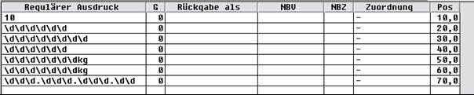

Nun kann man sein Werk schon mal prüfen, ob und welche Ergebnisse es liefern würde.

Das passiert mit der Funktion „Berechnen“ (F10).

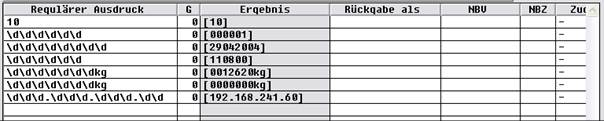

In der Spalte **Ergebnis** lässt sich deutlich das Ergebnis ablesen. Nochmalige Betätigung der Funktion nimmt die Spalte wieder weg. Das lässt sich beliebig oft durchführen.

Obwohl schon fast fertig, wollen wir noch einige Verbesserungen bzw. Optimierungen durchführen, auch ist die Allgemeingültigkeit für beliebige GA-Rückgaben dieses Wiegesystems zu überdenken …

Als fortgeschrittener Anwender macht man zunächst folgendes:

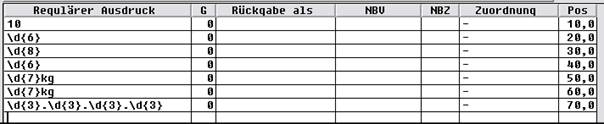

Das macht das Ganze etwas übersichtlicher und mit „Berechnen“ kann man sich davon überzeugen, dass das Ergebnis immer noch wie erwartet ist.

Die letzte Zeile wurde schon in Hinblick auf Allgemeingültigkeit dahingehend verbessert, dass dem Umstand Rechnung getragen wird, dass IP-Adressen (und um eine solche handelt es sich hier), aus einem Muster xxx.xxx.xxx.xxx bestehen … Der geneigte Fachmann unter den Anwendern weiß natürlich, dass das noch immer nicht reicht, denn es gibt ja auch IP-Adressen der Form 10.2.199.1. Also benötigt man etwas wie „eine bis drei Zahlen“ als regulären Ausdruck, und das geht mit \\d{1,3}, und bedeutet eben dies.

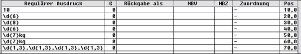

Nun gilt es noch, den Begriff der „Gruppe“ zu überwinden: Eine „Gruppe“ im Regulären ermöglicht es, eine Gruppe (!) von Zeichen zusammenzufassen, sowie die Möglichkeit, sich darauf später beziehen zu können.

Schaut man sich zum Beispiel die 5.te Zeile an, speziell den regulären Ausdruck \\d{7}kg, und weiß man, dass Aeins tunlichst darauf aus ist, nur die Gewichtszahl zu bekommen, dann hätte man ohne Möglichkeit der Gruppierung nun ein Problem.

G

Bezeichnet die Nummer der Gruppe, die zur weiteren Auswertung in Aeins herangezogen werden soll.

Man muss wissen, dass die 0.te Gruppe immer das Ergebnis des gesamten regulären Ausdruckes bezeichnet. Damit bleibt die obige Tabelle vorerst verständlich!

Das „Kg-Problem“ löst man nun so, dass man aus \\d{7}kg zunächst mit (\\d{7})kg eine Gruppe definiert und diese hat die laufende Nummer 1. Somit hat man folgendes:

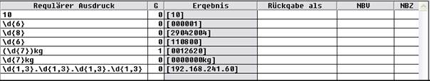

Man sieht deutlich den Unterschied im Ergebnis von Zeile 5 und Zeile 6.

Gruppiert wird also einfach durch Klammern! Und durch Angabe der entsprechenden Gruppennummer in der Spalte **G** lässt sich also möglicher Ballast abwerfen.

Zusammenfassend ist man nun also soweit:

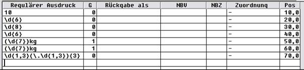

In der letzten Zeile wird demonstriert, wie man Gruppierung auch zur optischen Aufbereitung einsetzen kann, ohne die Gruppe als Ergebnis bekommen zu wollen!

Beachten Sie bitte ferner, dass der Punkt „.“ in regulären Ausdrücken ein Metazeichen ist und ein beliebiges Zeichen bedeutet. In einer IP handelt es sich aber um Punkte, also schreibt man auch „Punkt“ \\., wenn man einen Punkt „.“ meint.

Rückgabe als

Diese Spalte hat zum Zeitpunkt der Dokumentationserstellung dokumentatorischen Charakter, erfährt aber im Laufe der Weiterentwicklung des Waagenprofil-Modules noch eine wichtige Bedeutung. Es wird eine Anbindung zum Warenbewegungs-Addon geben.

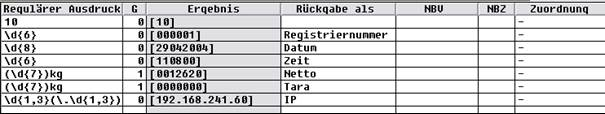

Dient somit vorerst nur zur eigenen schnellen Orientierung.

Mit einer kleinen aber feinen Ausnahme: Zeilen, die die Bezeichnung „Datum“ oder „Zeit“ tragen, werden in die der Hofliste zu Grunde liegenden Relation „OWaage“ in den Spalten „OWaage_1teWZeit“ resp. „OWaage-2teWZeit“ hinterlegt. Dieses Verfahren ist notwendig geworden, weil diese Daten bei bestimmten Wiegesystemen dazu verwendet werden, die Alibi-Zuordnung zu treffen.

Zuordnung

Die in „Ergebnis“ erhaltenen Daten müssen nun noch in Aeins fest hinterlegten Kriterien zugeordnet werden. Diese Kriterien sind

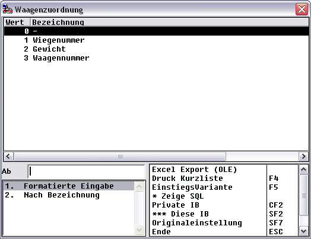

Beachten Sie bitte, dass Sie jeder Zeile natürlich maximal nur eine Zuordnung zuweisen können, und vor allem, das nicht mehrere Zuordnung möglich sind: Es gibt höchstens genau eine Wiegenummer, höchstes genau ein Gewicht und höchstens genau eine Waagennummer.

Nicht alle Wiegesysteme liefern alle diese Daten.

Nach der erfolgten Zuordnung stellt sich das Beispiel mittlerweile so dar:

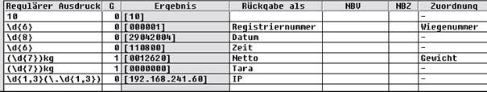

NBV/NBZ

Würde jedes Wiegesystem in einer „fachgerechten“ Form abliefern, wäre man jetzt fertig.

Aber leider müssen wir – und können wir – eine **Nachbearbeitung** durchführen.

Konkret das Datum sieht gemeinhin eher wie „29.04.2004“ aus statt „29042004“, die Zeit doch wohl eher als „11:08:00“ statt „110800“, und last but not least das Gewicht eher als „12620“ als „0012620“.

Folgende „Kunstgriffe“ der Regulären Ausdrucks-Technologie leisten das Gewünschte:

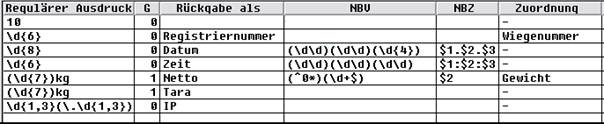

In **NBV** wird das Ergebnis schon mit der bewährten Technik zunächst gruppiert, dann wird in **NBZ** formuliert, wie weiter verfahren werden soll. Die „Gruppenansprache“ findet mit der Gruppennummer und vorgestelltem $-Zeichen statt.

„Datum“ und „Zeit“ sind somit verständlich, es finden einfach die gewünschten Transformationen statt.

Um die Transformation von „Netto“ zu verstehen, muss man noch wissen, dass ^ „am Anfang“, ein $ hinten „am Ende“ und das ein \* „keins oder beliebig viele“ bedeutet. Somit zeigt das Manöver um Netto, wie man beliebig viele führende Nullen eliminiert, dabei aber Sorgfalt walten lässt, dass man zumindest eine Zahl übrig lässt ( \\d+ bedeutet mindestens eine Ziffer ). Weitergereicht wird per $2 nur die 2.te-Gruppe.

Besonderheit:

Hat man es mit Wiegesystemen zu tun, die zum Beispiel für das Gewicht immer ein linksbündig mit Nullen aufgefülltes Gewicht zurückgeben und z.B. „Dezi-Kilogramm“ statt Kilogramm dann besteht die Möglichkeit

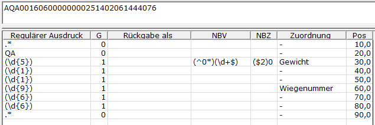

diese Situation ohne die Notwendigkeit von Skripten oder Einsatz von Mengeneinheiten zu operieren.

Der Ausdruck ($2)0 wird zunächst zu „(160)0“ und dieses wird von A.eins anschließend zu „1600“ bereinigt, d.h. A.eins nimmt die öffnenden und schließenden Klammern heraus.

Das braucht man, da das System sonst etwa „$20“ als „zwanzigste Gruppe“ interpretiert und die ist leer …
