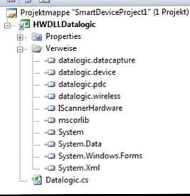

# Anbindung eines Fremd SDK von einem dritt Hersteller

<!-- source: https://amic.de/hilfe/_sdkdritt.htm -->

Es wurde die Möglichkeit geschaffen, einen anderen Scannerhersteller mit der Software A.eins.CE zu verbinden. Das SDK des Herstellers kann über eine Interface DLL angebunden werden.

Hierbei muss nur beachtet werden, dass für das Betriebssystem Windows CE die Version A.eins.CE benutzt wird und für die Windows Mobile Version die Software A.eins.WM.

<p class="just-emphasize">Erstellen einer DLL zur Anbindung eines Scanners</p>

Voraussetzungen

1. Visual Studio 2008 oder 2005

2. Windows CE SDK oder Windows Mobile SDK

3. Compact Framework

4. SDK des Geräteherstellers

Das Beispiel wurde mit dem SDK von Datalogic erstellt.

**Als erste muss ein neues Projekt angelegt werden**.

Dazu wird wie folgt vorgegangen:

1. Öffnen des Visual Studios

2. Über Datei->Neu->Projekt ein neues Projekt anlegen.

3. Als Projekttyp wird „Visual C#“ unter dem Punkt „Andere Sprachen“ ausgewählt. Unter diesem Punkt gibt es den Punkt „Intelligentes Gerät“. Als Vorlage wird „Projekt für Intelligente Geräte“ gewählt. Als Framework wird das .Net Framework 2.0 angegeben.

4. Als nächstes öffnet sich das Fenster für die Zielplattform. Hier wird jetzt je nach Abhängigkeit der Plattform des Scanners ausgewählt. Bei Windows CE ist die Plattform „Windows CE“ und bei Windows Mobile ist die „Plattform Windows Mobile 6 Professional SDK“. Die .Net Compact Framework-Version auf Version 2.0 zustellen. Als Vorlage ist die Klassenbibliothek zu wählen.

5. Jetzt wird das Projekt geöffnet.

**Einfügen von Verweisen**.

Als nächstes müssen wir Verweise zu dem Projekt hinzufügen. Als erstes muss die IScannerHardware in den Projektpfad kopiert werden, da diese in das Projekt mit eingebunden wird.

Vorgangsweise:

1. Aufrufen des Projektmappen-Explorer

2. Rechte Maustaste auf „Verweise“ und „Verweis hinzufügen“ auswählen

2.1. Jetzt kann auf der Registerkarte „Durchsuchen“ nach der IScannerHardware gesucht werden. Mit OK wird der Verweis hinzugefügt

2.2. Die DLLs des SDK sollten sich nach der Installation im Global Assembly Cache befinden. Der Global Assembly Cache kann auf der Registerkarte .Net durchsuchen werden. Sind dort die DLLs des Gerätherstellers nicht zu finden kann auf der Registerkarte Durchsuchen nach den DLLs gesucht werden. Meistens befinden sich die benötigten DLLs sich im Installationsverzeichnis des Gerätherstellers. Nach dem auch dieser Verweis hinzugefügt worden ist müssen jetzt using Anweisung in der Source angepasst werden.



**Using Direktive**

 Zusätzlich zu den Standard using Direktiven muss auf jeden Fall noch mit eingebunden werden.

1. Using ScannerHardware

2. Die Namespaces des Geräteherstellers

Nach dem Hinzufügen der using Anweisung und der Verweise sollte es in dem Projekt ungefähr so aussehen.

```csharp
using System;
using
System.Collections.Generic;
using System.Text;
using
System.Windows.Forms;
using
ScannerHardware;
using
datalogic.wireless;
using
datalogic.device;
using
datalogic.datacapture;
using datalogic.pdc;
```

**Schnittstellen Programmierung**

1. Als erstes muss die Klasse vom Interface IScannerHardware abgeleitet werden. public class Datalogic : IScannerHardware

2. Als nächstes wird das Kontextmenü über IScannerHardware aufgerufen. Jetzt sollte die Funktion „Schnittstelle implementieren“ im Kontext Menü ausgewählt werden. Danach werden die Methoden der Schnittstelle angezeigt.

```csharp
public class Datalogic : IScannerHardware
  {
#region IScannerHardware Member
    public void
Dispose()
    {
      throw new
NotImplementedException();
    }
    public void
DoBeep(int hertz, int laenge)
    {
      throw new
NotImplementedException();
    }
    public event
EventHandler OnRead;
    public bool
ScannerEnabled
    {
      get
      {
        throw new
NotImplementedException();
      }
      set
      {
        throw new
NotImplementedException();
      }
    }
    public bool
isVerbunden()
    {
      throw new
NotImplementedException();
    }
#endregion
  }
```

| Methode | Bedeutung |
| --- | --- |
| Dispose | Mit der Dispose Methode können Objekte der Hardware die beim Schließen der Software nicht mehr gebraucht werden geschlossen werden.<br>In dem Beispiel Anhand des Datalogic Scanners ist dass das Imager Objekt. |
| DoBeep | Falls der Scanner einen eigenen Beeper hat und nicht auf den beep aus dem Compact Framework anspricht kann dieser hier eingebunden werden. Der Methode wird Hertz Frequenz und die Länge in ms übergeben |
| ScannerEnabled | Mit der Methode wird abgefragt ob das Scannermodul aktiv oder nicht aktiv ist.<br>Des Weiteren muss die Funktionalität Implementiert sein, dass das Scannermodul von der Software aus zu deaktiviert oder aktiviert werden kann. |
| isVerbunden | Gibt einen boolschen Wert zurück.<br>1. True wenn WLAN verbunden ist<br>2. False wenn WLAN nicht verbunden ist. |
| Das Event OnRead | <pre><code>Dieses Event wird ausgelöst, wenn ein Barcode&#10; erfolgreich gelesen worden ist.&#10;public event EventHandler&#10; OnReadEvent;&#10;event EventHandler&#10; IScannerHardware.OnRead&#10; &#10; {&#10; add&#10; {&#10; &#10; if&#10; (OnReadEvent != null)&#10; &#10; {&#10; &#10; lock&#10; (OnReadEvent)&#10; &#10; {&#10; &#10; OnReadEvent += value;&#10; &#10; }&#10; &#10; }&#10; &#10; else&#10; &#10; {&#10; &#10; OnReadEvent = new EventHandler(value);&#10; &#10; }&#10; }&#10; remove&#10; {&#10; &#10; if&#10; (OnReadEvent != null)&#10; &#10; {&#10; &#10; lock&#10; (OnReadEvent)&#10; &#10; {&#10; &#10; OnReadEvent -= value;&#10; &#10; }&#10; &#10; }&#10; }&#10; }</code></pre> |
| | |

**Diese Methoden müssen jetzt mit Leben gefüllt werden:**

```csharp
using System;
using
System.Collections.Generic;
using System.Text;
using
System.Windows.Forms;
using A.eins.CE;
using
datalogic.wireless;
using
datalogic.device;
using
datalogic.datacapture;
using
datalogic.pdc;
namespace
HWDLLDatalogic
{
  /// <summary>
  /// Klasse Datalogic diese wird von dem Interfacs
IScannerHardware abgeleitet
  /// </summary>
  public class Datalogic :
IScannerHardware
  {
    /// <summary>
    /// Objekt dür das WLAN
Modul
    /// </summary>
    private RadioSignal _RadioSignal = new RadioSignal();
    /// <summary>
    /// Objekt des
Scanners
    /// </summary>
    private Imager
_Imager = new Imager();
    /// <summary>
    /// Konstruktor der
Klasse. In diesem Konstruktor wird das event Scanner registriet.
    /// Diese Event wird immer
dann gefeuert, wenn der Scanner einen Barcode gelsesen hat.
    /// </summary>
    public Datalogic()
    {
      _Imager.GoodReadEvent +=
new ScannerEngine.LaserEventHandler(_Imager_GoodReadEvent);
    }
    /// <summary>
    /// In diesem Event werden
die Daten aufbereitet
    /// </summary>
    /// <param name="sender"></param>
    void _Imager_GoodReadEvent(ScannerEngine sender)
    {
      //Erstellen eines neuen Objekt vom Typ
EventHandler.
      //Das Event wird am Ende der Methode geworfen und in der
Software aufgefangen
      EventHandler vHandler = OnReadEvent;
      if (vHandler != null)
      {
        // Erstellen eines Objektes für das Argument des
Events
        HardwareEventArgs vArgs = new HardwareEventArgs();
        //  Vorbelegung des Sccancode der Übergeben
wrid.
        string scancode = "-1";
        //Die Barcodes EAN13, EAN8, UPCA, DATAMTRIX haben Intern
eine bestimmten Code dieser muss
        //hier weiter gegeben werden.
        switch (sender.BarcodeTypeAsIdentifier)
        {
case BARCODE_Identifier.BARCODE_ID_EAN_13:
scancode = "-4";
break;
case BARCODE_Identifier.BARCODE_ID_EAN_8:
scancode = "-5";
break;
case BARCODE_Identifier.BARCODE_ID_UPC_A:
scancode = "-6";
break;
case BARCODE_Identifier.BARCODE_ID_DATAMATRIX:
scancode = "-8";
break;
default:
scancode = "-1";
break;
        }
        //Zuordnen des Scancodes zu den Event Argumenten
        vArgs.AICode
= scancode;
        //Zuordnen des gescannten Barcode als Text zu den Event
Argumenten
vArgs.BarcodeasText = sender.BarcodeDataAsText;
        //Werfen des Events
vHandler.Invoke(this, vArgs);
      }
    }
#region IScannerHardware Member
    /// <summary>
    /// Die Methode gibt
zurück ob das WLAN verbunden.
    /// </summary>
    /// <returns>Bool</returns>
    public bool
isVerbunden()
    {
      return _RadioSignal.IsAssociated();
    }
    /// <summary>
    /// In dieser Methode
können bestimmte Objekte wieder geschlossen werden,
    /// wenn die Software
geschlossen wird. In diesem Fall gibt die Software das Scannermodul
    /// wieder
frei.
    /// </summary>
    public void
Dispose()
    {
      _Imager.Dispose();
    }
    /// <summary>
    /// Mit diesem Get /Setter
kann der Status des Scanner abgefragt oder gesetzt werden.
    /// Das An und Auschalten
des Scannermoduls von aussen muss Möglich sein. Da im Fall von keiner WLAN
Verbindung
    /// noch irgendwelche
Daten erfasst werden dürfen.
    /// </summary>
    public bool
ScannerEnabled
    {
      get{ return
_Imager.ScannerEnabled;}
      set{ _Imager.ScannerEnabled = value;}
    }
#endregion
    /// <summary>
    ///  Event
OnReadEvent welches geworfen werden soll
    /// </summary>
    public event EventHandler OnReadEvent;
    /// <summary>
    /// Hinzufügen ud löschen
des Events aus der ScannerSoftware.
    /// Mit ADD wir das Event
regestiret
    /// Mit Remove wird das
Event wieder gelöscht.
    /// </summary>
    event EventHandler IScannerHardware.OnRead
    {
      add
      {
        if (OnReadEvent != null)
        {
lock (OnReadEvent)
{
OnReadEvent += value;
}
        }
        else
        {
OnReadEvent = new EventHandler(value);
        }
      }
      remove
      {
        if (OnReadEvent != null)
        {
lock (OnReadEvent)
{
OnReadEvent -= value;
}
        }
      }
    }
    /// <summary>
    /// Beepe für den
Datalogic Scanner
    /// </summary>
    /// <param name="herz">höhe des Tons</param>
    /// <param name="laenge">länge des Tons</param>
    public void
DoBeep(int hertz, int laenge)
    {
      Beeper beeper2 = new Beeper();
      beeper2.Beep(hertz / 10,
laenge);
    }
  }
}
```

Nach dem Erstellen der dll muss diese auf den Scanner kopiert werden. In dem Verzeichnis der Scannersoftware muss sich ein Ordner Hardwaredll befinden. Ist dieser nicht vorhanden so ist dieser neu anzulegen. In den Ordner wird dann die erstellte dll kopiert.

Nachdem die DLL auf den Scanner kopiert worden ist, kann das Programm gestartet werden.

**Beim Starten des Programms kann folgender Fehler auftreten**:

„Es konnte keine Interface DLL zum Anbinden der Scannerhardware im Pfad … gefunden werden.

Die kann mehrere Ursachen haben.

1. Der Ordner Hardwaredll exisitiert nicht

2. Der Ordner Hardwaredll existiert aber die erstellt DLL befindet sich nicht in diesem Ordner

3. Wenn der Ordner Hardwaredll existiert und die DLL befindet sich in diesem Ordner befindet, ist wahrscheinlich eine falsche DLL in der Scannerconfig.xml hinterlegt.

Lösung: Löschen Sie die scannerconfig.xml aus dem Verzeichnis in dem das A.eins.CE / WM liegt. Diese Datei wird neu geschrieben sobald diese nicht in dem Verzeichnis liegt. Das Programm sucht sich die Passende DLL aus dem Ordner Hardwaredll. Sind in dem Ordner mehr als eine DLL Hinterlegt, so kann die richtige per Auswahl ausgewählt werden.
