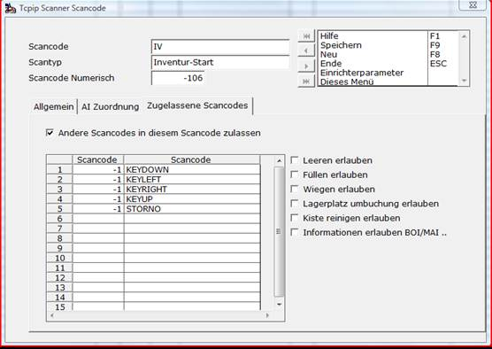

# Scanner Scancodes bearbeiten Modus

<!-- source: https://amic.de/hilfe/_cescannerscancodes.htm -->

In der ersten Variante in [SCTCP] können die Standard Einstellungen der Scancodes bearbeitet werden. Dazu wählen Sie den zu bearbeitenden Scancode aus und drücken F5. In diesem Beispiel werden die Funktionen anhand der Inventur erklärt.

| Maskenfelder | Inhalt | Bedeutung |
| --- | --- | --- |
| Scancode | IV | Dies ist der Scancodetext, der als EAN 128 verschlüsselt wird und zum Starten des Moduls eingescannt werden muss. |
| Scantyp | Inventur-Start | Dies ist das FS Format SCANAITYP. Dieses beschreibt um was für einen Scantyp es sich handelt. |
| Scancode Numerisch | \-106 | Die numerische Funktion die hinter dem Scancode 106 steht. |

Registerkarte Allgemein

| Maskenfelder | Inhalt | Bedeutung |
| --- | --- | --- |
| AI Start | Ja | Ist der erste Scancode der eingescannt wird um die Inventur zu starten. |
| Vorgangserzeugung | Ja | Inventur ist eine Vorgangsklasse |
| Vorgangs Klasse | Inventur Aufnahme | Vorgangs Klasse 5001 |
| Vorgangs Unterklasse | 0 | Vorgangsunterklasse |
| Füllen ohne Änderung | Nein | Wird nur im Zusammenhang mit dem LVS System gebraucht. Bedeutet wenn beim Auftrag erfassen eine Kiste gefüllt wird, dass das Füllen keine Änderung an der Position macht. |
| Startet Maschine | Nein | Wird nur im Zusammenhang mit dem LVS System gebraucht. Bedeutet dass der Vorgang, Kisten Füllen, Leeren und Wiegen darf. |
| Menüeintrag | Inventur Start | Eintrag für das Kontext Menü auf der Scanner Software |
| Benutzer | | Hier können einzelne Benutzer eingetragen werden, die dieses Modul starten dürfen z.B. Scanner1 |
| Private Itembox | | Hier kann eine Private Itembox eingetragen werden, die die Daten auf dem Scanner anzeigt. |
| Lila Id | | Wird nur bei der Vorgangs Erzeugung benötigt. Im Falle eines Lieferscheins, Auftrag kann noch ein Etikett ausgedruckt werden. |
| Druckerprofi AMIC Etikettendruck | | An dieser Stelle kann das Druckerprofil für den AMIC Etikettendruck hinterlegt werden. Beim Drucken über en AMIC Etikettendruck mit den Druckfunktionen des Lagerverwaltungssystem z.B. BOIP(für Box Informationen) wird das Profil einfach an den Scancode gehängt. |
| Privates Makro | | Möglichkeit einer privaten Prüffunktion die bei jedem Scannen aufgerufen wird. |
| Scancode Script | | |

Registerkarte AI Zuordnung

| **AI-Nr.** | **Application Identifier** | **Gruppennr.** | **Typ** | **Optional** |
| --- | --- | --- | --- | --- |
| \-30 | Mengeneingabe per Hand | 2 | Inventur-Start | Nein |
| \-6 | UPC-A Code | 1 | Inventur-Start | Nein |
| \-5 | EAN-Code 8 | 1 | Inventur-Start | Nein |
| \-4 | EAN-Code 13 | 1 | Inventur-Start | Nein |
| 1 | EAN Nummer der Handelseinheit | 1 | Inventur-Start | Nein |
| 2 | EAN der Verpackung | 1 | Inventur-Start | Nein |
| 10 | Charge/Partie | 3 | Inventur-Start | Nein |
| 30 | Menge in Stück (EAN128) | 2 | Inventur-Start | Nein |
| 37 | Menge in Stück (EAN128) | 2 | Inventur-Start | Nein |
| 3101 | Nettogewicht in Kilogramm (EAN128) | 2 | Inventur-Start | Nein |
| 3102 | Nettogewicht in Kilogramm (EAN128) | 2 | Inventur-Start | Nein |
| 3103 | Nettogewicht in Kilogramm (EAN128) | 2 | Inventur-Start | Nein |
| 3104 | Nettogewicht in Kilogramm (EAN128) | 2 | Inventur-Start | Nein |

In der AI Zuordnung werden die Codes eingetragen die pro Position eingescannt werden müssen. Dies sind eventuell EAN 13, EAN 8, UPC, die Menge oder die Partie.

**Feld Gruppennnr.**

Die Gruppennummer 1 wird für AI-Codes verwendet bei denen es sich um EAN-Codes handelt.  
Handelt es sich beim AI-Code um eine/ein Menge/Gewicht, dann wird die Gruppennr. 2 eingetragen.  
Gruppennr. 3 gilt für Charge/Partie.

Registerkarte Zugelassene Scancodes

Hier kann eingetragen werden ob andere Scancodes (keine AIs) in diesem Block zugelassen werden sollen. Ist hier nichts eingetragen worden, so wird beim Drücken der Taste „Keyleft“ eine Fehlermeldung ausgegeben.

Jeder EAN 128 Code der ein Scancode ist und in diesem Block zugelassen werden soll muss hier eingetragen werden. Im Standardfall sind dies KEYDOWN, KEYLEFT, KEYRIGHT, KEYUP und STORNO. Achtung hier dürfen keine AI-Codes stehen

Kontrollkästchen erleichtern die Eingabe für bestimmte Bereiche.  
    

| Kontrollkästchen | Scancode, der damit zugelassen wird |
| --- | --- |
| Leeren erlauben | LEEREN, LEERENENDE |
| Füllen erlauben | FUELLEN, FUELLENENDE |
| Wiegen erlauben | WIEGEN, WIEGENENDE |
| Lagerplatzumbuchung erlauben | LP, LPENDE |
| Kiste reinigen erlauben | LPL, LPLENDE |
| Informationen erlauben BOI/MAI | BOIP, LOIP, MAIP, PAP, BOI, LOI, MAI, PA |

Siehe auch:

- [Standard Einstellungen Scancodes](./standard_einstellungen_scancodes.md)
