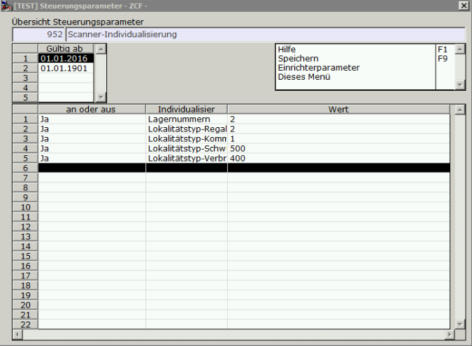
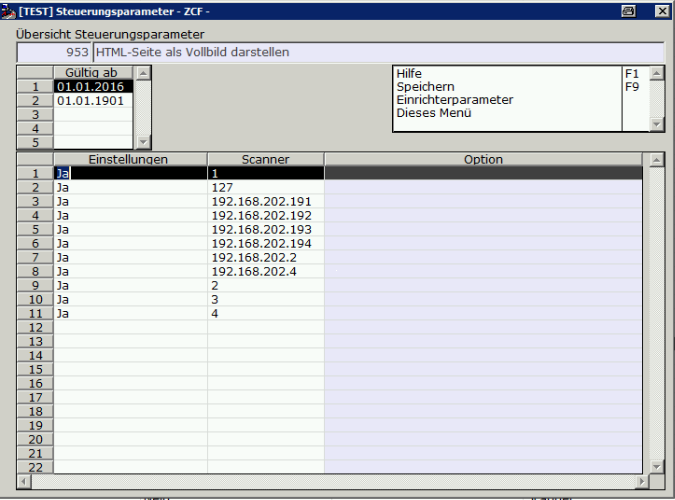
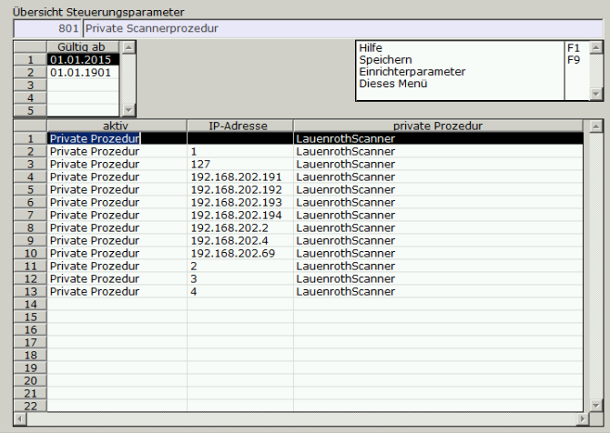
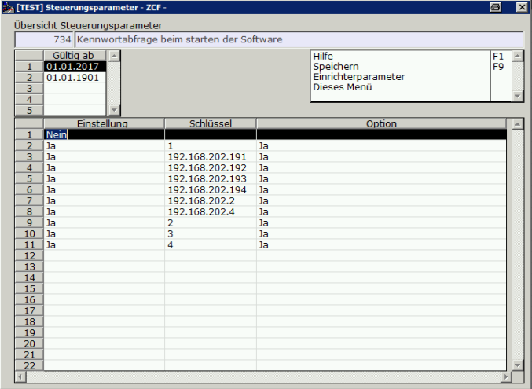
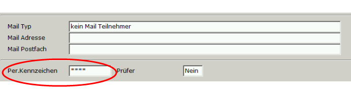

# Einrichtung

<!-- source: https://amic.de/hilfe/einrichtung8.htm -->

SPA 952 einrichten

SPA 953 einrichten

SPA 801 Scannerprozedur eintragen

Für jeden einzelnen Scanner muss die private Prozedur, wie 

SPA 734 einrichten

dbconfig.xml

In der Datei „dbconfig-xml“ im Aeins\\Bin- Verzeichnis wird die Verknüpfung zur Datenbank geregelt. Dazu ist folgende Zeile mit den ensprechenden Daten einzutragen:

&lt;DBConn Engine="Aeins_Engine" Dbn="testdb" User="TEST" Password="S1234" Commlinks="tcpip{HOST=192.168.202.2}" Extras="idle=60;lto=30;pooling=false;" Path="" Remote="" Standard="1" IPAdresse="192.168.202.4" ProfilIPAdresse="192.168.202.4">ZSCANNER1&lt;/DBConn>

Bedienereinrichtung

Für jeden Scanner ist ein Bediener einzurichten

Für jeden Bediener eines Scanners muss im Bedienerstamm die Persönliche Kennung (Es sind nur Ziffern erlaubt) eingerichtet werden.

Man meldet sich nun im Aeins mit seinem Kürzel und als Passwort &lt;„s“+die eingegebenene Nummer> an.
