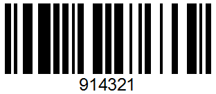

# Beispiel Scancodes für die Lagerplatzumbuchung

<!-- source: https://amic.de/hilfe/_scanner_bsp_lgpu.htm -->

In den Beispiel Scancodes für die Lagerplatzumbuchung befindet sich kein Scancode für einen Artikel. Hier ist ein Artikel aus dem Sortiment zu wählen.

Lagerplatzumbuchung Start

Lagerplatzumbuchung Ende

Storno

Lagerplatz

Damit der gescannte Lagerplatz im System gefunden wird muss ein Lagerplatz mit der Nummer 1234 auf dem Lager des Scanners eingerichtet werden.

