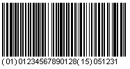
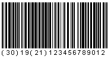

# EAN-128 / UCC-128

<!-- source: https://amic.de/hilfe/_cescannerean128.htm -->

| Gültige Zeichen: | Nahezu der gesamte ASCII Zeichensatz inkl. Steuerzeichen |
| --- | --- |
| Länge: | variabel (keine fest vorgegebene Länge) |
| Prüfziffer: | Berechnung nach Modulo 103  
ActiveBarcode berechnet die Prüfsumme für Sie automatisch |
| ActiveBarcode Typ#: | EAN/UCC-128 - #15 - CODEEAN128  
EAN/UCC-128 AI - #28 - CODEEAN128AI |
| Beispiel: |  | |
| Beschreibung: | Der *EAN/UCC 128* dient dem Handel und der Industrie vor allem der Waren- und Palettenauszeichnung.  
    
Der EAN/UCC 128 ist eine Sonderform des [Code 128](http://www.activebarcode.de/codes/code128.html). Er sieht die Verwendung eines besonderen Zeichens - dem FNC1 - unmittelbar nach dem Startzeichen vor. Diese direkte Aufeinanderfolge von Startzeichen und FNC1 am Anfang ist ein eindeutiges Kennzeichen für einen EAN 128.  
    
Die Länge ist des Codes ist variabel. Jedoch sollte die maximale Länge des Codes nicht mehr als 165mm betragen. Insgesamt dürfen maximal 48 Nutzzeichen (inkl. der [Datenbezeichner/AIs](http://www.activebarcode.de/codes/ean128_ucc128_ai.html) und eventueller FNC1 Trennzeichen) codiert werden.  
    
In einem EAN/UCC 128 Barcode können mehrere Daten gleichzeitig codiert werden. So ist es z.B. üblich Lebensmittelpaletten neben dem Produktcode (wie beim [EAN 13](http://www.activebarcode.de/codes/ean13.html)) auch zusätzlich mit Gewichtsangaben und dem Haltbarkeitsdatum im Barcode auszuzeichnen.  
    
Um diese unterschiedlichen Daten in einem Barcode codieren zu können gibt es einen internationalen Standard für Datenbezeichner, die angeben welche Daten codiert sind. Dies sind die [Application Identifier](http://www.activebarcode.de/codes/ean128_ucc128_ai.html). Ein Barcode könnte z.B. so aussehen:  
  
    
Die Werte innerhalb der Klammern sind die [Application Identifier](http://www.activebarcode.de/codes/ean128_ucc128_ai.html) (kurz: AI) und die Werte danach die entsprechenden Daten. Die Klammern dienen nur der Lesbarkeit der Klarschriftzeile und sind nicht in dem Strichcode codiert. Die "(01)" kennzeichnet beispielsweise den Produktcode, welcher immer in 14 Ziffern angegeben wird. Diese 14 Ziffern folgen dem [AI](http://www.activebarcode.de/codes/ean128_ucc128_ai.html). Daraufhin folgt der nächste [AI](http://www.activebarcode.de/codes/ean128_ucc128_ai.html) für die nächsten Daten. In diesem Beispiel ist es das Haltbarkeitsdatum, gekennzeichnet durch den [AI](http://www.activebarcode.de/codes/ean128_ucc128_ai.html) "(15)", welcher immer 6-stellig ist und das Datum in der Form JJMMTT darstellt. In diesem Beispiel ist es also das Datum 31.12.05  
    
    
Wenn Sie [AI](http://www.activebarcode.de/codes/ean128_ucc128_ai.html)'s verwenden, die Daten mit variabler Länge verwenden ist es nötig, das Steuerzeichen FNC1 vor dem nächst folgenden [AI](http://www.activebarcode.de/codes/ean128_ucc128_ai.html) zu setzen, damit der Scanner (bzw. die Software dahinter) weiß, dass die Daten variabler Länge beendet sind und wieder ein [AI](http://www.activebarcode.de/codes/ean128_ucc128_ai.html) folgt.  
Beispiel: Sie möchten die *Menge in Stück* (AI #30) und die *Seriennummer* (AI #21) in einem Code darstellen:  
  
    
In diesem Beispiel wurde die Menge mit 19 Stück und die Seriennummer 123456789012 codiert. Da die Stückzahl bis zu 8-stellig lang sein darf wird hinter der 9 das Steuerzeichen FNC1 codiert, damit der Scanner "weiß", dass nun die Daten beendet sind und ein neuer [AI](http://www.activebarcode.de/codes/ean128_ucc128_ai.html) kommt.  
Eine Auflistung der standardisierten [Application Identifier finden Sie hier](http://www.activebarcode.de/codes/ean128_ucc128_ai.html).  
    
    
    
Weitere Informationen zu diesem Thema bei [Wikipedia](http://www.wikipedia.de):  
[http://de.wikipedia.org/wiki/EAN128](http://de.wikipedia.org/wiki/EAN128) |

Die in diesem Code festgelegten Applikation Identifier verarbeitet das Scansystem und analysiert hieraus die entsprechenden Informationen, wie z.B. 00 (NVE) aus der dann der Lieferant der Ware gelesen werden kann.
